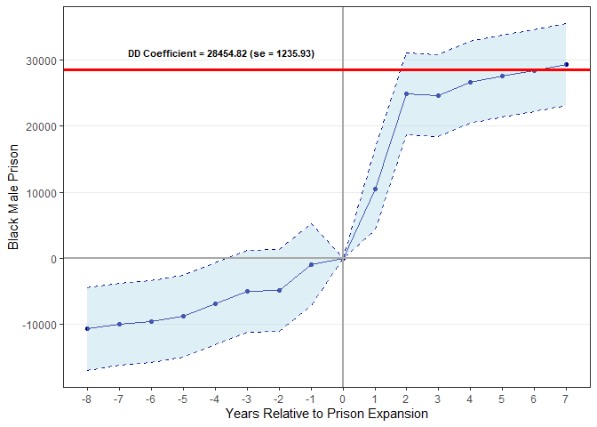
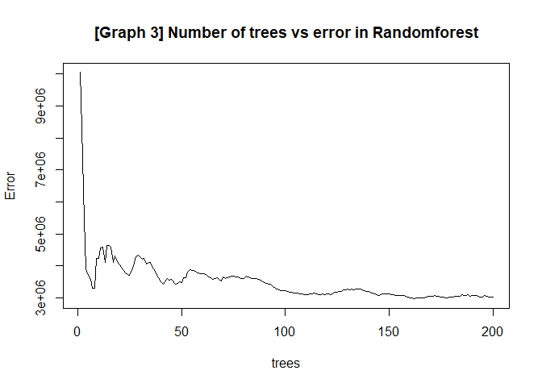
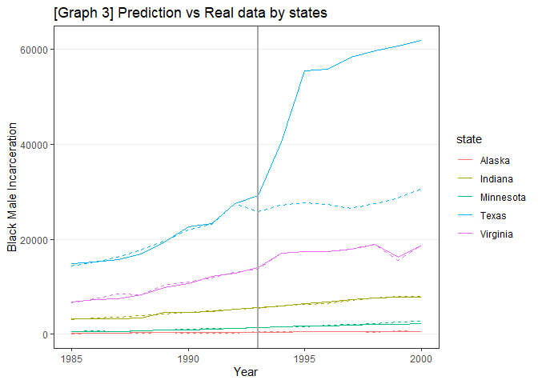

\#ECO 395M: Final Project

Bernardo Arreal Magalhaes - UTEID ba25727

Adhish Luitel - UTEID al49674

Ji Heon Shim - UTEID js93996

Introduction
------------

When there are increases in both prisoners and prison capacity, one
might naturally deduce that the increase in prisoners contributed to
increased prison capacity. However, causality can work conversely at
times. Here is an interesting study performed by Cunningham(2020). In
1993, Texas state government started a project building more prison to
double the state’s capacity within 3 years in accordance with the
court’s decision for prisoners’ welfare. He uses the synthetic control
method to predict counterfactuals, and his preliminar results indicate
that an increase in state prison capacity caused an increase in black
male incarceration. We will attempt to deduce if the prison construction
policy resulted in the increase in prisoners and find out whether there
is a causal relationship between them. But We will use a set of
alternative methods to estimate the causal effect. We will be utilizing
the methods we learned over the course of the semester with regards to
model prediction, and couple it with some powerful econometric tools to
assess the degree of causality between these two factors.

### Method

Our dataset is composed of state level annual observations(1985-2000) of
the following variables: number of black male prisoners (bmprison),
alcohol consumption per capita (alcohol), AIDs mortality (aidscapita),
average household income (income), unemployment rate (ur), share of the
population in poverty (poverty), share of the population which is
african american (black) and share of the population which is 15 to 19
years old (perc1519), and crack consumption(crack). In this project, we
used a standard Diff-in-Diff model, and compared its results with the
simple difference in outcomes predicted by the best predictive model
which showed the best performance out of these various methods. As the
table below illustrates, by decreasing the outcome after treatment from
the outcome before treatment for a treated state, the difference (D1) is
going to be the effect caused by the treatment (E) plus a trend (T).
This step neutralizes unobserved factors of a particular state. For a
state that wasn’t treated, the difference (D1) before and after
treatment is the trend (T) only. So, if we assume that T is the same for
both states, we can decrease T, that was measured from the control
state, from T + E in order to isolate the causal effect E.

This assumption is not testable because we don’t know what would’ve
happened to the treatment state had it not been treated. But what if we
could predict what would have happened to the treated state in this
alternative world where it wasn’t treated without having to rely on the
parallel trends assumption? In order to do that, we adopted various
predictive models such as Lasso Regression, Randomforests, Boosting, and
adopted the best predictive model to predict without parallel trends
assumption.

RESULTS
-------

### Differences-in-Differences

In order to preserve the same parameters that were included in
Cunningham’s analysis, the baseline model is:

    bmprison ~ alcohol + aidscapita + income + ur + poverty + black + perc1519 + year + state + year_after1993*state_texas

    ## bmprison ~ alcohol + aidscapita + income + ur + poverty + black + 
    ##     perc1519 + year + state + year_after1993 * state_texas

The model indicates that the expansion of the state prison capacity is
associated with an increase of 28,454.82 black male prisoners, holding
all else fixed.

    ## 
    ## =====================================================
    ##                               Dependent variable:    
    ##                           ---------------------------
    ##                              Black Male Prisoners    
    ## -----------------------------------------------------
    ## Prison capacity expansion        28,454.820***       
    ##                                   (1,235.930)        
    ##                                                      
    ## -----------------------------------------------------
    ## State Fixed effects                   Yes            
    ## Year Fixed effects                    Yes            
    ## Observations                          816            
    ## R2                                   0.947           
    ## Adjusted R2                          0.942           
    ## =====================================================
    ## Note:                     *p<0.1; **p<0.05; ***p<0.01

When decomposing the effect in each year, we get the point estimates
shown in the figure below. The coefficients capture how the treatment
group differs from the control group when controlling for multiple
factors and when considering state and year fixed effects. It also
allows us the test the plausibility of parallel trends in the
pre-treatment period. As we are including controls and fixed effects,
there should be less to be explained by the coefficients to the left of
the grey vertical line since the only difference should be the treatment
itself, and it didn’t occur in years prior to the intervention.

A test of joint significance of the leads coefficients, as in Kearney
and Levine (2015), reject the null hypothesis that they are jointly
equal to zero (p-value = 0.006). Therefore, it provides evidence that
the parallel trends assumption doesn’t hold even in the pre-treatment
period, indicating the necessity of exploring different methods.

    ## 
    ## ==========================================
    ## Statistic Res.Df   Df   Chisq  Pr(> Chisq)
    ## ------------------------------------------
    ## Mean      731.500 7.000 19.959    0.006   
    ## ------------------------------------------

### Predictions

We tested 3 models to find out the best predictive one other than
assuming the parallel trends. We built Lasso regression, Randomforest,
and Boosting model respectively and tested their performances by K-fold
validation.

#### Lasso Regression

First, we fit a lasso regression. From the baseline model we used in
diff-in-diff analysis, we added one more variable - ‘crack’, hoping it
can enhance our model’s predictive power, and consdiered all the
interactions. Running the lasso regression model, the path plot is shown
on \[Graph 2\].

    ## bmprison ~ (crack + alcohol + income + ur + poverty + black + 
    ##     perc1519 + aidscapita + year_fixed + statefip)^2

As a result, we obtained a model with 181 variables with an intercept.
Then we did K-fold cross validation to check RMSE when K is 10. We built
a train-test split and repeated the step from 1 to K repetitions by
running a loop. Our train set and test set are both subsets of our whole
dataset except the data from Texas state after year 1993. We can measure
the pure trend of the change of black male prisoners which is not
affected by the policy implementaion by excluding the data of treated
state after the policy change. When we calculate RMSE for the backward
selection model, it turned out to be 408.5

#### Randomforest

After this, we fit a randomforest model and also did K-fold cross
validation with our new baseline model we used in our lasso regression
above. We started with 200 trees and as \[Graph 3\] shows 200 is enough
to reduce our errors.

The K-fold validation result shows that the RMSE is 1645.31 which is
about 4 times larger than the RMSE of lasso regression.

#### Boosting

Lastly, we fit a boosting model with the same baseline model and did
K-fold validation as we did above.

The result of our K-fold cross validation shows that the RMSE is 815.29
which is lower than the randomforest model but still higher than the
lasso regression. \[Table 3\] shows that the lasso regression has the
best predictive power among all the models that we tested.

<table class="table table-striped" style="margin-left: auto; margin-right: auto;">
<caption>
\[Table 3\] The RMSE Results
</caption>
<tbody>
<tr>
<td style="text-align:left;">
Model
</td>
<td style="text-align:left;">
Lasso
</td>
<td style="text-align:left;">
Randomforest
</td>
<td style="text-align:left;">
Boosting
</td>
</tr>
<tr>
<td style="text-align:left;">
RMSE
</td>
<td style="text-align:left;">
408.60
</td>
<td style="text-align:left;">
1645.31
</td>
<td style="text-align:left;">
815.29
</td>
</tr>
</tbody>
</table>

### Compare our predictions with the real data

Since we have found the best predictive model, now we can compare our
predictions with the real data in our whole data set. We can see how our
predicion goes along with the real data in \[Graph 3\]. It shows the
change of black male incarceration in the treated state, Texas, with 5
randomly chosen states.

In \[Graph 3\], we can see two interesting foundings. One is that Texas
is showing clearly different movement from our predicted trend after the
treatment in 1993. The other is that Our prediction from the lasso model
fits very well on real data of controlled states.

CONCLUSION
----------
