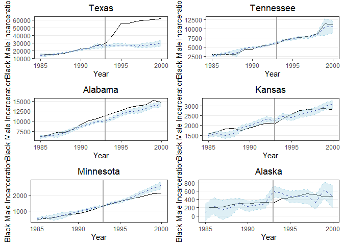
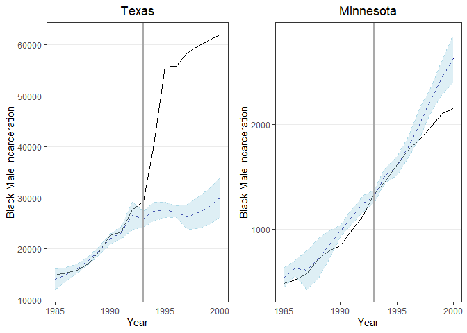

\#ECO 395M: Final Project \#\# Using Machine Learning literature to
predict counterfactuals: an alternative method to
Differences-in-Differences estimation

Bernardo Arreal Magalhaes - UTEID ba25727

Adhish Luitel - UTEID al49674

Ji Heon Shim - UTEID js93996

Introduction
------------

Assessing policy effects and making predictions based on it has always
been a key part of quantitative economics. Empirical economists are very
often interested in estimating the impact of certain events or policies
on a particular outcome. Wooldridge (2013) describes the effectiveness
applications of Differences-in-Differences methodology when the data
arise from a natural experiment. This kind of experiment occurs when an
exogenous event changes the environment in which individuals operate,
and require observations of both treatment and control group before and
after the change.

This methodology is particularly powerful for inferring causality since
it neutralizes unobserved, but fixed, omitted variables (Angrist and
Pischke, 2018). Nonetheless, it relies on a quite strong – and
unfortunately not testable – assumption that the outcome in the multiple
individuals/firms/states included in the analysis share the same trend
over time, which is called parallel trends assumption.

The table below illustrates a simple version of the Diff-in-Diff method
and why this assumption is required. By decreasing the outcome after
treatment from the outcome before treatment for a treated state, the
difference (D1) is going to be the effect caused by the treatment (E)
plus a trend (T). This step neutralizes unobserved factors of a
particular state. For a state that wasn’t treated, the difference (D1)
before and after treatment is the trend (T) only. So, if we assume that
T is the same for both states, we can decrease T, that was measured from
the control state, from T + E in order to isolate the causal effect E.

This assumption is not testable because we don’t know what would’ve
happened to the treatment state had it never been treated.

But what if we could predict what would have happened to the treated
state in this alternative world where it wasn’t treated without having
to rely on the parallel trends assumption?

In order to do that, we analyzed the application of a set of predictive
models such as Lasso Regression, RandomForest and Boosting in a
particular research topic, and adopted the best predictive model to
predict counterfactuals without having to rely on the parallel trends
assumption.

### Research topic brief summary

During the 1980s, the state of Texas lost a civil action lawsuit where a
prisoner argued that the state Department of Corrections was engaging in
unconstitutional practices regarding prisoners conditions. The court
ruled in favor of the prisoner, and forced the state to pursue a series
of settlements. Among other orders, the court placed constraints on the
number of inmates allowed per cells. Given this constraint, state
legislators approved a billion dollar prison construction project that
ended up doubling the state’s capacity within 3 years.

Cunningham (2020) argues that the nature of this expansion allows us to
use it as a natural experiment to estimate the effect of prison
expansion on incarceration. He uses the synthetic control method to
predict counterfactuals as in Abadie et al. (2010) by searching for the
set of weights that generate the best fitting convex combination of the
control units, being the best the one that minimizes root mean square
error in the pre-treatment period.

His preliminary results indicate that an increase in state prison
capacity caused an increase in black male incarceration. Bearing this in
mind, we used a set of alternative methods learned in class to estimate
counterfactuals and, therefore, measure the causal effect.

Method
------

In this project, we used a standard Diff-in-Diff model, and compared its
results with the simple difference in outcomes predicted by the
alternative method that yields the best out of sample predictive power
among multiple train-test splits.

With some evidence that the Diff-in-Diff assumptions might not hold, a
prominent supervised learning modelling method hopefully might predict
counterfactuals with more precision and produce more robust and accurate
results. Bearing the characteristics of our dataset in mind, we decided
to conduct iterative model selection and utilize regularization based
methods to identify the best working model.

Our dataset is consisted of state level annual observations of the
following variables: number of black male prisoners (bmprison), alcohol
consumption per capita (alcohol), AIDS mortality (aidscapita), average
household income (income), unemployment rate (ur), share of the
population in poverty (poverty), share of the population which is
African American (black) and share of the population which is 15 to 19
years old (perc1519).

RESULTS
-------

### Differences-in-Differences

In order to have a baseline model which preserve the same parameters
that were included in Cunningham’s analysis, the Diff-in-Diff model is:

    # bmprison ~ alcohol + aidscapita + income + ur + poverty + black + perc1519 + year + state + year_after1993*state_texas

The model indicates that the expansion of the state prison capacity is
associated with an increase of 28,454.82 black male prisoners, holding
all else fixed.

    ## 
    ## =====================================================
    ##                               Dependent variable:    
    ##                           ---------------------------
    ##                              Black Male Prisoners    
    ## -----------------------------------------------------
    ## Prison capacity expansion        28,454.820***       
    ##                                   (1,235.930)        
    ##                                                      
    ## -----------------------------------------------------
    ## State Fixed effects                   Yes            
    ## Year Fixed effects                    Yes            
    ## Observations                          816            
    ## R2                                   0.947           
    ## Adjusted R2                          0.942           
    ## =====================================================
    ## Note:                     *p<0.1; **p<0.05; ***p<0.01

When decomposing the effect in each year, we get the point estimates
shown in the figure below. The coefficients capture how the treatment
group differs from the control group when controlling for multiple
factors and when considering state and year fixed effects. It also
allows us the test the plausibility of parallel trends in the
pre-treatment period. As we are including controls and fixed effects,
there should be less to be explained by the coefficients to the left of
the grey vertical line since the only difference should be the treatment
itself, and it didn’t occur in years prior to the intervention.

A test of joint significance of the leads coefficients, as in Kearney
and Levine (2015), reject the null hypothesis that they are jointly
equal to zero (p-value = 0.006). Therefore, it provides evidence that
the parallel trends assumption doesn’t hold even in the pre-treatment
period, indicating the necessity of exploring different methods.

    ## 
    ## ==========================================
    ## Statistic Res.Df   Df   Chisq  Pr(> Chisq)
    ## ------------------------------------------
    ## Mean      731.500 7.000 19.959    0.006   
    ## ------------------------------------------

Therefore, we tested 3 alternative models to find out the best
predictive one other than assuming the parallel trends. As mentioned
before, we used Lasso regression, RandomForest, and Boosting model
respectively and tested their performances by K-fold validation.

### Lasso Regression

First, we fit a lasso regression. From the baseline model we used in
diff-in-diff analysis, we added one more variable - ‘crack’, hoping it
can enhance our model’s predictive power, and considered all possible
interactions. Running the lasso regression model, the path plot is shown
on \[Graph 2\].

As a result, we obtained a model with 181 variables with an intercept.
Then we did K-fold cross validation to check RMSE when K is 10. We used
a train-test split and repeated the step from 1 to K repetitions by
running a loop. Our train set and test set were both subsets of our
whole dataset except the observations from the state of Texas after
1993, which is what we want to predict. By doing it, we can measure how
the model estimate the change of black male prisoners which is not
affected by the policy implementation.\`

When we calculate RMSE for the backward selection model, it turned out
to be 408.49.

### RandomForest

After this, we fit a RandomForest model and also did K-fold cross
validation with the same baseline model we used in our lasso regression
above. We started with 200 trees and as \[Graph 3\] shows 200 is enough
to reduce our errors.

The K-fold validation result shows that the RMSE is 1684.41 which is
about 4 times larger than the RMSE of lasso regression.

### Boosting

Lastly, we used a boosting model with the same baseline model and did
K-fold validation as we did above.

The result of our K-fold cross validation shows that the RMSE is 869.66
which is lower than the RandomForest model but still higher than the
lasso regression. \[Table 3\] shows that the lasso regression has the
best predictive power among all the models that we tested.

<table class="table table-striped" style="margin-left: auto; margin-right: auto;">
<caption>
\[Table 3\] The RMSE Results
</caption>
<tbody>
<tr>
<td style="text-align:left;">
Model
</td>
<td style="text-align:left;">
Lasso
</td>
<td style="text-align:left;">
Randomforest
</td>
<td style="text-align:left;">
Boosting
</td>
</tr>
<tr>
<td style="text-align:left;">
RMSE
</td>
<td style="text-align:left;">
408.49
</td>
<td style="text-align:left;">
1684.41
</td>
<td style="text-align:left;">
869.66
</td>
</tr>
</tbody>
</table>

### Comparing the best model’s predictions with the observed data

Since we have assessed our best predictive model, now we can compare its
predictions with the real data in our whole data set. We can see how our
prediction goes along with the real data in \[Graph 3\]. It shows the
change of black male incarceration in the treated state, Texas, with 5
randomly chosen states.

In \[Graph 3\], we can see two interesting findings. One is that Texas
is showing clearly different movement from our predicted trend after the
treatment in 1993. The other is that Our prediction from the lasso model
fits very well on real data of controlled states.

For inference purposes, it is recommended to estimate a confidence
interval rather than showing the point estimate only. Therefore, we used
a bootstrap to calculate the standard deviation of the parameter’s
resampling distribution. The results are ADD THE RESULTS AND PLOT

    ## Warning in model.matrix.default(~x - 1, model.frame(~x - 1), contrasts = FALSE):
    ## non-list contrasts argument ignored

    ## Warning in model.matrix.default(~x - 1, model.frame(~x - 1), contrasts = FALSE):
    ## non-list contrasts argument ignored

    ## [1] 182

    ##    [1] "intercept"                 "crack"                    
    ##    [3] "alcohol"                   "income"                   
    ##    [5] "ur"                        "poverty"                  
    ##    [7] "black"                     "perc1519"                 
    ##    [9] "aidscapita"                "year_fixed1986"           
    ##   [11] "year_fixed1987"            "year_fixed1988"           
    ##   [13] "year_fixed1989"            "year_fixed1990"           
    ##   [15] "year_fixed1991"            "year_fixed1992"           
    ##   [17] "year_fixed1993"            "year_fixed1994"           
    ##   [19] "year_fixed1995"            "year_fixed1996"           
    ##   [21] "year_fixed1997"            "year_fixed1998"           
    ##   [23] "year_fixed1999"            "year_fixed2000"           
    ##   [25] "statefip2"                 "statefip4"                
    ##   [27] "statefip5"                 "statefip6"                
    ##   [29] "statefip8"                 "statefip9"                
    ##   [31] "statefip10"                "statefip11"               
    ##   [33] "statefip12"                "statefip13"               
    ##   [35] "statefip15"                "statefip16"               
    ##   [37] "statefip17"                "statefip18"               
    ##   [39] "statefip19"                "statefip20"               
    ##   [41] "statefip21"                "statefip22"               
    ##   [43] "statefip23"                "statefip24"               
    ##   [45] "statefip25"                "statefip26"               
    ##   [47] "statefip27"                "statefip28"               
    ##   [49] "statefip29"                "statefip30"               
    ##   [51] "statefip31"                "statefip32"               
    ##   [53] "statefip33"                "statefip34"               
    ##   [55] "statefip35"                "statefip36"               
    ##   [57] "statefip37"                "statefip38"               
    ##   [59] "statefip39"                "statefip40"               
    ##   [61] "statefip41"                "statefip42"               
    ##   [63] "statefip44"                "statefip45"               
    ##   [65] "statefip46"                "statefip47"               
    ##   [67] "statefip48"                "statefip49"               
    ##   [69] "statefip50"                "statefip51"               
    ##   [71] "statefip53"                "statefip54"               
    ##   [73] "statefip55"                "statefip56"               
    ##   [75] "crack:alcohol"             "crack:income"             
    ##   [77] "crack:ur"                  "crack:poverty"            
    ##   [79] "crack:black"               "crack:perc1519"           
    ##   [81] "crack:aidscapita"          "crack:year_fixed1986"     
    ##   [83] "crack:year_fixed1987"      "crack:year_fixed1988"     
    ##   [85] "crack:year_fixed1989"      "crack:year_fixed1990"     
    ##   [87] "crack:year_fixed1991"      "crack:year_fixed1992"     
    ##   [89] "crack:year_fixed1993"      "crack:year_fixed1994"     
    ##   [91] "crack:year_fixed1995"      "crack:year_fixed1996"     
    ##   [93] "crack:year_fixed1997"      "crack:year_fixed1998"     
    ##   [95] "crack:year_fixed1999"      "crack:year_fixed2000"     
    ##   [97] "crack:statefip2"           "crack:statefip4"          
    ##   [99] "crack:statefip5"           "crack:statefip6"          
    ##  [101] "crack:statefip8"           "crack:statefip9"          
    ##  [103] "crack:statefip10"          "crack:statefip11"         
    ##  [105] "crack:statefip12"          "crack:statefip13"         
    ##  [107] "crack:statefip15"          "crack:statefip16"         
    ##  [109] "crack:statefip17"          "crack:statefip18"         
    ##  [111] "crack:statefip19"          "crack:statefip20"         
    ##  [113] "crack:statefip21"          "crack:statefip22"         
    ##  [115] "crack:statefip23"          "crack:statefip24"         
    ##  [117] "crack:statefip25"          "crack:statefip26"         
    ##  [119] "crack:statefip27"          "crack:statefip28"         
    ##  [121] "crack:statefip29"          "crack:statefip30"         
    ##  [123] "crack:statefip31"          "crack:statefip32"         
    ##  [125] "crack:statefip33"          "crack:statefip34"         
    ##  [127] "crack:statefip35"          "crack:statefip36"         
    ##  [129] "crack:statefip37"          "crack:statefip38"         
    ##  [131] "crack:statefip39"          "crack:statefip40"         
    ##  [133] "crack:statefip41"          "crack:statefip42"         
    ##  [135] "crack:statefip44"          "crack:statefip45"         
    ##  [137] "crack:statefip46"          "crack:statefip47"         
    ##  [139] "crack:statefip48"          "crack:statefip49"         
    ##  [141] "crack:statefip50"          "crack:statefip51"         
    ##  [143] "crack:statefip53"          "crack:statefip54"         
    ##  [145] "crack:statefip55"          "crack:statefip56"         
    ##  [147] "alcohol:income"            "alcohol:ur"               
    ##  [149] "alcohol:poverty"           "alcohol:black"            
    ##  [151] "alcohol:perc1519"          "alcohol:aidscapita"       
    ##  [153] "alcohol:year_fixed1986"    "alcohol:year_fixed1987"   
    ##  [155] "alcohol:year_fixed1988"    "alcohol:year_fixed1989"   
    ##  [157] "alcohol:year_fixed1990"    "alcohol:year_fixed1991"   
    ##  [159] "alcohol:year_fixed1992"    "alcohol:year_fixed1993"   
    ##  [161] "alcohol:year_fixed1994"    "alcohol:year_fixed1995"   
    ##  [163] "alcohol:year_fixed1996"    "alcohol:year_fixed1997"   
    ##  [165] "alcohol:year_fixed1998"    "alcohol:year_fixed1999"   
    ##  [167] "alcohol:year_fixed2000"    "alcohol:statefip2"        
    ##  [169] "alcohol:statefip4"         "alcohol:statefip5"        
    ##  [171] "alcohol:statefip6"         "alcohol:statefip8"        
    ##  [173] "alcohol:statefip9"         "alcohol:statefip10"       
    ##  [175] "alcohol:statefip11"        "alcohol:statefip12"       
    ##  [177] "alcohol:statefip13"        "alcohol:statefip15"       
    ##  [179] "alcohol:statefip16"        "alcohol:statefip17"       
    ##  [181] "alcohol:statefip18"        "alcohol:statefip19"       
    ##  [183] "alcohol:statefip20"        "alcohol:statefip21"       
    ##  [185] "alcohol:statefip22"        "alcohol:statefip23"       
    ##  [187] "alcohol:statefip24"        "alcohol:statefip25"       
    ##  [189] "alcohol:statefip26"        "alcohol:statefip27"       
    ##  [191] "alcohol:statefip28"        "alcohol:statefip29"       
    ##  [193] "alcohol:statefip30"        "alcohol:statefip31"       
    ##  [195] "alcohol:statefip32"        "alcohol:statefip33"       
    ##  [197] "alcohol:statefip34"        "alcohol:statefip35"       
    ##  [199] "alcohol:statefip36"        "alcohol:statefip37"       
    ##  [201] "alcohol:statefip38"        "alcohol:statefip39"       
    ##  [203] "alcohol:statefip40"        "alcohol:statefip41"       
    ##  [205] "alcohol:statefip42"        "alcohol:statefip44"       
    ##  [207] "alcohol:statefip45"        "alcohol:statefip46"       
    ##  [209] "alcohol:statefip47"        "alcohol:statefip48"       
    ##  [211] "alcohol:statefip49"        "alcohol:statefip50"       
    ##  [213] "alcohol:statefip51"        "alcohol:statefip53"       
    ##  [215] "alcohol:statefip54"        "alcohol:statefip55"       
    ##  [217] "alcohol:statefip56"        "income:ur"                
    ##  [219] "income:poverty"            "income:black"             
    ##  [221] "income:perc1519"           "income:aidscapita"        
    ##  [223] "income:year_fixed1986"     "income:year_fixed1987"    
    ##  [225] "income:year_fixed1988"     "income:year_fixed1989"    
    ##  [227] "income:year_fixed1990"     "income:year_fixed1991"    
    ##  [229] "income:year_fixed1992"     "income:year_fixed1993"    
    ##  [231] "income:year_fixed1994"     "income:year_fixed1995"    
    ##  [233] "income:year_fixed1996"     "income:year_fixed1997"    
    ##  [235] "income:year_fixed1998"     "income:year_fixed1999"    
    ##  [237] "income:year_fixed2000"     "income:statefip2"         
    ##  [239] "income:statefip4"          "income:statefip5"         
    ##  [241] "income:statefip6"          "income:statefip8"         
    ##  [243] "income:statefip9"          "income:statefip10"        
    ##  [245] "income:statefip11"         "income:statefip12"        
    ##  [247] "income:statefip13"         "income:statefip15"        
    ##  [249] "income:statefip16"         "income:statefip17"        
    ##  [251] "income:statefip18"         "income:statefip19"        
    ##  [253] "income:statefip20"         "income:statefip21"        
    ##  [255] "income:statefip22"         "income:statefip23"        
    ##  [257] "income:statefip24"         "income:statefip25"        
    ##  [259] "income:statefip26"         "income:statefip27"        
    ##  [261] "income:statefip28"         "income:statefip29"        
    ##  [263] "income:statefip30"         "income:statefip31"        
    ##  [265] "income:statefip32"         "income:statefip33"        
    ##  [267] "income:statefip34"         "income:statefip35"        
    ##  [269] "income:statefip36"         "income:statefip37"        
    ##  [271] "income:statefip38"         "income:statefip39"        
    ##  [273] "income:statefip40"         "income:statefip41"        
    ##  [275] "income:statefip42"         "income:statefip44"        
    ##  [277] "income:statefip45"         "income:statefip46"        
    ##  [279] "income:statefip47"         "income:statefip48"        
    ##  [281] "income:statefip49"         "income:statefip50"        
    ##  [283] "income:statefip51"         "income:statefip53"        
    ##  [285] "income:statefip54"         "income:statefip55"        
    ##  [287] "income:statefip56"         "ur:poverty"               
    ##  [289] "ur:black"                  "ur:perc1519"              
    ##  [291] "ur:aidscapita"             "ur:year_fixed1986"        
    ##  [293] "ur:year_fixed1987"         "ur:year_fixed1988"        
    ##  [295] "ur:year_fixed1989"         "ur:year_fixed1990"        
    ##  [297] "ur:year_fixed1991"         "ur:year_fixed1992"        
    ##  [299] "ur:year_fixed1993"         "ur:year_fixed1994"        
    ##  [301] "ur:year_fixed1995"         "ur:year_fixed1996"        
    ##  [303] "ur:year_fixed1997"         "ur:year_fixed1998"        
    ##  [305] "ur:year_fixed1999"         "ur:year_fixed2000"        
    ##  [307] "ur:statefip2"              "ur:statefip4"             
    ##  [309] "ur:statefip5"              "ur:statefip6"             
    ##  [311] "ur:statefip8"              "ur:statefip9"             
    ##  [313] "ur:statefip10"             "ur:statefip11"            
    ##  [315] "ur:statefip12"             "ur:statefip13"            
    ##  [317] "ur:statefip15"             "ur:statefip16"            
    ##  [319] "ur:statefip17"             "ur:statefip18"            
    ##  [321] "ur:statefip19"             "ur:statefip20"            
    ##  [323] "ur:statefip21"             "ur:statefip22"            
    ##  [325] "ur:statefip23"             "ur:statefip24"            
    ##  [327] "ur:statefip25"             "ur:statefip26"            
    ##  [329] "ur:statefip27"             "ur:statefip28"            
    ##  [331] "ur:statefip29"             "ur:statefip30"            
    ##  [333] "ur:statefip31"             "ur:statefip32"            
    ##  [335] "ur:statefip33"             "ur:statefip34"            
    ##  [337] "ur:statefip35"             "ur:statefip36"            
    ##  [339] "ur:statefip37"             "ur:statefip38"            
    ##  [341] "ur:statefip39"             "ur:statefip40"            
    ##  [343] "ur:statefip41"             "ur:statefip42"            
    ##  [345] "ur:statefip44"             "ur:statefip45"            
    ##  [347] "ur:statefip46"             "ur:statefip47"            
    ##  [349] "ur:statefip48"             "ur:statefip49"            
    ##  [351] "ur:statefip50"             "ur:statefip51"            
    ##  [353] "ur:statefip53"             "ur:statefip54"            
    ##  [355] "ur:statefip55"             "ur:statefip56"            
    ##  [357] "poverty:black"             "poverty:perc1519"         
    ##  [359] "poverty:aidscapita"        "poverty:year_fixed1986"   
    ##  [361] "poverty:year_fixed1987"    "poverty:year_fixed1988"   
    ##  [363] "poverty:year_fixed1989"    "poverty:year_fixed1990"   
    ##  [365] "poverty:year_fixed1991"    "poverty:year_fixed1992"   
    ##  [367] "poverty:year_fixed1993"    "poverty:year_fixed1994"   
    ##  [369] "poverty:year_fixed1995"    "poverty:year_fixed1996"   
    ##  [371] "poverty:year_fixed1997"    "poverty:year_fixed1998"   
    ##  [373] "poverty:year_fixed1999"    "poverty:year_fixed2000"   
    ##  [375] "poverty:statefip2"         "poverty:statefip4"        
    ##  [377] "poverty:statefip5"         "poverty:statefip6"        
    ##  [379] "poverty:statefip8"         "poverty:statefip9"        
    ##  [381] "poverty:statefip10"        "poverty:statefip11"       
    ##  [383] "poverty:statefip12"        "poverty:statefip13"       
    ##  [385] "poverty:statefip15"        "poverty:statefip16"       
    ##  [387] "poverty:statefip17"        "poverty:statefip18"       
    ##  [389] "poverty:statefip19"        "poverty:statefip20"       
    ##  [391] "poverty:statefip21"        "poverty:statefip22"       
    ##  [393] "poverty:statefip23"        "poverty:statefip24"       
    ##  [395] "poverty:statefip25"        "poverty:statefip26"       
    ##  [397] "poverty:statefip27"        "poverty:statefip28"       
    ##  [399] "poverty:statefip29"        "poverty:statefip30"       
    ##  [401] "poverty:statefip31"        "poverty:statefip32"       
    ##  [403] "poverty:statefip33"        "poverty:statefip34"       
    ##  [405] "poverty:statefip35"        "poverty:statefip36"       
    ##  [407] "poverty:statefip37"        "poverty:statefip38"       
    ##  [409] "poverty:statefip39"        "poverty:statefip40"       
    ##  [411] "poverty:statefip41"        "poverty:statefip42"       
    ##  [413] "poverty:statefip44"        "poverty:statefip45"       
    ##  [415] "poverty:statefip46"        "poverty:statefip47"       
    ##  [417] "poverty:statefip48"        "poverty:statefip49"       
    ##  [419] "poverty:statefip50"        "poverty:statefip51"       
    ##  [421] "poverty:statefip53"        "poverty:statefip54"       
    ##  [423] "poverty:statefip55"        "poverty:statefip56"       
    ##  [425] "black:perc1519"            "black:aidscapita"         
    ##  [427] "black:year_fixed1986"      "black:year_fixed1987"     
    ##  [429] "black:year_fixed1988"      "black:year_fixed1989"     
    ##  [431] "black:year_fixed1990"      "black:year_fixed1991"     
    ##  [433] "black:year_fixed1992"      "black:year_fixed1993"     
    ##  [435] "black:year_fixed1994"      "black:year_fixed1995"     
    ##  [437] "black:year_fixed1996"      "black:year_fixed1997"     
    ##  [439] "black:year_fixed1998"      "black:year_fixed1999"     
    ##  [441] "black:year_fixed2000"      "black:statefip2"          
    ##  [443] "black:statefip4"           "black:statefip5"          
    ##  [445] "black:statefip6"           "black:statefip8"          
    ##  [447] "black:statefip9"           "black:statefip10"         
    ##  [449] "black:statefip11"          "black:statefip12"         
    ##  [451] "black:statefip13"          "black:statefip15"         
    ##  [453] "black:statefip16"          "black:statefip17"         
    ##  [455] "black:statefip18"          "black:statefip19"         
    ##  [457] "black:statefip20"          "black:statefip21"         
    ##  [459] "black:statefip22"          "black:statefip23"         
    ##  [461] "black:statefip24"          "black:statefip25"         
    ##  [463] "black:statefip26"          "black:statefip27"         
    ##  [465] "black:statefip28"          "black:statefip29"         
    ##  [467] "black:statefip30"          "black:statefip31"         
    ##  [469] "black:statefip32"          "black:statefip33"         
    ##  [471] "black:statefip34"          "black:statefip35"         
    ##  [473] "black:statefip36"          "black:statefip37"         
    ##  [475] "black:statefip38"          "black:statefip39"         
    ##  [477] "black:statefip40"          "black:statefip41"         
    ##  [479] "black:statefip42"          "black:statefip44"         
    ##  [481] "black:statefip45"          "black:statefip46"         
    ##  [483] "black:statefip47"          "black:statefip48"         
    ##  [485] "black:statefip49"          "black:statefip50"         
    ##  [487] "black:statefip51"          "black:statefip53"         
    ##  [489] "black:statefip54"          "black:statefip55"         
    ##  [491] "black:statefip56"          "perc1519:aidscapita"      
    ##  [493] "perc1519:year_fixed1986"   "perc1519:year_fixed1987"  
    ##  [495] "perc1519:year_fixed1988"   "perc1519:year_fixed1989"  
    ##  [497] "perc1519:year_fixed1990"   "perc1519:year_fixed1991"  
    ##  [499] "perc1519:year_fixed1992"   "perc1519:year_fixed1993"  
    ##  [501] "perc1519:year_fixed1994"   "perc1519:year_fixed1995"  
    ##  [503] "perc1519:year_fixed1996"   "perc1519:year_fixed1997"  
    ##  [505] "perc1519:year_fixed1998"   "perc1519:year_fixed1999"  
    ##  [507] "perc1519:year_fixed2000"   "perc1519:statefip2"       
    ##  [509] "perc1519:statefip4"        "perc1519:statefip5"       
    ##  [511] "perc1519:statefip6"        "perc1519:statefip8"       
    ##  [513] "perc1519:statefip9"        "perc1519:statefip10"      
    ##  [515] "perc1519:statefip11"       "perc1519:statefip12"      
    ##  [517] "perc1519:statefip13"       "perc1519:statefip15"      
    ##  [519] "perc1519:statefip16"       "perc1519:statefip17"      
    ##  [521] "perc1519:statefip18"       "perc1519:statefip19"      
    ##  [523] "perc1519:statefip20"       "perc1519:statefip21"      
    ##  [525] "perc1519:statefip22"       "perc1519:statefip23"      
    ##  [527] "perc1519:statefip24"       "perc1519:statefip25"      
    ##  [529] "perc1519:statefip26"       "perc1519:statefip27"      
    ##  [531] "perc1519:statefip28"       "perc1519:statefip29"      
    ##  [533] "perc1519:statefip30"       "perc1519:statefip31"      
    ##  [535] "perc1519:statefip32"       "perc1519:statefip33"      
    ##  [537] "perc1519:statefip34"       "perc1519:statefip35"      
    ##  [539] "perc1519:statefip36"       "perc1519:statefip37"      
    ##  [541] "perc1519:statefip38"       "perc1519:statefip39"      
    ##  [543] "perc1519:statefip40"       "perc1519:statefip41"      
    ##  [545] "perc1519:statefip42"       "perc1519:statefip44"      
    ##  [547] "perc1519:statefip45"       "perc1519:statefip46"      
    ##  [549] "perc1519:statefip47"       "perc1519:statefip48"      
    ##  [551] "perc1519:statefip49"       "perc1519:statefip50"      
    ##  [553] "perc1519:statefip51"       "perc1519:statefip53"      
    ##  [555] "perc1519:statefip54"       "perc1519:statefip55"      
    ##  [557] "perc1519:statefip56"       "aidscapita:year_fixed1986"
    ##  [559] "aidscapita:year_fixed1987" "aidscapita:year_fixed1988"
    ##  [561] "aidscapita:year_fixed1989" "aidscapita:year_fixed1990"
    ##  [563] "aidscapita:year_fixed1991" "aidscapita:year_fixed1992"
    ##  [565] "aidscapita:year_fixed1993" "aidscapita:year_fixed1994"
    ##  [567] "aidscapita:year_fixed1995" "aidscapita:year_fixed1996"
    ##  [569] "aidscapita:year_fixed1997" "aidscapita:year_fixed1998"
    ##  [571] "aidscapita:year_fixed1999" "aidscapita:year_fixed2000"
    ##  [573] "aidscapita:statefip2"      "aidscapita:statefip4"     
    ##  [575] "aidscapita:statefip5"      "aidscapita:statefip6"     
    ##  [577] "aidscapita:statefip8"      "aidscapita:statefip9"     
    ##  [579] "aidscapita:statefip10"     "aidscapita:statefip11"    
    ##  [581] "aidscapita:statefip12"     "aidscapita:statefip13"    
    ##  [583] "aidscapita:statefip15"     "aidscapita:statefip16"    
    ##  [585] "aidscapita:statefip17"     "aidscapita:statefip18"    
    ##  [587] "aidscapita:statefip19"     "aidscapita:statefip20"    
    ##  [589] "aidscapita:statefip21"     "aidscapita:statefip22"    
    ##  [591] "aidscapita:statefip23"     "aidscapita:statefip24"    
    ##  [593] "aidscapita:statefip25"     "aidscapita:statefip26"    
    ##  [595] "aidscapita:statefip27"     "aidscapita:statefip28"    
    ##  [597] "aidscapita:statefip29"     "aidscapita:statefip30"    
    ##  [599] "aidscapita:statefip31"     "aidscapita:statefip32"    
    ##  [601] "aidscapita:statefip33"     "aidscapita:statefip34"    
    ##  [603] "aidscapita:statefip35"     "aidscapita:statefip36"    
    ##  [605] "aidscapita:statefip37"     "aidscapita:statefip38"    
    ##  [607] "aidscapita:statefip39"     "aidscapita:statefip40"    
    ##  [609] "aidscapita:statefip41"     "aidscapita:statefip42"    
    ##  [611] "aidscapita:statefip44"     "aidscapita:statefip45"    
    ##  [613] "aidscapita:statefip46"     "aidscapita:statefip47"    
    ##  [615] "aidscapita:statefip48"     "aidscapita:statefip49"    
    ##  [617] "aidscapita:statefip50"     "aidscapita:statefip51"    
    ##  [619] "aidscapita:statefip53"     "aidscapita:statefip54"    
    ##  [621] "aidscapita:statefip55"     "aidscapita:statefip56"    
    ##  [623] "year_fixed1986:statefip2"  "year_fixed1987:statefip2" 
    ##  [625] "year_fixed1988:statefip2"  "year_fixed1989:statefip2" 
    ##  [627] "year_fixed1990:statefip2"  "year_fixed1991:statefip2" 
    ##  [629] "year_fixed1992:statefip2"  "year_fixed1993:statefip2" 
    ##  [631] "year_fixed1994:statefip2"  "year_fixed1995:statefip2" 
    ##  [633] "year_fixed1996:statefip2"  "year_fixed1997:statefip2" 
    ##  [635] "year_fixed1998:statefip2"  "year_fixed1999:statefip2" 
    ##  [637] "year_fixed2000:statefip2"  "year_fixed1986:statefip4" 
    ##  [639] "year_fixed1987:statefip4"  "year_fixed1988:statefip4" 
    ##  [641] "year_fixed1989:statefip4"  "year_fixed1990:statefip4" 
    ##  [643] "year_fixed1991:statefip4"  "year_fixed1992:statefip4" 
    ##  [645] "year_fixed1993:statefip4"  "year_fixed1994:statefip4" 
    ##  [647] "year_fixed1995:statefip4"  "year_fixed1996:statefip4" 
    ##  [649] "year_fixed1997:statefip4"  "year_fixed1998:statefip4" 
    ##  [651] "year_fixed1999:statefip4"  "year_fixed2000:statefip4" 
    ##  [653] "year_fixed1986:statefip5"  "year_fixed1987:statefip5" 
    ##  [655] "year_fixed1988:statefip5"  "year_fixed1989:statefip5" 
    ##  [657] "year_fixed1990:statefip5"  "year_fixed1991:statefip5" 
    ##  [659] "year_fixed1992:statefip5"  "year_fixed1993:statefip5" 
    ##  [661] "year_fixed1994:statefip5"  "year_fixed1995:statefip5" 
    ##  [663] "year_fixed1996:statefip5"  "year_fixed1997:statefip5" 
    ##  [665] "year_fixed1998:statefip5"  "year_fixed1999:statefip5" 
    ##  [667] "year_fixed2000:statefip5"  "year_fixed1986:statefip6" 
    ##  [669] "year_fixed1987:statefip6"  "year_fixed1988:statefip6" 
    ##  [671] "year_fixed1989:statefip6"  "year_fixed1990:statefip6" 
    ##  [673] "year_fixed1991:statefip6"  "year_fixed1992:statefip6" 
    ##  [675] "year_fixed1993:statefip6"  "year_fixed1994:statefip6" 
    ##  [677] "year_fixed1995:statefip6"  "year_fixed1996:statefip6" 
    ##  [679] "year_fixed1997:statefip6"  "year_fixed1998:statefip6" 
    ##  [681] "year_fixed1999:statefip6"  "year_fixed2000:statefip6" 
    ##  [683] "year_fixed1986:statefip8"  "year_fixed1987:statefip8" 
    ##  [685] "year_fixed1988:statefip8"  "year_fixed1989:statefip8" 
    ##  [687] "year_fixed1990:statefip8"  "year_fixed1991:statefip8" 
    ##  [689] "year_fixed1992:statefip8"  "year_fixed1993:statefip8" 
    ##  [691] "year_fixed1994:statefip8"  "year_fixed1995:statefip8" 
    ##  [693] "year_fixed1996:statefip8"  "year_fixed1997:statefip8" 
    ##  [695] "year_fixed1998:statefip8"  "year_fixed1999:statefip8" 
    ##  [697] "year_fixed2000:statefip8"  "year_fixed1986:statefip9" 
    ##  [699] "year_fixed1987:statefip9"  "year_fixed1988:statefip9" 
    ##  [701] "year_fixed1989:statefip9"  "year_fixed1990:statefip9" 
    ##  [703] "year_fixed1991:statefip9"  "year_fixed1992:statefip9" 
    ##  [705] "year_fixed1993:statefip9"  "year_fixed1994:statefip9" 
    ##  [707] "year_fixed1995:statefip9"  "year_fixed1996:statefip9" 
    ##  [709] "year_fixed1997:statefip9"  "year_fixed1998:statefip9" 
    ##  [711] "year_fixed1999:statefip9"  "year_fixed2000:statefip9" 
    ##  [713] "year_fixed1986:statefip10" "year_fixed1987:statefip10"
    ##  [715] "year_fixed1988:statefip10" "year_fixed1989:statefip10"
    ##  [717] "year_fixed1990:statefip10" "year_fixed1991:statefip10"
    ##  [719] "year_fixed1992:statefip10" "year_fixed1993:statefip10"
    ##  [721] "year_fixed1994:statefip10" "year_fixed1995:statefip10"
    ##  [723] "year_fixed1996:statefip10" "year_fixed1997:statefip10"
    ##  [725] "year_fixed1998:statefip10" "year_fixed1999:statefip10"
    ##  [727] "year_fixed2000:statefip10" "year_fixed1986:statefip11"
    ##  [729] "year_fixed1987:statefip11" "year_fixed1988:statefip11"
    ##  [731] "year_fixed1989:statefip11" "year_fixed1990:statefip11"
    ##  [733] "year_fixed1991:statefip11" "year_fixed1992:statefip11"
    ##  [735] "year_fixed1993:statefip11" "year_fixed1994:statefip11"
    ##  [737] "year_fixed1995:statefip11" "year_fixed1996:statefip11"
    ##  [739] "year_fixed1997:statefip11" "year_fixed1998:statefip11"
    ##  [741] "year_fixed1999:statefip11" "year_fixed2000:statefip11"
    ##  [743] "year_fixed1986:statefip12" "year_fixed1987:statefip12"
    ##  [745] "year_fixed1988:statefip12" "year_fixed1989:statefip12"
    ##  [747] "year_fixed1990:statefip12" "year_fixed1991:statefip12"
    ##  [749] "year_fixed1992:statefip12" "year_fixed1993:statefip12"
    ##  [751] "year_fixed1994:statefip12" "year_fixed1995:statefip12"
    ##  [753] "year_fixed1996:statefip12" "year_fixed1997:statefip12"
    ##  [755] "year_fixed1998:statefip12" "year_fixed1999:statefip12"
    ##  [757] "year_fixed2000:statefip12" "year_fixed1986:statefip13"
    ##  [759] "year_fixed1987:statefip13" "year_fixed1988:statefip13"
    ##  [761] "year_fixed1989:statefip13" "year_fixed1990:statefip13"
    ##  [763] "year_fixed1991:statefip13" "year_fixed1992:statefip13"
    ##  [765] "year_fixed1993:statefip13" "year_fixed1994:statefip13"
    ##  [767] "year_fixed1995:statefip13" "year_fixed1996:statefip13"
    ##  [769] "year_fixed1997:statefip13" "year_fixed1998:statefip13"
    ##  [771] "year_fixed1999:statefip13" "year_fixed2000:statefip13"
    ##  [773] "year_fixed1986:statefip15" "year_fixed1987:statefip15"
    ##  [775] "year_fixed1988:statefip15" "year_fixed1989:statefip15"
    ##  [777] "year_fixed1990:statefip15" "year_fixed1991:statefip15"
    ##  [779] "year_fixed1992:statefip15" "year_fixed1993:statefip15"
    ##  [781] "year_fixed1994:statefip15" "year_fixed1995:statefip15"
    ##  [783] "year_fixed1996:statefip15" "year_fixed1997:statefip15"
    ##  [785] "year_fixed1998:statefip15" "year_fixed1999:statefip15"
    ##  [787] "year_fixed2000:statefip15" "year_fixed1986:statefip16"
    ##  [789] "year_fixed1987:statefip16" "year_fixed1988:statefip16"
    ##  [791] "year_fixed1989:statefip16" "year_fixed1990:statefip16"
    ##  [793] "year_fixed1991:statefip16" "year_fixed1992:statefip16"
    ##  [795] "year_fixed1993:statefip16" "year_fixed1994:statefip16"
    ##  [797] "year_fixed1995:statefip16" "year_fixed1996:statefip16"
    ##  [799] "year_fixed1997:statefip16" "year_fixed1998:statefip16"
    ##  [801] "year_fixed1999:statefip16" "year_fixed2000:statefip16"
    ##  [803] "year_fixed1986:statefip17" "year_fixed1987:statefip17"
    ##  [805] "year_fixed1988:statefip17" "year_fixed1989:statefip17"
    ##  [807] "year_fixed1990:statefip17" "year_fixed1991:statefip17"
    ##  [809] "year_fixed1992:statefip17" "year_fixed1993:statefip17"
    ##  [811] "year_fixed1994:statefip17" "year_fixed1995:statefip17"
    ##  [813] "year_fixed1996:statefip17" "year_fixed1997:statefip17"
    ##  [815] "year_fixed1998:statefip17" "year_fixed1999:statefip17"
    ##  [817] "year_fixed2000:statefip17" "year_fixed1986:statefip18"
    ##  [819] "year_fixed1987:statefip18" "year_fixed1988:statefip18"
    ##  [821] "year_fixed1989:statefip18" "year_fixed1990:statefip18"
    ##  [823] "year_fixed1991:statefip18" "year_fixed1992:statefip18"
    ##  [825] "year_fixed1993:statefip18" "year_fixed1994:statefip18"
    ##  [827] "year_fixed1995:statefip18" "year_fixed1996:statefip18"
    ##  [829] "year_fixed1997:statefip18" "year_fixed1998:statefip18"
    ##  [831] "year_fixed1999:statefip18" "year_fixed2000:statefip18"
    ##  [833] "year_fixed1986:statefip19" "year_fixed1987:statefip19"
    ##  [835] "year_fixed1988:statefip19" "year_fixed1989:statefip19"
    ##  [837] "year_fixed1990:statefip19" "year_fixed1991:statefip19"
    ##  [839] "year_fixed1992:statefip19" "year_fixed1993:statefip19"
    ##  [841] "year_fixed1994:statefip19" "year_fixed1995:statefip19"
    ##  [843] "year_fixed1996:statefip19" "year_fixed1997:statefip19"
    ##  [845] "year_fixed1998:statefip19" "year_fixed1999:statefip19"
    ##  [847] "year_fixed2000:statefip19" "year_fixed1986:statefip20"
    ##  [849] "year_fixed1987:statefip20" "year_fixed1988:statefip20"
    ##  [851] "year_fixed1989:statefip20" "year_fixed1990:statefip20"
    ##  [853] "year_fixed1991:statefip20" "year_fixed1992:statefip20"
    ##  [855] "year_fixed1993:statefip20" "year_fixed1994:statefip20"
    ##  [857] "year_fixed1995:statefip20" "year_fixed1996:statefip20"
    ##  [859] "year_fixed1997:statefip20" "year_fixed1998:statefip20"
    ##  [861] "year_fixed1999:statefip20" "year_fixed2000:statefip20"
    ##  [863] "year_fixed1986:statefip21" "year_fixed1987:statefip21"
    ##  [865] "year_fixed1988:statefip21" "year_fixed1989:statefip21"
    ##  [867] "year_fixed1990:statefip21" "year_fixed1991:statefip21"
    ##  [869] "year_fixed1992:statefip21" "year_fixed1993:statefip21"
    ##  [871] "year_fixed1994:statefip21" "year_fixed1995:statefip21"
    ##  [873] "year_fixed1996:statefip21" "year_fixed1997:statefip21"
    ##  [875] "year_fixed1998:statefip21" "year_fixed1999:statefip21"
    ##  [877] "year_fixed2000:statefip21" "year_fixed1986:statefip22"
    ##  [879] "year_fixed1987:statefip22" "year_fixed1988:statefip22"
    ##  [881] "year_fixed1989:statefip22" "year_fixed1990:statefip22"
    ##  [883] "year_fixed1991:statefip22" "year_fixed1992:statefip22"
    ##  [885] "year_fixed1993:statefip22" "year_fixed1994:statefip22"
    ##  [887] "year_fixed1995:statefip22" "year_fixed1996:statefip22"
    ##  [889] "year_fixed1997:statefip22" "year_fixed1998:statefip22"
    ##  [891] "year_fixed1999:statefip22" "year_fixed2000:statefip22"
    ##  [893] "year_fixed1986:statefip23" "year_fixed1987:statefip23"
    ##  [895] "year_fixed1988:statefip23" "year_fixed1989:statefip23"
    ##  [897] "year_fixed1990:statefip23" "year_fixed1991:statefip23"
    ##  [899] "year_fixed1992:statefip23" "year_fixed1993:statefip23"
    ##  [901] "year_fixed1994:statefip23" "year_fixed1995:statefip23"
    ##  [903] "year_fixed1996:statefip23" "year_fixed1997:statefip23"
    ##  [905] "year_fixed1998:statefip23" "year_fixed1999:statefip23"
    ##  [907] "year_fixed2000:statefip23" "year_fixed1986:statefip24"
    ##  [909] "year_fixed1987:statefip24" "year_fixed1988:statefip24"
    ##  [911] "year_fixed1989:statefip24" "year_fixed1990:statefip24"
    ##  [913] "year_fixed1991:statefip24" "year_fixed1992:statefip24"
    ##  [915] "year_fixed1993:statefip24" "year_fixed1994:statefip24"
    ##  [917] "year_fixed1995:statefip24" "year_fixed1996:statefip24"
    ##  [919] "year_fixed1997:statefip24" "year_fixed1998:statefip24"
    ##  [921] "year_fixed1999:statefip24" "year_fixed2000:statefip24"
    ##  [923] "year_fixed1986:statefip25" "year_fixed1987:statefip25"
    ##  [925] "year_fixed1988:statefip25" "year_fixed1989:statefip25"
    ##  [927] "year_fixed1990:statefip25" "year_fixed1991:statefip25"
    ##  [929] "year_fixed1992:statefip25" "year_fixed1993:statefip25"
    ##  [931] "year_fixed1994:statefip25" "year_fixed1995:statefip25"
    ##  [933] "year_fixed1996:statefip25" "year_fixed1997:statefip25"
    ##  [935] "year_fixed1998:statefip25" "year_fixed1999:statefip25"
    ##  [937] "year_fixed2000:statefip25" "year_fixed1986:statefip26"
    ##  [939] "year_fixed1987:statefip26" "year_fixed1988:statefip26"
    ##  [941] "year_fixed1989:statefip26" "year_fixed1990:statefip26"
    ##  [943] "year_fixed1991:statefip26" "year_fixed1992:statefip26"
    ##  [945] "year_fixed1993:statefip26" "year_fixed1994:statefip26"
    ##  [947] "year_fixed1995:statefip26" "year_fixed1996:statefip26"
    ##  [949] "year_fixed1997:statefip26" "year_fixed1998:statefip26"
    ##  [951] "year_fixed1999:statefip26" "year_fixed2000:statefip26"
    ##  [953] "year_fixed1986:statefip27" "year_fixed1987:statefip27"
    ##  [955] "year_fixed1988:statefip27" "year_fixed1989:statefip27"
    ##  [957] "year_fixed1990:statefip27" "year_fixed1991:statefip27"
    ##  [959] "year_fixed1992:statefip27" "year_fixed1993:statefip27"
    ##  [961] "year_fixed1994:statefip27" "year_fixed1995:statefip27"
    ##  [963] "year_fixed1996:statefip27" "year_fixed1997:statefip27"
    ##  [965] "year_fixed1998:statefip27" "year_fixed1999:statefip27"
    ##  [967] "year_fixed2000:statefip27" "year_fixed1986:statefip28"
    ##  [969] "year_fixed1987:statefip28" "year_fixed1988:statefip28"
    ##  [971] "year_fixed1989:statefip28" "year_fixed1990:statefip28"
    ##  [973] "year_fixed1991:statefip28" "year_fixed1992:statefip28"
    ##  [975] "year_fixed1993:statefip28" "year_fixed1994:statefip28"
    ##  [977] "year_fixed1995:statefip28" "year_fixed1996:statefip28"
    ##  [979] "year_fixed1997:statefip28" "year_fixed1998:statefip28"
    ##  [981] "year_fixed1999:statefip28" "year_fixed2000:statefip28"
    ##  [983] "year_fixed1986:statefip29" "year_fixed1987:statefip29"
    ##  [985] "year_fixed1988:statefip29" "year_fixed1989:statefip29"
    ##  [987] "year_fixed1990:statefip29" "year_fixed1991:statefip29"
    ##  [989] "year_fixed1992:statefip29" "year_fixed1993:statefip29"
    ##  [991] "year_fixed1994:statefip29" "year_fixed1995:statefip29"
    ##  [993] "year_fixed1996:statefip29" "year_fixed1997:statefip29"
    ##  [995] "year_fixed1998:statefip29" "year_fixed1999:statefip29"
    ##  [997] "year_fixed2000:statefip29" "year_fixed1986:statefip30"
    ##  [999] "year_fixed1987:statefip30" "year_fixed1988:statefip30"
    ## [1001] "year_fixed1989:statefip30" "year_fixed1990:statefip30"
    ## [1003] "year_fixed1991:statefip30" "year_fixed1992:statefip30"
    ## [1005] "year_fixed1993:statefip30" "year_fixed1994:statefip30"
    ## [1007] "year_fixed1995:statefip30" "year_fixed1996:statefip30"
    ## [1009] "year_fixed1997:statefip30" "year_fixed1998:statefip30"
    ## [1011] "year_fixed1999:statefip30" "year_fixed2000:statefip30"
    ## [1013] "year_fixed1986:statefip31" "year_fixed1987:statefip31"
    ## [1015] "year_fixed1988:statefip31" "year_fixed1989:statefip31"
    ## [1017] "year_fixed1990:statefip31" "year_fixed1991:statefip31"
    ## [1019] "year_fixed1992:statefip31" "year_fixed1993:statefip31"
    ## [1021] "year_fixed1994:statefip31" "year_fixed1995:statefip31"
    ## [1023] "year_fixed1996:statefip31" "year_fixed1997:statefip31"
    ## [1025] "year_fixed1998:statefip31" "year_fixed1999:statefip31"
    ## [1027] "year_fixed2000:statefip31" "year_fixed1986:statefip32"
    ## [1029] "year_fixed1987:statefip32" "year_fixed1988:statefip32"
    ## [1031] "year_fixed1989:statefip32" "year_fixed1990:statefip32"
    ## [1033] "year_fixed1991:statefip32" "year_fixed1992:statefip32"
    ## [1035] "year_fixed1993:statefip32" "year_fixed1994:statefip32"
    ## [1037] "year_fixed1995:statefip32" "year_fixed1996:statefip32"
    ## [1039] "year_fixed1997:statefip32" "year_fixed1998:statefip32"
    ## [1041] "year_fixed1999:statefip32" "year_fixed2000:statefip32"
    ## [1043] "year_fixed1986:statefip33" "year_fixed1987:statefip33"
    ## [1045] "year_fixed1988:statefip33" "year_fixed1989:statefip33"
    ## [1047] "year_fixed1990:statefip33" "year_fixed1991:statefip33"
    ## [1049] "year_fixed1992:statefip33" "year_fixed1993:statefip33"
    ## [1051] "year_fixed1994:statefip33" "year_fixed1995:statefip33"
    ## [1053] "year_fixed1996:statefip33" "year_fixed1997:statefip33"
    ## [1055] "year_fixed1998:statefip33" "year_fixed1999:statefip33"
    ## [1057] "year_fixed2000:statefip33" "year_fixed1986:statefip34"
    ## [1059] "year_fixed1987:statefip34" "year_fixed1988:statefip34"
    ## [1061] "year_fixed1989:statefip34" "year_fixed1990:statefip34"
    ## [1063] "year_fixed1991:statefip34" "year_fixed1992:statefip34"
    ## [1065] "year_fixed1993:statefip34" "year_fixed1994:statefip34"
    ## [1067] "year_fixed1995:statefip34" "year_fixed1996:statefip34"
    ## [1069] "year_fixed1997:statefip34" "year_fixed1998:statefip34"
    ## [1071] "year_fixed1999:statefip34" "year_fixed2000:statefip34"
    ## [1073] "year_fixed1986:statefip35" "year_fixed1987:statefip35"
    ## [1075] "year_fixed1988:statefip35" "year_fixed1989:statefip35"
    ## [1077] "year_fixed1990:statefip35" "year_fixed1991:statefip35"
    ## [1079] "year_fixed1992:statefip35" "year_fixed1993:statefip35"
    ## [1081] "year_fixed1994:statefip35" "year_fixed1995:statefip35"
    ## [1083] "year_fixed1996:statefip35" "year_fixed1997:statefip35"
    ## [1085] "year_fixed1998:statefip35" "year_fixed1999:statefip35"
    ## [1087] "year_fixed2000:statefip35" "year_fixed1986:statefip36"
    ## [1089] "year_fixed1987:statefip36" "year_fixed1988:statefip36"
    ## [1091] "year_fixed1989:statefip36" "year_fixed1990:statefip36"
    ## [1093] "year_fixed1991:statefip36" "year_fixed1992:statefip36"
    ## [1095] "year_fixed1993:statefip36" "year_fixed1994:statefip36"
    ## [1097] "year_fixed1995:statefip36" "year_fixed1996:statefip36"
    ## [1099] "year_fixed1997:statefip36" "year_fixed1998:statefip36"
    ## [1101] "year_fixed1999:statefip36" "year_fixed2000:statefip36"
    ## [1103] "year_fixed1986:statefip37" "year_fixed1987:statefip37"
    ## [1105] "year_fixed1988:statefip37" "year_fixed1989:statefip37"
    ## [1107] "year_fixed1990:statefip37" "year_fixed1991:statefip37"
    ## [1109] "year_fixed1992:statefip37" "year_fixed1993:statefip37"
    ## [1111] "year_fixed1994:statefip37" "year_fixed1995:statefip37"
    ## [1113] "year_fixed1996:statefip37" "year_fixed1997:statefip37"
    ## [1115] "year_fixed1998:statefip37" "year_fixed1999:statefip37"
    ## [1117] "year_fixed2000:statefip37" "year_fixed1986:statefip38"
    ## [1119] "year_fixed1987:statefip38" "year_fixed1988:statefip38"
    ## [1121] "year_fixed1989:statefip38" "year_fixed1990:statefip38"
    ## [1123] "year_fixed1991:statefip38" "year_fixed1992:statefip38"
    ## [1125] "year_fixed1993:statefip38" "year_fixed1994:statefip38"
    ## [1127] "year_fixed1995:statefip38" "year_fixed1996:statefip38"
    ## [1129] "year_fixed1997:statefip38" "year_fixed1998:statefip38"
    ## [1131] "year_fixed1999:statefip38" "year_fixed2000:statefip38"
    ## [1133] "year_fixed1986:statefip39" "year_fixed1987:statefip39"
    ## [1135] "year_fixed1988:statefip39" "year_fixed1989:statefip39"
    ## [1137] "year_fixed1990:statefip39" "year_fixed1991:statefip39"
    ## [1139] "year_fixed1992:statefip39" "year_fixed1993:statefip39"
    ## [1141] "year_fixed1994:statefip39" "year_fixed1995:statefip39"
    ## [1143] "year_fixed1996:statefip39" "year_fixed1997:statefip39"
    ## [1145] "year_fixed1998:statefip39" "year_fixed1999:statefip39"
    ## [1147] "year_fixed2000:statefip39" "year_fixed1986:statefip40"
    ## [1149] "year_fixed1987:statefip40" "year_fixed1988:statefip40"
    ## [1151] "year_fixed1989:statefip40" "year_fixed1990:statefip40"
    ## [1153] "year_fixed1991:statefip40" "year_fixed1992:statefip40"
    ## [1155] "year_fixed1993:statefip40" "year_fixed1994:statefip40"
    ## [1157] "year_fixed1995:statefip40" "year_fixed1996:statefip40"
    ## [1159] "year_fixed1997:statefip40" "year_fixed1998:statefip40"
    ## [1161] "year_fixed1999:statefip40" "year_fixed2000:statefip40"
    ## [1163] "year_fixed1986:statefip41" "year_fixed1987:statefip41"
    ## [1165] "year_fixed1988:statefip41" "year_fixed1989:statefip41"
    ## [1167] "year_fixed1990:statefip41" "year_fixed1991:statefip41"
    ## [1169] "year_fixed1992:statefip41" "year_fixed1993:statefip41"
    ## [1171] "year_fixed1994:statefip41" "year_fixed1995:statefip41"
    ## [1173] "year_fixed1996:statefip41" "year_fixed1997:statefip41"
    ## [1175] "year_fixed1998:statefip41" "year_fixed1999:statefip41"
    ## [1177] "year_fixed2000:statefip41" "year_fixed1986:statefip42"
    ## [1179] "year_fixed1987:statefip42" "year_fixed1988:statefip42"
    ## [1181] "year_fixed1989:statefip42" "year_fixed1990:statefip42"
    ## [1183] "year_fixed1991:statefip42" "year_fixed1992:statefip42"
    ## [1185] "year_fixed1993:statefip42" "year_fixed1994:statefip42"
    ## [1187] "year_fixed1995:statefip42" "year_fixed1996:statefip42"
    ## [1189] "year_fixed1997:statefip42" "year_fixed1998:statefip42"
    ## [1191] "year_fixed1999:statefip42" "year_fixed2000:statefip42"
    ## [1193] "year_fixed1986:statefip44" "year_fixed1987:statefip44"
    ## [1195] "year_fixed1988:statefip44" "year_fixed1989:statefip44"
    ## [1197] "year_fixed1990:statefip44" "year_fixed1991:statefip44"
    ## [1199] "year_fixed1992:statefip44" "year_fixed1993:statefip44"
    ## [1201] "year_fixed1994:statefip44" "year_fixed1995:statefip44"
    ## [1203] "year_fixed1996:statefip44" "year_fixed1997:statefip44"
    ## [1205] "year_fixed1998:statefip44" "year_fixed1999:statefip44"
    ## [1207] "year_fixed2000:statefip44" "year_fixed1986:statefip45"
    ## [1209] "year_fixed1987:statefip45" "year_fixed1988:statefip45"
    ## [1211] "year_fixed1989:statefip45" "year_fixed1990:statefip45"
    ## [1213] "year_fixed1991:statefip45" "year_fixed1992:statefip45"
    ## [1215] "year_fixed1993:statefip45" "year_fixed1994:statefip45"
    ## [1217] "year_fixed1995:statefip45" "year_fixed1996:statefip45"
    ## [1219] "year_fixed1997:statefip45" "year_fixed1998:statefip45"
    ## [1221] "year_fixed1999:statefip45" "year_fixed2000:statefip45"
    ## [1223] "year_fixed1986:statefip46" "year_fixed1987:statefip46"
    ## [1225] "year_fixed1988:statefip46" "year_fixed1989:statefip46"
    ## [1227] "year_fixed1990:statefip46" "year_fixed1991:statefip46"
    ## [1229] "year_fixed1992:statefip46" "year_fixed1993:statefip46"
    ## [1231] "year_fixed1994:statefip46" "year_fixed1995:statefip46"
    ## [1233] "year_fixed1996:statefip46" "year_fixed1997:statefip46"
    ## [1235] "year_fixed1998:statefip46" "year_fixed1999:statefip46"
    ## [1237] "year_fixed2000:statefip46" "year_fixed1986:statefip47"
    ## [1239] "year_fixed1987:statefip47" "year_fixed1988:statefip47"
    ## [1241] "year_fixed1989:statefip47" "year_fixed1990:statefip47"
    ## [1243] "year_fixed1991:statefip47" "year_fixed1992:statefip47"
    ## [1245] "year_fixed1993:statefip47" "year_fixed1994:statefip47"
    ## [1247] "year_fixed1995:statefip47" "year_fixed1996:statefip47"
    ## [1249] "year_fixed1997:statefip47" "year_fixed1998:statefip47"
    ## [1251] "year_fixed1999:statefip47" "year_fixed2000:statefip47"
    ## [1253] "year_fixed1986:statefip48" "year_fixed1987:statefip48"
    ## [1255] "year_fixed1988:statefip48" "year_fixed1989:statefip48"
    ## [1257] "year_fixed1990:statefip48" "year_fixed1991:statefip48"
    ## [1259] "year_fixed1992:statefip48" "year_fixed1993:statefip48"
    ## [1261] "year_fixed1994:statefip48" "year_fixed1995:statefip48"
    ## [1263] "year_fixed1996:statefip48" "year_fixed1997:statefip48"
    ## [1265] "year_fixed1998:statefip48" "year_fixed1999:statefip48"
    ## [1267] "year_fixed2000:statefip48" "year_fixed1986:statefip49"
    ## [1269] "year_fixed1987:statefip49" "year_fixed1988:statefip49"
    ## [1271] "year_fixed1989:statefip49" "year_fixed1990:statefip49"
    ## [1273] "year_fixed1991:statefip49" "year_fixed1992:statefip49"
    ## [1275] "year_fixed1993:statefip49" "year_fixed1994:statefip49"
    ## [1277] "year_fixed1995:statefip49" "year_fixed1996:statefip49"
    ## [1279] "year_fixed1997:statefip49" "year_fixed1998:statefip49"
    ## [1281] "year_fixed1999:statefip49" "year_fixed2000:statefip49"
    ## [1283] "year_fixed1986:statefip50" "year_fixed1987:statefip50"
    ## [1285] "year_fixed1988:statefip50" "year_fixed1989:statefip50"
    ## [1287] "year_fixed1990:statefip50" "year_fixed1991:statefip50"
    ## [1289] "year_fixed1992:statefip50" "year_fixed1993:statefip50"
    ## [1291] "year_fixed1994:statefip50" "year_fixed1995:statefip50"
    ## [1293] "year_fixed1996:statefip50" "year_fixed1997:statefip50"
    ## [1295] "year_fixed1998:statefip50" "year_fixed1999:statefip50"
    ## [1297] "year_fixed2000:statefip50" "year_fixed1986:statefip51"
    ## [1299] "year_fixed1987:statefip51" "year_fixed1988:statefip51"
    ## [1301] "year_fixed1989:statefip51" "year_fixed1990:statefip51"
    ## [1303] "year_fixed1991:statefip51" "year_fixed1992:statefip51"
    ## [1305] "year_fixed1993:statefip51" "year_fixed1994:statefip51"
    ## [1307] "year_fixed1995:statefip51" "year_fixed1996:statefip51"
    ## [1309] "year_fixed1997:statefip51" "year_fixed1998:statefip51"
    ## [1311] "year_fixed1999:statefip51" "year_fixed2000:statefip51"
    ## [1313] "year_fixed1986:statefip53" "year_fixed1987:statefip53"
    ## [1315] "year_fixed1988:statefip53" "year_fixed1989:statefip53"
    ## [1317] "year_fixed1990:statefip53" "year_fixed1991:statefip53"
    ## [1319] "year_fixed1992:statefip53" "year_fixed1993:statefip53"
    ## [1321] "year_fixed1994:statefip53" "year_fixed1995:statefip53"
    ## [1323] "year_fixed1996:statefip53" "year_fixed1997:statefip53"
    ## [1325] "year_fixed1998:statefip53" "year_fixed1999:statefip53"
    ## [1327] "year_fixed2000:statefip53" "year_fixed1986:statefip54"
    ## [1329] "year_fixed1987:statefip54" "year_fixed1988:statefip54"
    ## [1331] "year_fixed1989:statefip54" "year_fixed1990:statefip54"
    ## [1333] "year_fixed1991:statefip54" "year_fixed1992:statefip54"
    ## [1335] "year_fixed1993:statefip54" "year_fixed1994:statefip54"
    ## [1337] "year_fixed1995:statefip54" "year_fixed1996:statefip54"
    ## [1339] "year_fixed1997:statefip54" "year_fixed1998:statefip54"
    ## [1341] "year_fixed1999:statefip54" "year_fixed2000:statefip54"
    ## [1343] "year_fixed1986:statefip55" "year_fixed1987:statefip55"
    ## [1345] "year_fixed1988:statefip55" "year_fixed1989:statefip55"
    ## [1347] "year_fixed1990:statefip55" "year_fixed1991:statefip55"
    ## [1349] "year_fixed1992:statefip55" "year_fixed1993:statefip55"
    ## [1351] "year_fixed1994:statefip55" "year_fixed1995:statefip55"
    ## [1353] "year_fixed1996:statefip55" "year_fixed1997:statefip55"
    ## [1355] "year_fixed1998:statefip55" "year_fixed1999:statefip55"
    ## [1357] "year_fixed2000:statefip55" "year_fixed1986:statefip56"
    ## [1359] "year_fixed1987:statefip56" "year_fixed1988:statefip56"
    ## [1361] "year_fixed1989:statefip56" "year_fixed1990:statefip56"
    ## [1363] "year_fixed1991:statefip56" "year_fixed1992:statefip56"
    ## [1365] "year_fixed1993:statefip56" "year_fixed1994:statefip56"
    ## [1367] "year_fixed1995:statefip56" "year_fixed1996:statefip56"
    ## [1369] "year_fixed1997:statefip56" "year_fixed1998:statefip56"
    ## [1371] "year_fixed1999:statefip56" "year_fixed2000:statefip56"

    ## NULL

    ## Warning in predict.lm(boot_train, newdata = texas_general): prediction from a
    ## rank-deficient fit may be misleading

    ## Warning in predict.lm(boot_train, newdata = texas_general): prediction from a
    ## rank-deficient fit may be misleading

    ## Warning in predict.lm(boot_train, newdata = texas_general): prediction from a
    ## rank-deficient fit may be misleading

    ## Warning in predict.lm(boot_train, newdata = texas_general): prediction from a
    ## rank-deficient fit may be misleading

    ## Warning in predict.lm(boot_train, newdata = texas_general): prediction from a
    ## rank-deficient fit may be misleading

    ## Warning in predict.lm(boot_train, newdata = texas_general): prediction from a
    ## rank-deficient fit may be misleading

    ## Warning in predict.lm(boot_train, newdata = texas_general): prediction from a
    ## rank-deficient fit may be misleading

    ## Warning in predict.lm(boot_train, newdata = texas_general): prediction from a
    ## rank-deficient fit may be misleading

    ## Warning in predict.lm(boot_train, newdata = texas_general): prediction from a
    ## rank-deficient fit may be misleading

    ## Warning in predict.lm(boot_train, newdata = texas_general): prediction from a
    ## rank-deficient fit may be misleading

    ## Warning in predict.lm(boot_train, newdata = texas_general): prediction from a
    ## rank-deficient fit may be misleading

    ## Warning in predict.lm(boot_train, newdata = texas_general): prediction from a
    ## rank-deficient fit may be misleading

    ## Warning in predict.lm(boot_train, newdata = texas_general): prediction from a
    ## rank-deficient fit may be misleading

    ## Warning in predict.lm(boot_train, newdata = texas_general): prediction from a
    ## rank-deficient fit may be misleading

    ## Warning in predict.lm(boot_train, newdata = texas_general): prediction from a
    ## rank-deficient fit may be misleading

    ## Warning in predict.lm(boot_train, newdata = texas_general): prediction from a
    ## rank-deficient fit may be misleading

    ## Warning in predict.lm(boot_train, newdata = texas_general): prediction from a
    ## rank-deficient fit may be misleading

    ## Warning in predict.lm(boot_train, newdata = texas_general): prediction from a
    ## rank-deficient fit may be misleading

    ## Warning in predict.lm(boot_train, newdata = texas_general): prediction from a
    ## rank-deficient fit may be misleading

    ## Warning in predict.lm(boot_train, newdata = texas_general): prediction from a
    ## rank-deficient fit may be misleading

    ## Warning in predict.lm(boot_train, newdata = texas_general): prediction from a
    ## rank-deficient fit may be misleading

    ## Warning in predict.lm(boot_train, newdata = texas_general): prediction from a
    ## rank-deficient fit may be misleading

    ## Warning in predict.lm(boot_train, newdata = texas_general): prediction from a
    ## rank-deficient fit may be misleading

    ## Warning in predict.lm(boot_train, newdata = texas_general): prediction from a
    ## rank-deficient fit may be misleading

    ## Warning in predict.lm(boot_train, newdata = texas_general): prediction from a
    ## rank-deficient fit may be misleading

    ## Warning in predict.lm(boot_train, newdata = texas_general): prediction from a
    ## rank-deficient fit may be misleading

    ## Warning in predict.lm(boot_train, newdata = texas_general): prediction from a
    ## rank-deficient fit may be misleading

    ## Warning in predict.lm(boot_train, newdata = texas_general): prediction from a
    ## rank-deficient fit may be misleading

    ## Warning in predict.lm(boot_train, newdata = texas_general): prediction from a
    ## rank-deficient fit may be misleading

    ## Warning in predict.lm(boot_train, newdata = texas_general): prediction from a
    ## rank-deficient fit may be misleading

    ## Warning in predict.lm(boot_train, newdata = texas_general): prediction from a
    ## rank-deficient fit may be misleading

    ## Warning in predict.lm(boot_train, newdata = texas_general): prediction from a
    ## rank-deficient fit may be misleading

    ## Warning in predict.lm(boot_train, newdata = texas_general): prediction from a
    ## rank-deficient fit may be misleading

    ## Warning in predict.lm(boot_train, newdata = texas_general): prediction from a
    ## rank-deficient fit may be misleading

    ## Warning in predict.lm(boot_train, newdata = texas_general): prediction from a
    ## rank-deficient fit may be misleading

    ## Warning in predict.lm(boot_train, newdata = texas_general): prediction from a
    ## rank-deficient fit may be misleading

    ## Warning in predict.lm(boot_train, newdata = texas_general): prediction from a
    ## rank-deficient fit may be misleading

    ## Warning in predict.lm(boot_train, newdata = texas_general): prediction from a
    ## rank-deficient fit may be misleading

    ## Warning in predict.lm(boot_train, newdata = texas_general): prediction from a
    ## rank-deficient fit may be misleading

    ## Warning in predict.lm(boot_train, newdata = texas_general): prediction from a
    ## rank-deficient fit may be misleading

    ## Warning in predict.lm(boot_train, newdata = texas_general): prediction from a
    ## rank-deficient fit may be misleading

    ## Warning in predict.lm(boot_train, newdata = texas_general): prediction from a
    ## rank-deficient fit may be misleading

    ## Warning in predict.lm(boot_train, newdata = texas_general): prediction from a
    ## rank-deficient fit may be misleading

    ## Warning in predict.lm(boot_train, newdata = texas_general): prediction from a
    ## rank-deficient fit may be misleading

    ## Warning in predict.lm(boot_train, newdata = texas_general): prediction from a
    ## rank-deficient fit may be misleading

    ## Warning in predict.lm(boot_train, newdata = texas_general): prediction from a
    ## rank-deficient fit may be misleading

    ## Warning in predict.lm(boot_train, newdata = texas_general): prediction from a
    ## rank-deficient fit may be misleading

    ## Warning in predict.lm(boot_train, newdata = texas_general): prediction from a
    ## rank-deficient fit may be misleading

    ## Warning in predict.lm(boot_train, newdata = texas_general): prediction from a
    ## rank-deficient fit may be misleading

    ## Warning in predict.lm(boot_train, newdata = texas_general): prediction from a
    ## rank-deficient fit may be misleading

    ## Warning in predict.lm(boot_train, newdata = texas_general): prediction from a
    ## rank-deficient fit may be misleading

    ## Warning in predict.lm(boot_train, newdata = texas_general): prediction from a
    ## rank-deficient fit may be misleading

    ## Warning in predict.lm(boot_train, newdata = texas_general): prediction from a
    ## rank-deficient fit may be misleading

    ## Warning in predict.lm(boot_train, newdata = texas_general): prediction from a
    ## rank-deficient fit may be misleading

    ## Warning in predict.lm(boot_train, newdata = texas_general): prediction from a
    ## rank-deficient fit may be misleading

    ## Warning in predict.lm(boot_train, newdata = texas_general): prediction from a
    ## rank-deficient fit may be misleading

    ## Warning in predict.lm(boot_train, newdata = texas_general): prediction from a
    ## rank-deficient fit may be misleading

    ## Warning in predict.lm(boot_train, newdata = texas_general): prediction from a
    ## rank-deficient fit may be misleading

    ## Warning in predict.lm(boot_train, newdata = texas_general): prediction from a
    ## rank-deficient fit may be misleading

    ## Warning in predict.lm(boot_train, newdata = texas_general): prediction from a
    ## rank-deficient fit may be misleading

    ## Warning in predict.lm(boot_train, newdata = texas_general): prediction from a
    ## rank-deficient fit may be misleading

    ## Warning in predict.lm(boot_train, newdata = texas_general): prediction from a
    ## rank-deficient fit may be misleading

    ## Warning in predict.lm(boot_train, newdata = texas_general): prediction from a
    ## rank-deficient fit may be misleading

    ## Warning in predict.lm(boot_train, newdata = texas_general): prediction from a
    ## rank-deficient fit may be misleading

    ## Warning in predict.lm(boot_train, newdata = texas_general): prediction from a
    ## rank-deficient fit may be misleading

    ## Warning in predict.lm(boot_train, newdata = texas_general): prediction from a
    ## rank-deficient fit may be misleading

    ## Warning in predict.lm(boot_train, newdata = texas_general): prediction from a
    ## rank-deficient fit may be misleading

    ## Warning in predict.lm(boot_train, newdata = texas_general): prediction from a
    ## rank-deficient fit may be misleading

    ## Warning in predict.lm(boot_train, newdata = texas_general): prediction from a
    ## rank-deficient fit may be misleading

    ## Warning in predict.lm(boot_train, newdata = texas_general): prediction from a
    ## rank-deficient fit may be misleading

    ## Warning in predict.lm(boot_train, newdata = texas_general): prediction from a
    ## rank-deficient fit may be misleading

    ## Warning in predict.lm(boot_train, newdata = texas_general): prediction from a
    ## rank-deficient fit may be misleading

    ## Warning in predict.lm(boot_train, newdata = texas_general): prediction from a
    ## rank-deficient fit may be misleading

    ## Warning in predict.lm(boot_train, newdata = texas_general): prediction from a
    ## rank-deficient fit may be misleading

    ## Warning in predict.lm(boot_train, newdata = texas_general): prediction from a
    ## rank-deficient fit may be misleading

    ## Warning in predict.lm(boot_train, newdata = texas_general): prediction from a
    ## rank-deficient fit may be misleading

    ## Warning in predict.lm(boot_train, newdata = texas_general): prediction from a
    ## rank-deficient fit may be misleading

    ## Warning in predict.lm(boot_train, newdata = texas_general): prediction from a
    ## rank-deficient fit may be misleading

    ## Warning in predict.lm(boot_train, newdata = texas_general): prediction from a
    ## rank-deficient fit may be misleading

    ## Warning in predict.lm(boot_train, newdata = texas_general): prediction from a
    ## rank-deficient fit may be misleading

    ## Warning in predict.lm(boot_train, newdata = texas_general): prediction from a
    ## rank-deficient fit may be misleading

    ## Warning in predict.lm(boot_train, newdata = texas_general): prediction from a
    ## rank-deficient fit may be misleading

    ## Warning in predict.lm(boot_train, newdata = texas_general): prediction from a
    ## rank-deficient fit may be misleading

    ## Warning in predict.lm(boot_train, newdata = texas_general): prediction from a
    ## rank-deficient fit may be misleading

    ## Warning in predict.lm(boot_train, newdata = texas_general): prediction from a
    ## rank-deficient fit may be misleading

    ## Warning in predict.lm(boot_train, newdata = texas_general): prediction from a
    ## rank-deficient fit may be misleading

    ## Warning in predict.lm(boot_train, newdata = texas_general): prediction from a
    ## rank-deficient fit may be misleading

    ## Warning in predict.lm(boot_train, newdata = texas_general): prediction from a
    ## rank-deficient fit may be misleading

    ## Warning in predict.lm(boot_train, newdata = texas_general): prediction from a
    ## rank-deficient fit may be misleading

    ## Warning in predict.lm(boot_train, newdata = texas_general): prediction from a
    ## rank-deficient fit may be misleading

    ## Warning in predict.lm(boot_train, newdata = texas_general): prediction from a
    ## rank-deficient fit may be misleading

    ## Warning in predict.lm(boot_train, newdata = texas_general): prediction from a
    ## rank-deficient fit may be misleading

    ## Warning in predict.lm(boot_train, newdata = texas_general): prediction from a
    ## rank-deficient fit may be misleading

    ## Warning in predict.lm(boot_train, newdata = texas_general): prediction from a
    ## rank-deficient fit may be misleading

    ## Warning in predict.lm(boot_train, newdata = texas_general): prediction from a
    ## rank-deficient fit may be misleading

    ## Warning in predict.lm(boot_train, newdata = texas_general): prediction from a
    ## rank-deficient fit may be misleading

    ## Warning in predict.lm(boot_train, newdata = texas_general): prediction from a
    ## rank-deficient fit may be misleading

    ## Warning in predict.lm(boot_train, newdata = texas_general): prediction from a
    ## rank-deficient fit may be misleading

    ## Warning in predict.lm(boot_train, newdata = texas_general): prediction from a
    ## rank-deficient fit may be misleading

    ## Warning in predict.lm(boot_train, newdata = texas_general): prediction from a
    ## rank-deficient fit may be misleading

    ## Warning in predict.lm(boot_train, newdata = texas_general): prediction from a
    ## rank-deficient fit may be misleading

    ## Warning in predict.lm(boot_train, newdata = texas_general): prediction from a
    ## rank-deficient fit may be misleading

    ## Warning in predict.lm(boot_train, newdata = texas_general): prediction from a
    ## rank-deficient fit may be misleading

    ## Warning in predict.lm(boot_train, newdata = texas_general): prediction from a
    ## rank-deficient fit may be misleading

    ## Warning in predict.lm(boot_train, newdata = texas_general): prediction from a
    ## rank-deficient fit may be misleading

    ## Warning in predict.lm(boot_train, newdata = texas_general): prediction from a
    ## rank-deficient fit may be misleading

    ## Warning in predict.lm(boot_train, newdata = texas_general): prediction from a
    ## rank-deficient fit may be misleading

    ## Warning in predict.lm(boot_train, newdata = texas_general): prediction from a
    ## rank-deficient fit may be misleading

    ## Warning in predict.lm(boot_train, newdata = texas_general): prediction from a
    ## rank-deficient fit may be misleading

    ## Warning in predict.lm(boot_train, newdata = texas_general): prediction from a
    ## rank-deficient fit may be misleading

    ## Warning in predict.lm(boot_train, newdata = texas_general): prediction from a
    ## rank-deficient fit may be misleading

    ## Warning in predict.lm(boot_train, newdata = texas_general): prediction from a
    ## rank-deficient fit may be misleading

    ## Warning in predict.lm(boot_train, newdata = texas_general): prediction from a
    ## rank-deficient fit may be misleading

    ## Warning in predict.lm(boot_train, newdata = texas_general): prediction from a
    ## rank-deficient fit may be misleading

    ## Warning in predict.lm(boot_train, newdata = texas_general): prediction from a
    ## rank-deficient fit may be misleading

    ## Warning in predict.lm(boot_train, newdata = texas_general): prediction from a
    ## rank-deficient fit may be misleading

    ## Warning in predict.lm(boot_train, newdata = texas_general): prediction from a
    ## rank-deficient fit may be misleading

    ## Warning in predict.lm(boot_train, newdata = texas_general): prediction from a
    ## rank-deficient fit may be misleading

    ## Warning in predict.lm(boot_train, newdata = texas_general): prediction from a
    ## rank-deficient fit may be misleading

    ## Warning in predict.lm(boot_train, newdata = texas_general): prediction from a
    ## rank-deficient fit may be misleading

    ## Warning in predict.lm(boot_train, newdata = texas_general): prediction from a
    ## rank-deficient fit may be misleading

    ## Warning in predict.lm(boot_train, newdata = texas_general): prediction from a
    ## rank-deficient fit may be misleading

    ## Warning in predict.lm(boot_train, newdata = texas_general): prediction from a
    ## rank-deficient fit may be misleading

    ## Warning in predict.lm(boot_train, newdata = texas_general): prediction from a
    ## rank-deficient fit may be misleading

    ## Warning in predict.lm(boot_train, newdata = texas_general): prediction from a
    ## rank-deficient fit may be misleading

    ## Warning in predict.lm(boot_train, newdata = texas_general): prediction from a
    ## rank-deficient fit may be misleading

    ## Warning in predict.lm(boot_train, newdata = texas_general): prediction from a
    ## rank-deficient fit may be misleading

    ## Warning in predict.lm(boot_train, newdata = texas_general): prediction from a
    ## rank-deficient fit may be misleading

    ## Warning in predict.lm(boot_train, newdata = texas_general): prediction from a
    ## rank-deficient fit may be misleading

    ## Warning in predict.lm(boot_train, newdata = texas_general): prediction from a
    ## rank-deficient fit may be misleading

    ## Warning in predict.lm(boot_train, newdata = texas_general): prediction from a
    ## rank-deficient fit may be misleading

    ## Warning in predict.lm(boot_train, newdata = texas_general): prediction from a
    ## rank-deficient fit may be misleading

    ## Warning in predict.lm(boot_train, newdata = texas_general): prediction from a
    ## rank-deficient fit may be misleading

    ## Warning in predict.lm(boot_train, newdata = texas_general): prediction from a
    ## rank-deficient fit may be misleading

    ## Warning in predict.lm(boot_train, newdata = texas_general): prediction from a
    ## rank-deficient fit may be misleading

    ## Warning in predict.lm(boot_train, newdata = texas_general): prediction from a
    ## rank-deficient fit may be misleading

    ## Warning in predict.lm(boot_train, newdata = texas_general): prediction from a
    ## rank-deficient fit may be misleading

    ## Warning in predict.lm(boot_train, newdata = texas_general): prediction from a
    ## rank-deficient fit may be misleading

    ## Warning in predict.lm(boot_train, newdata = texas_general): prediction from a
    ## rank-deficient fit may be misleading

    ## Warning in predict.lm(boot_train, newdata = texas_general): prediction from a
    ## rank-deficient fit may be misleading

    ## Warning in predict.lm(boot_train, newdata = texas_general): prediction from a
    ## rank-deficient fit may be misleading

    ## Warning in predict.lm(boot_train, newdata = texas_general): prediction from a
    ## rank-deficient fit may be misleading

    ## Warning in predict.lm(boot_train, newdata = texas_general): prediction from a
    ## rank-deficient fit may be misleading

    ## Warning in predict.lm(boot_train, newdata = texas_general): prediction from a
    ## rank-deficient fit may be misleading

    ## Warning in predict.lm(boot_train, newdata = texas_general): prediction from a
    ## rank-deficient fit may be misleading

    ## Warning in predict.lm(boot_train, newdata = texas_general): prediction from a
    ## rank-deficient fit may be misleading

    ## Warning in predict.lm(boot_train, newdata = texas_general): prediction from a
    ## rank-deficient fit may be misleading

    ## Warning in predict.lm(boot_train, newdata = texas_general): prediction from a
    ## rank-deficient fit may be misleading

    ## Warning in predict.lm(boot_train, newdata = texas_general): prediction from a
    ## rank-deficient fit may be misleading

    ## Warning in predict.lm(boot_train, newdata = texas_general): prediction from a
    ## rank-deficient fit may be misleading

    ## Warning in predict.lm(boot_train, newdata = texas_general): prediction from a
    ## rank-deficient fit may be misleading

    ## Warning in predict.lm(boot_train, newdata = texas_general): prediction from a
    ## rank-deficient fit may be misleading

    ## Warning in predict.lm(boot_train, newdata = texas_general): prediction from a
    ## rank-deficient fit may be misleading

    ## Warning in predict.lm(boot_train, newdata = texas_general): prediction from a
    ## rank-deficient fit may be misleading

    ## Warning in predict.lm(boot_train, newdata = texas_general): prediction from a
    ## rank-deficient fit may be misleading

    ## Warning in predict.lm(boot_train, newdata = texas_general): prediction from a
    ## rank-deficient fit may be misleading

    ## Warning in predict.lm(boot_train, newdata = texas_general): prediction from a
    ## rank-deficient fit may be misleading

    ## Warning in predict.lm(boot_train, newdata = texas_general): prediction from a
    ## rank-deficient fit may be misleading

    ## Warning in predict.lm(boot_train, newdata = texas_general): prediction from a
    ## rank-deficient fit may be misleading

    ## Warning in predict.lm(boot_train, newdata = texas_general): prediction from a
    ## rank-deficient fit may be misleading

    ## Warning in predict.lm(boot_train, newdata = texas_general): prediction from a
    ## rank-deficient fit may be misleading

    ## Warning in predict.lm(boot_train, newdata = texas_general): prediction from a
    ## rank-deficient fit may be misleading

    ## Warning in predict.lm(boot_train, newdata = texas_general): prediction from a
    ## rank-deficient fit may be misleading

    ## Warning in predict.lm(boot_train, newdata = texas_general): prediction from a
    ## rank-deficient fit may be misleading

    ## Warning in predict.lm(boot_train, newdata = texas_general): prediction from a
    ## rank-deficient fit may be misleading

    ## Warning in predict.lm(boot_train, newdata = texas_general): prediction from a
    ## rank-deficient fit may be misleading

    ## Warning in predict.lm(boot_train, newdata = texas_general): prediction from a
    ## rank-deficient fit may be misleading

    ## Warning in predict.lm(boot_train, newdata = texas_general): prediction from a
    ## rank-deficient fit may be misleading

    ## Warning in predict.lm(boot_train, newdata = texas_general): prediction from a
    ## rank-deficient fit may be misleading

    ## Warning in predict.lm(boot_train, newdata = texas_general): prediction from a
    ## rank-deficient fit may be misleading

    ## Warning in predict.lm(boot_train, newdata = texas_general): prediction from a
    ## rank-deficient fit may be misleading

    ## Warning in predict.lm(boot_train, newdata = texas_general): prediction from a
    ## rank-deficient fit may be misleading

    ## Warning in predict.lm(boot_train, newdata = texas_general): prediction from a
    ## rank-deficient fit may be misleading

    ## Warning in predict.lm(boot_train, newdata = texas_general): prediction from a
    ## rank-deficient fit may be misleading

    ## Warning in predict.lm(boot_train, newdata = texas_general): prediction from a
    ## rank-deficient fit may be misleading

    ## Warning in predict.lm(boot_train, newdata = texas_general): prediction from a
    ## rank-deficient fit may be misleading

    ## Warning in predict.lm(boot_train, newdata = texas_general): prediction from a
    ## rank-deficient fit may be misleading

    ## Warning in predict.lm(boot_train, newdata = texas_general): prediction from a
    ## rank-deficient fit may be misleading

    ## Warning in predict.lm(boot_train, newdata = texas_general): prediction from a
    ## rank-deficient fit may be misleading

    ## Warning in predict.lm(boot_train, newdata = texas_general): prediction from a
    ## rank-deficient fit may be misleading

    ## Warning in predict.lm(boot_train, newdata = texas_general): prediction from a
    ## rank-deficient fit may be misleading

    ## Warning in predict.lm(boot_train, newdata = texas_general): prediction from a
    ## rank-deficient fit may be misleading

    ## Warning in predict.lm(boot_train, newdata = texas_general): prediction from a
    ## rank-deficient fit may be misleading

    ## Warning in predict.lm(boot_train, newdata = texas_general): prediction from a
    ## rank-deficient fit may be misleading

    ## Warning in predict.lm(boot_train, newdata = texas_general): prediction from a
    ## rank-deficient fit may be misleading

    ## Warning in predict.lm(boot_train, newdata = texas_general): prediction from a
    ## rank-deficient fit may be misleading

    ## Warning in predict.lm(boot_train, newdata = texas_general): prediction from a
    ## rank-deficient fit may be misleading

    ## Warning in predict.lm(boot_train, newdata = texas_general): prediction from a
    ## rank-deficient fit may be misleading

    ## Warning in predict.lm(boot_train, newdata = texas_general): prediction from a
    ## rank-deficient fit may be misleading

    ## Warning in predict.lm(boot_train, newdata = texas_general): prediction from a
    ## rank-deficient fit may be misleading

    ## Warning in predict.lm(boot_train, newdata = texas_general): prediction from a
    ## rank-deficient fit may be misleading

    ## Warning in predict.lm(boot_train, newdata = texas_general): prediction from a
    ## rank-deficient fit may be misleading

    ## Warning in predict.lm(boot_train, newdata = texas_general): prediction from a
    ## rank-deficient fit may be misleading

    ## Warning in predict.lm(boot_train, newdata = texas_general): prediction from a
    ## rank-deficient fit may be misleading

    ## Warning in predict.lm(boot_train, newdata = texas_general): prediction from a
    ## rank-deficient fit may be misleading

    ## Warning in predict.lm(boot_train, newdata = texas_general): prediction from a
    ## rank-deficient fit may be misleading

    ## Warning in predict.lm(boot_train, newdata = texas_general): prediction from a
    ## rank-deficient fit may be misleading

    ## Warning in predict.lm(boot_train, newdata = texas_general): prediction from a
    ## rank-deficient fit may be misleading

    ## Warning in predict.lm(boot_train, newdata = texas_general): prediction from a
    ## rank-deficient fit may be misleading

    ## Warning in predict.lm(boot_train, newdata = texas_general): prediction from a
    ## rank-deficient fit may be misleading

    ## Warning in predict.lm(boot_train, newdata = texas_general): prediction from a
    ## rank-deficient fit may be misleading

    ## Warning in predict.lm(boot_train, newdata = texas_general): prediction from a
    ## rank-deficient fit may be misleading

    ## Warning in predict.lm(boot_train, newdata = texas_general): prediction from a
    ## rank-deficient fit may be misleading

    ## Warning in predict.lm(boot_train, newdata = texas_general): prediction from a
    ## rank-deficient fit may be misleading

    ## Warning in predict.lm(boot_train, newdata = texas_general): prediction from a
    ## rank-deficient fit may be misleading

    ## Warning in predict.lm(boot_train, newdata = texas_general): prediction from a
    ## rank-deficient fit may be misleading

    ## Warning in predict.lm(boot_train, newdata = texas_general): prediction from a
    ## rank-deficient fit may be misleading

    ## Warning in predict.lm(boot_train, newdata = texas_general): prediction from a
    ## rank-deficient fit may be misleading

    ## Warning in predict.lm(boot_train, newdata = texas_general): prediction from a
    ## rank-deficient fit may be misleading

    ## Warning in predict.lm(boot_train, newdata = texas_general): prediction from a
    ## rank-deficient fit may be misleading

    ## Warning in predict.lm(boot_train, newdata = texas_general): prediction from a
    ## rank-deficient fit may be misleading

    ## Warning in predict.lm(boot_train, newdata = texas_general): prediction from a
    ## rank-deficient fit may be misleading

    ## Warning in predict.lm(boot_train, newdata = texas_general): prediction from a
    ## rank-deficient fit may be misleading

    ## Warning in predict.lm(boot_train, newdata = texas_general): prediction from a
    ## rank-deficient fit may be misleading

    ## Warning in predict.lm(boot_train, newdata = texas_general): prediction from a
    ## rank-deficient fit may be misleading

    ## Warning in predict.lm(boot_train, newdata = texas_general): prediction from a
    ## rank-deficient fit may be misleading

    ## Warning in predict.lm(boot_train, newdata = texas_general): prediction from a
    ## rank-deficient fit may be misleading

    ## Warning in predict.lm(boot_train, newdata = texas_general): prediction from a
    ## rank-deficient fit may be misleading

    ## Warning in predict.lm(boot_train, newdata = texas_general): prediction from a
    ## rank-deficient fit may be misleading

    ## Warning in predict.lm(boot_train, newdata = texas_general): prediction from a
    ## rank-deficient fit may be misleading

    ## Warning in predict.lm(boot_train, newdata = texas_general): prediction from a
    ## rank-deficient fit may be misleading

    ## Warning in predict.lm(boot_train, newdata = texas_general): prediction from a
    ## rank-deficient fit may be misleading

    ## Warning in predict.lm(boot_train, newdata = texas_general): prediction from a
    ## rank-deficient fit may be misleading

    ## Warning in predict.lm(boot_train, newdata = texas_general): prediction from a
    ## rank-deficient fit may be misleading

    ## Warning in predict.lm(boot_train, newdata = texas_general): prediction from a
    ## rank-deficient fit may be misleading

    ## Warning in predict.lm(boot_train, newdata = texas_general): prediction from a
    ## rank-deficient fit may be misleading

    ## Warning in predict.lm(boot_train, newdata = texas_general): prediction from a
    ## rank-deficient fit may be misleading

    ## Warning in predict.lm(boot_train, newdata = texas_general): prediction from a
    ## rank-deficient fit may be misleading

    ## Warning in predict.lm(boot_train, newdata = texas_general): prediction from a
    ## rank-deficient fit may be misleading

    ## Warning in predict.lm(boot_train, newdata = texas_general): prediction from a
    ## rank-deficient fit may be misleading

    ## Warning in predict.lm(boot_train, newdata = texas_general): prediction from a
    ## rank-deficient fit may be misleading

    ## Warning in predict.lm(boot_train, newdata = texas_general): prediction from a
    ## rank-deficient fit may be misleading

    ## Warning in predict.lm(boot_train, newdata = texas_general): prediction from a
    ## rank-deficient fit may be misleading

    ## Warning in predict.lm(boot_train, newdata = texas_general): prediction from a
    ## rank-deficient fit may be misleading

    ## Warning in predict.lm(boot_train, newdata = texas_general): prediction from a
    ## rank-deficient fit may be misleading

    ## Warning in predict.lm(boot_train, newdata = texas_general): prediction from a
    ## rank-deficient fit may be misleading

    ## Warning in predict.lm(boot_train, newdata = texas_general): prediction from a
    ## rank-deficient fit may be misleading

    ## Warning in predict.lm(boot_train, newdata = texas_general): prediction from a
    ## rank-deficient fit may be misleading

    ## Warning in predict.lm(boot_train, newdata = texas_general): prediction from a
    ## rank-deficient fit may be misleading

    ## Warning in predict.lm(boot_train, newdata = texas_general): prediction from a
    ## rank-deficient fit may be misleading

    ## Warning in predict.lm(boot_train, newdata = texas_general): prediction from a
    ## rank-deficient fit may be misleading

    ## Warning in predict.lm(boot_train, newdata = texas_general): prediction from a
    ## rank-deficient fit may be misleading

    ## Warning in predict.lm(boot_train, newdata = texas_general): prediction from a
    ## rank-deficient fit may be misleading

    ## Warning in predict.lm(boot_train, newdata = texas_general): prediction from a
    ## rank-deficient fit may be misleading

    ## Warning in predict.lm(boot_train, newdata = texas_general): prediction from a
    ## rank-deficient fit may be misleading

    ## Warning in predict.lm(boot_train, newdata = texas_general): prediction from a
    ## rank-deficient fit may be misleading

    ## Warning in predict.lm(boot_train, newdata = texas_general): prediction from a
    ## rank-deficient fit may be misleading

    ## Warning in predict.lm(boot_train, newdata = texas_general): prediction from a
    ## rank-deficient fit may be misleading

    ## Warning in predict.lm(boot_train, newdata = texas_general): prediction from a
    ## rank-deficient fit may be misleading

    ## Warning in predict.lm(boot_train, newdata = texas_general): prediction from a
    ## rank-deficient fit may be misleading

    ## Warning in predict.lm(boot_train, newdata = texas_general): prediction from a
    ## rank-deficient fit may be misleading

    ## Warning in predict.lm(boot_train, newdata = texas_general): prediction from a
    ## rank-deficient fit may be misleading

    ## Warning in predict.lm(boot_train, newdata = texas_general): prediction from a
    ## rank-deficient fit may be misleading

    ## Warning in predict.lm(boot_train, newdata = texas_general): prediction from a
    ## rank-deficient fit may be misleading

    ## Warning in predict.lm(boot_train, newdata = texas_general): prediction from a
    ## rank-deficient fit may be misleading

    ## Warning in predict.lm(boot_train, newdata = texas_general): prediction from a
    ## rank-deficient fit may be misleading

    ## Warning in predict.lm(boot_train, newdata = texas_general): prediction from a
    ## rank-deficient fit may be misleading

    ## Warning in predict.lm(boot_train, newdata = texas_general): prediction from a
    ## rank-deficient fit may be misleading

    ## Warning in predict.lm(boot_train, newdata = texas_general): prediction from a
    ## rank-deficient fit may be misleading

    ## Warning in predict.lm(boot_train, newdata = texas_general): prediction from a
    ## rank-deficient fit may be misleading

    ## Warning in predict.lm(boot_train, newdata = texas_general): prediction from a
    ## rank-deficient fit may be misleading

    ## Warning in predict.lm(boot_train, newdata = texas_general): prediction from a
    ## rank-deficient fit may be misleading

    ## Warning in predict.lm(boot_train, newdata = texas_general): prediction from a
    ## rank-deficient fit may be misleading

    ## Warning in predict.lm(boot_train, newdata = texas_general): prediction from a
    ## rank-deficient fit may be misleading

    ## Warning in predict.lm(boot_train, newdata = texas_general): prediction from a
    ## rank-deficient fit may be misleading

    ## Warning in predict.lm(boot_train, newdata = texas_general): prediction from a
    ## rank-deficient fit may be misleading

    ## Warning in predict.lm(boot_train, newdata = texas_general): prediction from a
    ## rank-deficient fit may be misleading

    ## Warning in predict.lm(boot_train, newdata = texas_general): prediction from a
    ## rank-deficient fit may be misleading

    ## Warning in predict.lm(boot_train, newdata = texas_general): prediction from a
    ## rank-deficient fit may be misleading

    ## Warning in predict.lm(boot_train, newdata = texas_general): prediction from a
    ## rank-deficient fit may be misleading

    ## Warning in predict.lm(boot_train, newdata = texas_general): prediction from a
    ## rank-deficient fit may be misleading

    ## Warning in predict.lm(boot_train, newdata = texas_general): prediction from a
    ## rank-deficient fit may be misleading

    ## Warning in predict.lm(boot_train, newdata = texas_general): prediction from a
    ## rank-deficient fit may be misleading

    ## Warning in predict.lm(boot_train, newdata = texas_general): prediction from a
    ## rank-deficient fit may be misleading

    ## Warning in predict.lm(boot_train, newdata = texas_general): prediction from a
    ## rank-deficient fit may be misleading

    ## Warning in predict.lm(boot_train, newdata = texas_general): prediction from a
    ## rank-deficient fit may be misleading

    ## Warning in predict.lm(boot_train, newdata = texas_general): prediction from a
    ## rank-deficient fit may be misleading

    ## Warning in predict.lm(boot_train, newdata = texas_general): prediction from a
    ## rank-deficient fit may be misleading

    ## Warning in predict.lm(boot_train, newdata = texas_general): prediction from a
    ## rank-deficient fit may be misleading

    ## Warning in predict.lm(boot_train, newdata = texas_general): prediction from a
    ## rank-deficient fit may be misleading

    ## Warning in predict.lm(boot_train, newdata = texas_general): prediction from a
    ## rank-deficient fit may be misleading

    ## Warning in predict.lm(boot_train, newdata = texas_general): prediction from a
    ## rank-deficient fit may be misleading

    ## Warning in predict.lm(boot_train, newdata = texas_general): prediction from a
    ## rank-deficient fit may be misleading

    ## Warning in predict.lm(boot_train, newdata = texas_general): prediction from a
    ## rank-deficient fit may be misleading

    ## Warning in predict.lm(boot_train, newdata = texas_general): prediction from a
    ## rank-deficient fit may be misleading

    ## Warning in predict.lm(boot_train, newdata = texas_general): prediction from a
    ## rank-deficient fit may be misleading

    ## Warning in predict.lm(boot_train, newdata = texas_general): prediction from a
    ## rank-deficient fit may be misleading

    ## Warning in predict.lm(boot_train, newdata = texas_general): prediction from a
    ## rank-deficient fit may be misleading

    ## Warning in predict.lm(boot_train, newdata = texas_general): prediction from a
    ## rank-deficient fit may be misleading

    ## Warning in predict.lm(boot_train, newdata = texas_general): prediction from a
    ## rank-deficient fit may be misleading

    ## Warning in predict.lm(boot_train, newdata = texas_general): prediction from a
    ## rank-deficient fit may be misleading

    ## Warning in predict.lm(boot_train, newdata = texas_general): prediction from a
    ## rank-deficient fit may be misleading

    ## Warning in predict.lm(boot_train, newdata = texas_general): prediction from a
    ## rank-deficient fit may be misleading

    ## Warning in predict.lm(boot_train, newdata = texas_general): prediction from a
    ## rank-deficient fit may be misleading

    ## Warning in predict.lm(boot_train, newdata = texas_general): prediction from a
    ## rank-deficient fit may be misleading

    ## Warning in predict.lm(boot_train, newdata = texas_general): prediction from a
    ## rank-deficient fit may be misleading

    ## Warning in predict.lm(boot_train, newdata = texas_general): prediction from a
    ## rank-deficient fit may be misleading

    ## Warning in predict.lm(boot_train, newdata = texas_general): prediction from a
    ## rank-deficient fit may be misleading

    ## Warning in predict.lm(boot_train, newdata = texas_general): prediction from a
    ## rank-deficient fit may be misleading

    ## Warning in predict.lm(boot_train, newdata = texas_general): prediction from a
    ## rank-deficient fit may be misleading

    ## Warning in predict.lm(boot_train, newdata = texas_general): prediction from a
    ## rank-deficient fit may be misleading

    ## Warning in predict.lm(boot_train, newdata = texas_general): prediction from a
    ## rank-deficient fit may be misleading

    ## Warning in predict.lm(boot_train, newdata = texas_general): prediction from a
    ## rank-deficient fit may be misleading

    ## Warning in predict.lm(boot_train, newdata = texas_general): prediction from a
    ## rank-deficient fit may be misleading

    ## Warning in predict.lm(boot_train, newdata = texas_general): prediction from a
    ## rank-deficient fit may be misleading

    ## Warning in predict.lm(boot_train, newdata = texas_general): prediction from a
    ## rank-deficient fit may be misleading

    ## Warning in predict.lm(boot_train, newdata = texas_general): prediction from a
    ## rank-deficient fit may be misleading

    ## Warning in predict.lm(boot_train, newdata = texas_general): prediction from a
    ## rank-deficient fit may be misleading

    ## Warning in predict.lm(boot_train, newdata = texas_general): prediction from a
    ## rank-deficient fit may be misleading

    ## Warning in predict.lm(boot_train, newdata = texas_general): prediction from a
    ## rank-deficient fit may be misleading

    ## Warning in predict.lm(boot_train, newdata = texas_general): prediction from a
    ## rank-deficient fit may be misleading

    ## Warning in predict.lm(boot_train, newdata = texas_general): prediction from a
    ## rank-deficient fit may be misleading

    ## Warning in predict.lm(boot_train, newdata = texas_general): prediction from a
    ## rank-deficient fit may be misleading

    ## Warning in predict.lm(boot_train, newdata = texas_general): prediction from a
    ## rank-deficient fit may be misleading

    ## Warning in predict.lm(boot_train, newdata = texas_general): prediction from a
    ## rank-deficient fit may be misleading

    ## Warning in predict.lm(boot_train, newdata = texas_general): prediction from a
    ## rank-deficient fit may be misleading

    ## Warning in predict.lm(boot_train, newdata = texas_general): prediction from a
    ## rank-deficient fit may be misleading

    ## Warning in predict.lm(boot_train, newdata = texas_general): prediction from a
    ## rank-deficient fit may be misleading

    ## Warning in predict.lm(boot_train, newdata = texas_general): prediction from a
    ## rank-deficient fit may be misleading

    ## Warning in predict.lm(boot_train, newdata = texas_general): prediction from a
    ## rank-deficient fit may be misleading

    ## Warning in predict.lm(boot_train, newdata = texas_general): prediction from a
    ## rank-deficient fit may be misleading

    ## Warning in predict.lm(boot_train, newdata = texas_general): prediction from a
    ## rank-deficient fit may be misleading

    ## Warning in predict.lm(boot_train, newdata = texas_general): prediction from a
    ## rank-deficient fit may be misleading

    ## Warning in predict.lm(boot_train, newdata = texas_general): prediction from a
    ## rank-deficient fit may be misleading

    ## Warning in predict.lm(boot_train, newdata = texas_general): prediction from a
    ## rank-deficient fit may be misleading

    ## Warning in predict.lm(boot_train, newdata = texas_general): prediction from a
    ## rank-deficient fit may be misleading

    ## Warning in predict.lm(boot_train, newdata = texas_general): prediction from a
    ## rank-deficient fit may be misleading

    ## Warning in predict.lm(boot_train, newdata = texas_general): prediction from a
    ## rank-deficient fit may be misleading

    ## Warning in predict.lm(boot_train, newdata = texas_general): prediction from a
    ## rank-deficient fit may be misleading

    ## Warning in predict.lm(boot_train, newdata = texas_general): prediction from a
    ## rank-deficient fit may be misleading

    ## Warning in predict.lm(boot_train, newdata = texas_general): prediction from a
    ## rank-deficient fit may be misleading

    ## Warning in predict.lm(boot_train, newdata = texas_general): prediction from a
    ## rank-deficient fit may be misleading

    ## Warning in predict.lm(boot_train, newdata = texas_general): prediction from a
    ## rank-deficient fit may be misleading

    ## Warning in predict.lm(boot_train, newdata = texas_general): prediction from a
    ## rank-deficient fit may be misleading

    ## Warning in predict.lm(boot_train, newdata = texas_general): prediction from a
    ## rank-deficient fit may be misleading

    ## Warning in predict.lm(boot_train, newdata = texas_general): prediction from a
    ## rank-deficient fit may be misleading

    ## Warning in predict.lm(boot_train, newdata = texas_general): prediction from a
    ## rank-deficient fit may be misleading

    ## Warning in predict.lm(boot_train, newdata = texas_general): prediction from a
    ## rank-deficient fit may be misleading

    ## Warning in predict.lm(boot_train, newdata = texas_general): prediction from a
    ## rank-deficient fit may be misleading

    ## Warning in predict.lm(boot_train, newdata = texas_general): prediction from a
    ## rank-deficient fit may be misleading

    ## Warning in predict.lm(boot_train, newdata = texas_general): prediction from a
    ## rank-deficient fit may be misleading

    ## Warning in predict.lm(boot_train, newdata = texas_general): prediction from a
    ## rank-deficient fit may be misleading

    ## Warning in predict.lm(boot_train, newdata = texas_general): prediction from a
    ## rank-deficient fit may be misleading

    ## Warning in predict.lm(boot_train, newdata = texas_general): prediction from a
    ## rank-deficient fit may be misleading

    ## Warning in predict.lm(boot_train, newdata = texas_general): prediction from a
    ## rank-deficient fit may be misleading

    ## Warning in predict.lm(boot_train, newdata = texas_general): prediction from a
    ## rank-deficient fit may be misleading

    ## Warning in predict.lm(boot_train, newdata = texas_general): prediction from a
    ## rank-deficient fit may be misleading

    ## Warning in predict.lm(boot_train, newdata = texas_general): prediction from a
    ## rank-deficient fit may be misleading

    ## Warning in predict.lm(boot_train, newdata = texas_general): prediction from a
    ## rank-deficient fit may be misleading

    ## Warning in predict.lm(boot_train, newdata = texas_general): prediction from a
    ## rank-deficient fit may be misleading

    ## Warning in predict.lm(boot_train, newdata = texas_general): prediction from a
    ## rank-deficient fit may be misleading

    ## Warning in predict.lm(boot_train, newdata = texas_general): prediction from a
    ## rank-deficient fit may be misleading

    ## Warning in predict.lm(boot_train, newdata = texas_general): prediction from a
    ## rank-deficient fit may be misleading

    ## Warning in predict.lm(boot_train, newdata = texas_general): prediction from a
    ## rank-deficient fit may be misleading

    ## Warning in predict.lm(boot_train, newdata = texas_general): prediction from a
    ## rank-deficient fit may be misleading

    ## Warning in predict.lm(boot_train, newdata = texas_general): prediction from a
    ## rank-deficient fit may be misleading

    ## Warning in predict.lm(boot_train, newdata = texas_general): prediction from a
    ## rank-deficient fit may be misleading

    ## Warning in predict.lm(boot_train, newdata = texas_general): prediction from a
    ## rank-deficient fit may be misleading

    ## Warning in predict.lm(boot_train, newdata = texas_general): prediction from a
    ## rank-deficient fit may be misleading

    ## Warning in predict.lm(boot_train, newdata = texas_general): prediction from a
    ## rank-deficient fit may be misleading

    ## Warning in predict.lm(boot_train, newdata = texas_general): prediction from a
    ## rank-deficient fit may be misleading

    ## Warning in predict.lm(boot_train, newdata = texas_general): prediction from a
    ## rank-deficient fit may be misleading

    ## Warning in predict.lm(boot_train, newdata = texas_general): prediction from a
    ## rank-deficient fit may be misleading

    ## Warning in predict.lm(boot_train, newdata = texas_general): prediction from a
    ## rank-deficient fit may be misleading

    ## Warning in predict.lm(boot_train, newdata = texas_general): prediction from a
    ## rank-deficient fit may be misleading

    ## Warning in predict.lm(boot_train, newdata = texas_general): prediction from a
    ## rank-deficient fit may be misleading

    ## Warning in predict.lm(boot_train, newdata = texas_general): prediction from a
    ## rank-deficient fit may be misleading

    ## Warning in predict.lm(boot_train, newdata = texas_general): prediction from a
    ## rank-deficient fit may be misleading

    ## Warning in predict.lm(boot_train, newdata = texas_general): prediction from a
    ## rank-deficient fit may be misleading

    ## Warning in predict.lm(boot_train, newdata = texas_general): prediction from a
    ## rank-deficient fit may be misleading

    ## Warning in predict.lm(boot_train, newdata = texas_general): prediction from a
    ## rank-deficient fit may be misleading

    ## Warning in predict.lm(boot_train, newdata = texas_general): prediction from a
    ## rank-deficient fit may be misleading

    ## Warning in predict.lm(boot_train, newdata = texas_general): prediction from a
    ## rank-deficient fit may be misleading

    ## Warning in predict.lm(boot_train, newdata = texas_general): prediction from a
    ## rank-deficient fit may be misleading

    ## Warning in predict.lm(boot_train, newdata = texas_general): prediction from a
    ## rank-deficient fit may be misleading

    ## Warning in predict.lm(boot_train, newdata = texas_general): prediction from a
    ## rank-deficient fit may be misleading

    ## Warning in predict.lm(boot_train, newdata = texas_general): prediction from a
    ## rank-deficient fit may be misleading

    ## Warning in predict.lm(boot_train, newdata = texas_general): prediction from a
    ## rank-deficient fit may be misleading

    ## Warning in predict.lm(boot_train, newdata = texas_general): prediction from a
    ## rank-deficient fit may be misleading

    ## Warning in predict.lm(boot_train, newdata = texas_general): prediction from a
    ## rank-deficient fit may be misleading

    ## Warning in predict.lm(boot_train, newdata = texas_general): prediction from a
    ## rank-deficient fit may be misleading

    ## Warning in predict.lm(boot_train, newdata = texas_general): prediction from a
    ## rank-deficient fit may be misleading

    ## Warning in predict.lm(boot_train, newdata = texas_general): prediction from a
    ## rank-deficient fit may be misleading

    ## Warning in predict.lm(boot_train, newdata = texas_general): prediction from a
    ## rank-deficient fit may be misleading

    ## Warning in predict.lm(boot_train, newdata = texas_general): prediction from a
    ## rank-deficient fit may be misleading

    ## Warning in predict.lm(boot_train, newdata = texas_general): prediction from a
    ## rank-deficient fit may be misleading

    ## Warning in predict.lm(boot_train, newdata = texas_general): prediction from a
    ## rank-deficient fit may be misleading

    ## Warning in predict.lm(boot_train, newdata = texas_general): prediction from a
    ## rank-deficient fit may be misleading

    ## Warning in predict.lm(boot_train, newdata = texas_general): prediction from a
    ## rank-deficient fit may be misleading

    ## Warning in predict.lm(boot_train, newdata = texas_general): prediction from a
    ## rank-deficient fit may be misleading

    ## Warning in predict.lm(boot_train, newdata = texas_general): prediction from a
    ## rank-deficient fit may be misleading

    ## Warning in predict.lm(boot_train, newdata = texas_general): prediction from a
    ## rank-deficient fit may be misleading

    ## Warning in predict.lm(boot_train, newdata = texas_general): prediction from a
    ## rank-deficient fit may be misleading

    ## Warning in predict.lm(boot_train, newdata = texas_general): prediction from a
    ## rank-deficient fit may be misleading

    ## Warning in predict.lm(boot_train, newdata = texas_general): prediction from a
    ## rank-deficient fit may be misleading

    ## Warning in predict.lm(boot_train, newdata = texas_general): prediction from a
    ## rank-deficient fit may be misleading

    ## Warning in predict.lm(boot_train, newdata = texas_general): prediction from a
    ## rank-deficient fit may be misleading

    ## Warning in predict.lm(boot_train, newdata = texas_general): prediction from a
    ## rank-deficient fit may be misleading

    ## Warning in predict.lm(boot_train, newdata = texas_general): prediction from a
    ## rank-deficient fit may be misleading

    ## Warning in predict.lm(boot_train, newdata = texas_general): prediction from a
    ## rank-deficient fit may be misleading

    ## Warning in predict.lm(boot_train, newdata = texas_general): prediction from a
    ## rank-deficient fit may be misleading

    ## Warning in predict.lm(boot_train, newdata = texas_general): prediction from a
    ## rank-deficient fit may be misleading

    ## Warning in predict.lm(boot_train, newdata = texas_general): prediction from a
    ## rank-deficient fit may be misleading

    ## Warning in predict.lm(boot_train, newdata = texas_general): prediction from a
    ## rank-deficient fit may be misleading

    ## Warning in predict.lm(boot_train, newdata = texas_general): prediction from a
    ## rank-deficient fit may be misleading

    ## Warning in predict.lm(boot_train, newdata = texas_general): prediction from a
    ## rank-deficient fit may be misleading

    ## Warning in predict.lm(boot_train, newdata = texas_general): prediction from a
    ## rank-deficient fit may be misleading

    ## Warning in predict.lm(boot_train, newdata = texas_general): prediction from a
    ## rank-deficient fit may be misleading

    ## Warning in predict.lm(boot_train, newdata = texas_general): prediction from a
    ## rank-deficient fit may be misleading

    ## Warning in predict.lm(boot_train, newdata = texas_general): prediction from a
    ## rank-deficient fit may be misleading

    ## Warning in predict.lm(boot_train, newdata = texas_general): prediction from a
    ## rank-deficient fit may be misleading

    ## Warning in predict.lm(boot_train, newdata = texas_general): prediction from a
    ## rank-deficient fit may be misleading

    ## Warning in predict.lm(boot_train, newdata = texas_general): prediction from a
    ## rank-deficient fit may be misleading

    ## Warning in predict.lm(boot_train, newdata = texas_general): prediction from a
    ## rank-deficient fit may be misleading

    ## Warning in predict.lm(boot_train, newdata = texas_general): prediction from a
    ## rank-deficient fit may be misleading

    ## Warning in predict.lm(boot_train, newdata = texas_general): prediction from a
    ## rank-deficient fit may be misleading

    ## Warning in predict.lm(boot_train, newdata = texas_general): prediction from a
    ## rank-deficient fit may be misleading

    ## Warning in predict.lm(boot_train, newdata = texas_general): prediction from a
    ## rank-deficient fit may be misleading

    ## Warning in predict.lm(boot_train, newdata = texas_general): prediction from a
    ## rank-deficient fit may be misleading

    ## Warning in predict.lm(boot_train, newdata = texas_general): prediction from a
    ## rank-deficient fit may be misleading

    ## Warning in predict.lm(boot_train, newdata = texas_general): prediction from a
    ## rank-deficient fit may be misleading

    ## Warning in predict.lm(boot_train, newdata = texas_general): prediction from a
    ## rank-deficient fit may be misleading

    ## Warning in predict.lm(boot_train, newdata = texas_general): prediction from a
    ## rank-deficient fit may be misleading

    ## Warning in predict.lm(boot_train, newdata = texas_general): prediction from a
    ## rank-deficient fit may be misleading

    ## Warning in predict.lm(boot_train, newdata = texas_general): prediction from a
    ## rank-deficient fit may be misleading

    ## Warning in predict.lm(boot_train, newdata = texas_general): prediction from a
    ## rank-deficient fit may be misleading

    ## Warning in predict.lm(boot_train, newdata = texas_general): prediction from a
    ## rank-deficient fit may be misleading

    ## Warning in predict.lm(boot_train, newdata = texas_general): prediction from a
    ## rank-deficient fit may be misleading

    ## Warning in predict.lm(boot_train, newdata = texas_general): prediction from a
    ## rank-deficient fit may be misleading

    ## Warning in predict.lm(boot_train, newdata = texas_general): prediction from a
    ## rank-deficient fit may be misleading

    ## Warning in predict.lm(boot_train, newdata = texas_general): prediction from a
    ## rank-deficient fit may be misleading

    ## Warning in predict.lm(boot_train, newdata = texas_general): prediction from a
    ## rank-deficient fit may be misleading

    ## Warning in predict.lm(boot_train, newdata = texas_general): prediction from a
    ## rank-deficient fit may be misleading

    ## Warning in predict.lm(boot_train, newdata = texas_general): prediction from a
    ## rank-deficient fit may be misleading

    ## Warning in predict.lm(boot_train, newdata = texas_general): prediction from a
    ## rank-deficient fit may be misleading

    ## Warning in predict.lm(boot_train, newdata = texas_general): prediction from a
    ## rank-deficient fit may be misleading

    ## Warning in predict.lm(boot_train, newdata = texas_general): prediction from a
    ## rank-deficient fit may be misleading

    ## Warning in predict.lm(boot_train, newdata = texas_general): prediction from a
    ## rank-deficient fit may be misleading

    ## Warning in predict.lm(boot_train, newdata = texas_general): prediction from a
    ## rank-deficient fit may be misleading

    ## Warning in predict.lm(boot_train, newdata = texas_general): prediction from a
    ## rank-deficient fit may be misleading

    ## Warning in predict.lm(boot_train, newdata = texas_general): prediction from a
    ## rank-deficient fit may be misleading

    ## Warning in predict.lm(boot_train, newdata = texas_general): prediction from a
    ## rank-deficient fit may be misleading

    ## Warning in predict.lm(boot_train, newdata = texas_general): prediction from a
    ## rank-deficient fit may be misleading

    ## Warning in predict.lm(boot_train, newdata = texas_general): prediction from a
    ## rank-deficient fit may be misleading

    ## Warning in predict.lm(boot_train, newdata = texas_general): prediction from a
    ## rank-deficient fit may be misleading

    ## Warning in predict.lm(boot_train, newdata = texas_general): prediction from a
    ## rank-deficient fit may be misleading

    ## Warning in predict.lm(boot_train, newdata = texas_general): prediction from a
    ## rank-deficient fit may be misleading

    ## Warning in predict.lm(boot_train, newdata = texas_general): prediction from a
    ## rank-deficient fit may be misleading

    ## Warning in predict.lm(boot_train, newdata = texas_general): prediction from a
    ## rank-deficient fit may be misleading

    ## Warning in predict.lm(boot_train, newdata = texas_general): prediction from a
    ## rank-deficient fit may be misleading

    ## Warning in predict.lm(boot_train, newdata = texas_general): prediction from a
    ## rank-deficient fit may be misleading

    ## Warning in predict.lm(boot_train, newdata = texas_general): prediction from a
    ## rank-deficient fit may be misleading

    ## Warning in predict.lm(boot_train, newdata = texas_general): prediction from a
    ## rank-deficient fit may be misleading

    ## Warning in predict.lm(boot_train, newdata = texas_general): prediction from a
    ## rank-deficient fit may be misleading

    ## Warning in predict.lm(boot_train, newdata = texas_general): prediction from a
    ## rank-deficient fit may be misleading

    ## Warning in predict.lm(boot_train, newdata = texas_general): prediction from a
    ## rank-deficient fit may be misleading

    ## Warning in predict.lm(boot_train, newdata = texas_general): prediction from a
    ## rank-deficient fit may be misleading

    ## Warning in predict.lm(boot_train, newdata = texas_general): prediction from a
    ## rank-deficient fit may be misleading

    ## Warning in predict.lm(boot_train, newdata = texas_general): prediction from a
    ## rank-deficient fit may be misleading

    ## Warning in predict.lm(boot_train, newdata = texas_general): prediction from a
    ## rank-deficient fit may be misleading

    ## Warning in predict.lm(boot_train, newdata = texas_general): prediction from a
    ## rank-deficient fit may be misleading

    ## Warning in predict.lm(boot_train, newdata = texas_general): prediction from a
    ## rank-deficient fit may be misleading

    ## Warning in predict.lm(boot_train, newdata = texas_general): prediction from a
    ## rank-deficient fit may be misleading

    ## Warning in predict.lm(boot_train, newdata = texas_general): prediction from a
    ## rank-deficient fit may be misleading

    ## Warning in predict.lm(boot_train, newdata = texas_general): prediction from a
    ## rank-deficient fit may be misleading

    ## Warning in predict.lm(boot_train, newdata = texas_general): prediction from a
    ## rank-deficient fit may be misleading

    ## Warning in predict.lm(boot_train, newdata = texas_general): prediction from a
    ## rank-deficient fit may be misleading

    ## Warning in predict.lm(boot_train, newdata = texas_general): prediction from a
    ## rank-deficient fit may be misleading

    ## Warning in predict.lm(boot_train, newdata = texas_general): prediction from a
    ## rank-deficient fit may be misleading

    ## Warning in predict.lm(boot_train, newdata = texas_general): prediction from a
    ## rank-deficient fit may be misleading

    ## Warning in predict.lm(boot_train, newdata = texas_general): prediction from a
    ## rank-deficient fit may be misleading

    ## Warning in predict.lm(boot_train, newdata = texas_general): prediction from a
    ## rank-deficient fit may be misleading

    ## Warning in predict.lm(boot_train, newdata = texas_general): prediction from a
    ## rank-deficient fit may be misleading

    ## Warning in predict.lm(boot_train, newdata = texas_general): prediction from a
    ## rank-deficient fit may be misleading

    ## Warning in predict.lm(boot_train, newdata = texas_general): prediction from a
    ## rank-deficient fit may be misleading

    ## Warning in predict.lm(boot_train, newdata = texas_general): prediction from a
    ## rank-deficient fit may be misleading

    ## Warning in predict.lm(boot_train, newdata = texas_general): prediction from a
    ## rank-deficient fit may be misleading

    ## Warning in predict.lm(boot_train, newdata = texas_general): prediction from a
    ## rank-deficient fit may be misleading

    ## Warning in predict.lm(boot_train, newdata = texas_general): prediction from a
    ## rank-deficient fit may be misleading

    ## Warning in predict.lm(boot_train, newdata = texas_general): prediction from a
    ## rank-deficient fit may be misleading

    ## Warning in predict.lm(boot_train, newdata = texas_general): prediction from a
    ## rank-deficient fit may be misleading

    ## Warning in predict.lm(boot_train, newdata = texas_general): prediction from a
    ## rank-deficient fit may be misleading

    ## Warning in predict.lm(boot_train, newdata = texas_general): prediction from a
    ## rank-deficient fit may be misleading

    ## Warning in predict.lm(boot_train, newdata = texas_general): prediction from a
    ## rank-deficient fit may be misleading

    ## Warning in predict.lm(boot_train, newdata = texas_general): prediction from a
    ## rank-deficient fit may be misleading

    ## Warning in predict.lm(boot_train, newdata = texas_general): prediction from a
    ## rank-deficient fit may be misleading

    ## Warning in predict.lm(boot_train, newdata = texas_general): prediction from a
    ## rank-deficient fit may be misleading

    ## Warning in predict.lm(boot_train, newdata = texas_general): prediction from a
    ## rank-deficient fit may be misleading

    ## Warning in predict.lm(boot_train, newdata = texas_general): prediction from a
    ## rank-deficient fit may be misleading

    ## Warning in predict.lm(boot_train, newdata = texas_general): prediction from a
    ## rank-deficient fit may be misleading

    ## Warning in predict.lm(boot_train, newdata = texas_general): prediction from a
    ## rank-deficient fit may be misleading

    ## Warning in predict.lm(boot_train, newdata = texas_general): prediction from a
    ## rank-deficient fit may be misleading

    ## Warning in predict.lm(boot_train, newdata = texas_general): prediction from a
    ## rank-deficient fit may be misleading

    ## Warning in predict.lm(boot_train, newdata = texas_general): prediction from a
    ## rank-deficient fit may be misleading

    ## Warning in predict.lm(boot_train, newdata = texas_general): prediction from a
    ## rank-deficient fit may be misleading

    ## Warning in predict.lm(boot_train, newdata = texas_general): prediction from a
    ## rank-deficient fit may be misleading

    ## Warning in predict.lm(boot_train, newdata = texas_general): prediction from a
    ## rank-deficient fit may be misleading

    ## Warning in predict.lm(boot_train, newdata = texas_general): prediction from a
    ## rank-deficient fit may be misleading

    ## Warning in predict.lm(boot_train, newdata = texas_general): prediction from a
    ## rank-deficient fit may be misleading

    ## Warning in predict.lm(boot_train, newdata = texas_general): prediction from a
    ## rank-deficient fit may be misleading

    ## Warning in predict.lm(boot_train, newdata = texas_general): prediction from a
    ## rank-deficient fit may be misleading

    ## Warning in predict.lm(boot_train, newdata = texas_general): prediction from a
    ## rank-deficient fit may be misleading

    ## Warning in predict.lm(boot_train, newdata = texas_general): prediction from a
    ## rank-deficient fit may be misleading

    ## Warning in predict.lm(boot_train, newdata = texas_general): prediction from a
    ## rank-deficient fit may be misleading

    ## Warning in predict.lm(boot_train, newdata = texas_general): prediction from a
    ## rank-deficient fit may be misleading

    ## Warning in predict.lm(boot_train, newdata = texas_general): prediction from a
    ## rank-deficient fit may be misleading

    ## Warning in predict.lm(boot_train, newdata = texas_general): prediction from a
    ## rank-deficient fit may be misleading

    ## Warning in predict.lm(boot_train, newdata = texas_general): prediction from a
    ## rank-deficient fit may be misleading

    ## Warning in predict.lm(boot_train, newdata = texas_general): prediction from a
    ## rank-deficient fit may be misleading

    ## Warning in predict.lm(boot_train, newdata = texas_general): prediction from a
    ## rank-deficient fit may be misleading

    ## Warning in predict.lm(boot_train, newdata = texas_general): prediction from a
    ## rank-deficient fit may be misleading

    ## Warning in predict.lm(boot_train, newdata = texas_general): prediction from a
    ## rank-deficient fit may be misleading

    ## Warning in predict.lm(boot_train, newdata = texas_general): prediction from a
    ## rank-deficient fit may be misleading

    ## Warning in predict.lm(boot_train, newdata = texas_general): prediction from a
    ## rank-deficient fit may be misleading

    ## Warning in predict.lm(boot_train, newdata = texas_general): prediction from a
    ## rank-deficient fit may be misleading

    ## Warning in predict.lm(boot_train, newdata = texas_general): prediction from a
    ## rank-deficient fit may be misleading

    ## Warning in predict.lm(boot_train, newdata = texas_general): prediction from a
    ## rank-deficient fit may be misleading

    ## Warning in predict.lm(boot_train, newdata = texas_general): prediction from a
    ## rank-deficient fit may be misleading

    ## Warning in predict.lm(boot_train, newdata = texas_general): prediction from a
    ## rank-deficient fit may be misleading

    ## Warning in predict.lm(boot_train, newdata = texas_general): prediction from a
    ## rank-deficient fit may be misleading

    ## Warning in predict.lm(boot_train, newdata = texas_general): prediction from a
    ## rank-deficient fit may be misleading

    ## Warning in predict.lm(boot_train, newdata = texas_general): prediction from a
    ## rank-deficient fit may be misleading

    ## Warning in predict.lm(boot_train, newdata = texas_general): prediction from a
    ## rank-deficient fit may be misleading

    ## Warning in predict.lm(boot_train, newdata = texas_general): prediction from a
    ## rank-deficient fit may be misleading

    ## Warning in predict.lm(boot_train, newdata = texas_general): prediction from a
    ## rank-deficient fit may be misleading

    ## Warning in predict.lm(boot_train, newdata = texas_general): prediction from a
    ## rank-deficient fit may be misleading

    ## Warning in predict.lm(boot_train, newdata = texas_general): prediction from a
    ## rank-deficient fit may be misleading

    ## Warning in predict.lm(boot_train, newdata = texas_general): prediction from a
    ## rank-deficient fit may be misleading

    ## Warning in predict.lm(boot_train, newdata = texas_general): prediction from a
    ## rank-deficient fit may be misleading

    ## Warning in predict.lm(boot_train, newdata = texas_general): prediction from a
    ## rank-deficient fit may be misleading

    ## Warning in predict.lm(boot_train, newdata = texas_general): prediction from a
    ## rank-deficient fit may be misleading

    ## Warning in predict.lm(boot_train, newdata = texas_general): prediction from a
    ## rank-deficient fit may be misleading

    ## Warning in predict.lm(boot_train, newdata = texas_general): prediction from a
    ## rank-deficient fit may be misleading

    ## Warning in predict.lm(boot_train, newdata = texas_general): prediction from a
    ## rank-deficient fit may be misleading

    ## Warning in predict.lm(boot_train, newdata = texas_general): prediction from a
    ## rank-deficient fit may be misleading

    ## Warning in predict.lm(boot_train, newdata = texas_general): prediction from a
    ## rank-deficient fit may be misleading

    ## Warning in predict.lm(boot_train, newdata = texas_general): prediction from a
    ## rank-deficient fit may be misleading

    ## Warning in predict.lm(boot_train, newdata = texas_general): prediction from a
    ## rank-deficient fit may be misleading

    ## Warning in predict.lm(boot_train, newdata = texas_general): prediction from a
    ## rank-deficient fit may be misleading

    ## Warning in predict.lm(boot_train, newdata = texas_general): prediction from a
    ## rank-deficient fit may be misleading

    ## Warning in predict.lm(boot_train, newdata = texas_general): prediction from a
    ## rank-deficient fit may be misleading

    ## Warning in predict.lm(boot_train, newdata = texas_general): prediction from a
    ## rank-deficient fit may be misleading

    ## Warning in predict.lm(boot_train, newdata = texas_general): prediction from a
    ## rank-deficient fit may be misleading

    ## Warning in predict.lm(boot_train, newdata = texas_general): prediction from a
    ## rank-deficient fit may be misleading

    ## Warning in predict.lm(boot_train, newdata = texas_general): prediction from a
    ## rank-deficient fit may be misleading

    ## Warning in predict.lm(boot_train, newdata = texas_general): prediction from a
    ## rank-deficient fit may be misleading

    ## Warning in predict.lm(boot_train, newdata = texas_general): prediction from a
    ## rank-deficient fit may be misleading

    ## Warning in predict.lm(boot_train, newdata = texas_general): prediction from a
    ## rank-deficient fit may be misleading

    ## Warning in predict.lm(boot_train, newdata = texas_general): prediction from a
    ## rank-deficient fit may be misleading

    ## Warning in predict.lm(boot_train, newdata = texas_general): prediction from a
    ## rank-deficient fit may be misleading

    ## Warning in predict.lm(boot_train, newdata = texas_general): prediction from a
    ## rank-deficient fit may be misleading

    ## Warning in predict.lm(boot_train, newdata = texas_general): prediction from a
    ## rank-deficient fit may be misleading

    ## Warning in predict.lm(boot_train, newdata = texas_general): prediction from a
    ## rank-deficient fit may be misleading

    ## Warning in predict.lm(boot_train, newdata = texas_general): prediction from a
    ## rank-deficient fit may be misleading

    ## Warning in predict.lm(boot_train, newdata = texas_general): prediction from a
    ## rank-deficient fit may be misleading

    ## Warning in predict.lm(boot_train, newdata = texas_general): prediction from a
    ## rank-deficient fit may be misleading

    ## Warning in predict.lm(boot_train, newdata = texas_general): prediction from a
    ## rank-deficient fit may be misleading

    ## Warning in predict.lm(boot_train, newdata = texas_general): prediction from a
    ## rank-deficient fit may be misleading

    ## Warning in predict.lm(boot_train, newdata = texas_general): prediction from a
    ## rank-deficient fit may be misleading

    ## Warning in predict.lm(boot_train, newdata = texas_general): prediction from a
    ## rank-deficient fit may be misleading

    ## Warning in predict.lm(boot_train, newdata = texas_general): prediction from a
    ## rank-deficient fit may be misleading

    ## Warning in predict.lm(boot_train, newdata = texas_general): prediction from a
    ## rank-deficient fit may be misleading

    ## Warning in predict.lm(boot_train, newdata = texas_general): prediction from a
    ## rank-deficient fit may be misleading

    ## Warning in predict.lm(boot_train, newdata = texas_general): prediction from a
    ## rank-deficient fit may be misleading

    ## Warning in predict.lm(boot_train, newdata = texas_general): prediction from a
    ## rank-deficient fit may be misleading

    ## Warning in predict.lm(boot_train, newdata = texas_general): prediction from a
    ## rank-deficient fit may be misleading

    ## Warning in predict.lm(boot_train, newdata = texas_general): prediction from a
    ## rank-deficient fit may be misleading

    ## Warning in predict.lm(boot_train, newdata = texas_general): prediction from a
    ## rank-deficient fit may be misleading

    ## Warning in predict.lm(boot_train, newdata = texas_general): prediction from a
    ## rank-deficient fit may be misleading

    ## Warning in predict.lm(boot_train, newdata = texas_general): prediction from a
    ## rank-deficient fit may be misleading

    ## Warning in predict.lm(boot_train, newdata = texas_general): prediction from a
    ## rank-deficient fit may be misleading

    ## Warning in predict.lm(boot_train, newdata = texas_general): prediction from a
    ## rank-deficient fit may be misleading

    ## Warning in predict.lm(boot_train, newdata = texas_general): prediction from a
    ## rank-deficient fit may be misleading

    ## Warning in predict.lm(boot_train, newdata = texas_general): prediction from a
    ## rank-deficient fit may be misleading

    ## Warning in predict.lm(boot_train, newdata = texas_general): prediction from a
    ## rank-deficient fit may be misleading

    ## Warning in predict.lm(boot_train, newdata = texas_general): prediction from a
    ## rank-deficient fit may be misleading

    ## Warning in predict.lm(boot_train, newdata = texas_general): prediction from a
    ## rank-deficient fit may be misleading

    ## Warning in predict.lm(boot_train, newdata = texas_general): prediction from a
    ## rank-deficient fit may be misleading

    ## Warning in predict.lm(boot_train, newdata = texas_general): prediction from a
    ## rank-deficient fit may be misleading

    ## Warning in predict.lm(boot_train, newdata = texas_general): prediction from a
    ## rank-deficient fit may be misleading

    ## Warning in predict.lm(boot_train, newdata = texas_general): prediction from a
    ## rank-deficient fit may be misleading

    ## Warning in predict.lm(boot_train, newdata = texas_general): prediction from a
    ## rank-deficient fit may be misleading

    ## Warning in predict.lm(boot_train, newdata = texas_general): prediction from a
    ## rank-deficient fit may be misleading

    ## Warning in predict.lm(boot_train, newdata = texas_general): prediction from a
    ## rank-deficient fit may be misleading

    ## Warning in predict.lm(boot_train, newdata = texas_general): prediction from a
    ## rank-deficient fit may be misleading

    ## Warning in predict.lm(boot_train, newdata = texas_general): prediction from a
    ## rank-deficient fit may be misleading

    ## Warning in predict.lm(boot_train, newdata = texas_general): prediction from a
    ## rank-deficient fit may be misleading

    ## Warning in predict.lm(boot_train, newdata = texas_general): prediction from a
    ## rank-deficient fit may be misleading

    ## Warning in predict.lm(boot_train, newdata = texas_general): prediction from a
    ## rank-deficient fit may be misleading

    ## Warning in predict.lm(boot_train, newdata = texas_general): prediction from a
    ## rank-deficient fit may be misleading

    ## Warning in predict.lm(boot_train, newdata = texas_general): prediction from a
    ## rank-deficient fit may be misleading

    ## Warning in predict.lm(boot_train, newdata = texas_general): prediction from a
    ## rank-deficient fit may be misleading

    ## Warning in predict.lm(boot_train, newdata = texas_general): prediction from a
    ## rank-deficient fit may be misleading

    ## Warning in predict.lm(boot_train, newdata = texas_general): prediction from a
    ## rank-deficient fit may be misleading

    ## Warning in predict.lm(boot_train, newdata = texas_general): prediction from a
    ## rank-deficient fit may be misleading

    ## Warning in predict.lm(boot_train, newdata = texas_general): prediction from a
    ## rank-deficient fit may be misleading

    ## Warning in predict.lm(boot_train, newdata = texas_general): prediction from a
    ## rank-deficient fit may be misleading

    ## Warning in predict.lm(boot_train, newdata = texas_general): prediction from a
    ## rank-deficient fit may be misleading

    ## Warning in predict.lm(boot_train, newdata = texas_general): prediction from a
    ## rank-deficient fit may be misleading

    ## Warning in predict.lm(boot_train, newdata = texas_general): prediction from a
    ## rank-deficient fit may be misleading

    ## Warning in predict.lm(boot_train, newdata = texas_general): prediction from a
    ## rank-deficient fit may be misleading

    ## Warning in predict.lm(boot_train, newdata = texas_general): prediction from a
    ## rank-deficient fit may be misleading

    ## Warning in predict.lm(boot_train, newdata = texas_general): prediction from a
    ## rank-deficient fit may be misleading

    ## Warning in predict.lm(boot_train, newdata = texas_general): prediction from a
    ## rank-deficient fit may be misleading

    ## Warning in predict.lm(boot_train, newdata = texas_general): prediction from a
    ## rank-deficient fit may be misleading

    ## Warning in predict.lm(boot_train, newdata = texas_general): prediction from a
    ## rank-deficient fit may be misleading

    ## Warning in predict.lm(boot_train, newdata = texas_general): prediction from a
    ## rank-deficient fit may be misleading

    ## Warning in predict.lm(boot_train, newdata = texas_general): prediction from a
    ## rank-deficient fit may be misleading

    ## Warning in predict.lm(boot_train, newdata = texas_general): prediction from a
    ## rank-deficient fit may be misleading

    ## Warning in predict.lm(boot_train, newdata = texas_general): prediction from a
    ## rank-deficient fit may be misleading

    ## Warning in predict.lm(boot_train, newdata = texas_general): prediction from a
    ## rank-deficient fit may be misleading

    ## Warning in predict.lm(boot_train, newdata = texas_general): prediction from a
    ## rank-deficient fit may be misleading

    ## Warning in predict.lm(boot_train, newdata = texas_general): prediction from a
    ## rank-deficient fit may be misleading

    ## Warning in predict.lm(boot_train, newdata = texas_general): prediction from a
    ## rank-deficient fit may be misleading

    ## Warning in predict.lm(boot_train, newdata = texas_general): prediction from a
    ## rank-deficient fit may be misleading

    ## Warning in predict.lm(boot_train, newdata = texas_general): prediction from a
    ## rank-deficient fit may be misleading

    ## Warning in predict.lm(boot_train, newdata = texas_general): prediction from a
    ## rank-deficient fit may be misleading

    ## Warning in predict.lm(boot_train, newdata = texas_general): prediction from a
    ## rank-deficient fit may be misleading

    ## Warning in predict.lm(boot_train, newdata = texas_general): prediction from a
    ## rank-deficient fit may be misleading

    ## Warning in predict.lm(boot_train, newdata = texas_general): prediction from a
    ## rank-deficient fit may be misleading

    ## Warning in predict.lm(boot_train, newdata = texas_general): prediction from a
    ## rank-deficient fit may be misleading

    ## Warning in predict.lm(boot_train, newdata = texas_general): prediction from a
    ## rank-deficient fit may be misleading

    ## Warning in predict.lm(boot_train, newdata = texas_general): prediction from a
    ## rank-deficient fit may be misleading

    ## Warning in predict.lm(boot_train, newdata = texas_general): prediction from a
    ## rank-deficient fit may be misleading

    ## Warning in predict.lm(boot_train, newdata = texas_general): prediction from a
    ## rank-deficient fit may be misleading

    ## Warning in predict.lm(boot_train, newdata = texas_general): prediction from a
    ## rank-deficient fit may be misleading

    ## Warning in predict.lm(boot_train, newdata = texas_general): prediction from a
    ## rank-deficient fit may be misleading

    ## Warning in predict.lm(boot_train, newdata = texas_general): prediction from a
    ## rank-deficient fit may be misleading

    ## Warning in predict.lm(boot_train, newdata = texas_general): prediction from a
    ## rank-deficient fit may be misleading

    ## Warning in predict.lm(boot_train, newdata = texas_general): prediction from a
    ## rank-deficient fit may be misleading

    ## Warning in predict.lm(boot_train, newdata = texas_general): prediction from a
    ## rank-deficient fit may be misleading

    ## Warning in predict.lm(boot_train, newdata = texas_general): prediction from a
    ## rank-deficient fit may be misleading

    ## Warning in predict.lm(boot_train, newdata = texas_general): prediction from a
    ## rank-deficient fit may be misleading

    ## Warning in predict.lm(boot_train, newdata = texas_general): prediction from a
    ## rank-deficient fit may be misleading

    ## Warning in predict.lm(boot_train, newdata = texas_general): prediction from a
    ## rank-deficient fit may be misleading

    ## Warning in predict.lm(boot_train, newdata = texas_general): prediction from a
    ## rank-deficient fit may be misleading

    ## Warning in predict.lm(boot_train, newdata = texas_general): prediction from a
    ## rank-deficient fit may be misleading

    ## Warning in predict.lm(boot_train, newdata = texas_general): prediction from a
    ## rank-deficient fit may be misleading

    ## Warning in predict.lm(boot_train, newdata = texas_general): prediction from a
    ## rank-deficient fit may be misleading

    ## Warning in predict.lm(boot_train, newdata = texas_general): prediction from a
    ## rank-deficient fit may be misleading

    ## Warning in predict.lm(boot_train, newdata = texas_general): prediction from a
    ## rank-deficient fit may be misleading

    ## Warning in predict.lm(boot_train, newdata = texas_general): prediction from a
    ## rank-deficient fit may be misleading

    ## Warning in predict.lm(boot_train, newdata = texas_general): prediction from a
    ## rank-deficient fit may be misleading

    ## Warning in predict.lm(boot_train, newdata = texas_general): prediction from a
    ## rank-deficient fit may be misleading

    ## Warning in predict.lm(boot_train, newdata = texas_general): prediction from a
    ## rank-deficient fit may be misleading

    ## Warning in predict.lm(boot_train, newdata = texas_general): prediction from a
    ## rank-deficient fit may be misleading

    ## Warning in predict.lm(boot_train, newdata = texas_general): prediction from a
    ## rank-deficient fit may be misleading

    ## Warning in predict.lm(boot_train, newdata = texas_general): prediction from a
    ## rank-deficient fit may be misleading

    ## Warning in predict.lm(boot_train, newdata = texas_general): prediction from a
    ## rank-deficient fit may be misleading

    ## Warning in predict.lm(boot_train, newdata = texas_general): prediction from a
    ## rank-deficient fit may be misleading

    ## Warning in predict.lm(boot_train, newdata = texas_general): prediction from a
    ## rank-deficient fit may be misleading

    ## Warning in predict.lm(boot_train, newdata = texas_general): prediction from a
    ## rank-deficient fit may be misleading

    ## Warning in predict.lm(boot_train, newdata = texas_general): prediction from a
    ## rank-deficient fit may be misleading

    ## Warning in predict.lm(boot_train, newdata = texas_general): prediction from a
    ## rank-deficient fit may be misleading

    ## Warning in predict.lm(boot_train, newdata = texas_general): prediction from a
    ## rank-deficient fit may be misleading

    ## Warning in predict.lm(boot_train, newdata = texas_general): prediction from a
    ## rank-deficient fit may be misleading

    ## Warning in predict.lm(boot_train, newdata = texas_general): prediction from a
    ## rank-deficient fit may be misleading

    ## Warning in predict.lm(boot_train, newdata = texas_general): prediction from a
    ## rank-deficient fit may be misleading

    ## Warning in predict.lm(boot_train, newdata = texas_general): prediction from a
    ## rank-deficient fit may be misleading

    ## Warning in predict.lm(boot_train, newdata = texas_general): prediction from a
    ## rank-deficient fit may be misleading

    ## Warning in predict.lm(boot_train, newdata = texas_general): prediction from a
    ## rank-deficient fit may be misleading

    ## Warning in predict.lm(boot_train, newdata = texas_general): prediction from a
    ## rank-deficient fit may be misleading

    ## Warning in predict.lm(boot_train, newdata = texas_general): prediction from a
    ## rank-deficient fit may be misleading

    ## Warning in predict.lm(boot_train, newdata = texas_general): prediction from a
    ## rank-deficient fit may be misleading

    ## Warning in predict.lm(boot_train, newdata = texas_general): prediction from a
    ## rank-deficient fit may be misleading

    ## Warning in predict.lm(boot_train, newdata = texas_general): prediction from a
    ## rank-deficient fit may be misleading

    ## Warning in predict.lm(boot_train, newdata = texas_general): prediction from a
    ## rank-deficient fit may be misleading

    ## Warning in predict.lm(boot_train, newdata = texas_general): prediction from a
    ## rank-deficient fit may be misleading

    ## Warning in predict.lm(boot_train, newdata = texas_general): prediction from a
    ## rank-deficient fit may be misleading

    ## Warning in predict.lm(boot_train, newdata = texas_general): prediction from a
    ## rank-deficient fit may be misleading

    ## Warning in predict.lm(boot_train, newdata = texas_general): prediction from a
    ## rank-deficient fit may be misleading

    ## Warning in predict.lm(boot_train, newdata = texas_general): prediction from a
    ## rank-deficient fit may be misleading

    ## Warning in predict.lm(boot_train, newdata = texas_general): prediction from a
    ## rank-deficient fit may be misleading

    ## Warning in predict.lm(boot_train, newdata = texas_general): prediction from a
    ## rank-deficient fit may be misleading

    ## Warning in predict.lm(boot_train, newdata = texas_general): prediction from a
    ## rank-deficient fit may be misleading

    ## Warning in predict.lm(boot_train, newdata = texas_general): prediction from a
    ## rank-deficient fit may be misleading

    ## Warning in predict.lm(boot_train, newdata = texas_general): prediction from a
    ## rank-deficient fit may be misleading

    ## Warning in predict.lm(boot_train, newdata = texas_general): prediction from a
    ## rank-deficient fit may be misleading

    ## Warning in predict.lm(boot_train, newdata = texas_general): prediction from a
    ## rank-deficient fit may be misleading

    ## Warning in predict.lm(boot_train, newdata = texas_general): prediction from a
    ## rank-deficient fit may be misleading

    ## Warning in predict.lm(boot_train, newdata = texas_general): prediction from a
    ## rank-deficient fit may be misleading

    ## Warning in predict.lm(boot_train, newdata = texas_general): prediction from a
    ## rank-deficient fit may be misleading

    ## Warning in predict.lm(boot_train, newdata = texas_general): prediction from a
    ## rank-deficient fit may be misleading

    ## Warning in predict.lm(boot_train, newdata = texas_general): prediction from a
    ## rank-deficient fit may be misleading

    ## Warning in predict.lm(boot_train, newdata = texas_general): prediction from a
    ## rank-deficient fit may be misleading

    ## Warning in predict.lm(boot_train, newdata = texas_general): prediction from a
    ## rank-deficient fit may be misleading

    ## Warning in predict.lm(boot_train, newdata = texas_general): prediction from a
    ## rank-deficient fit may be misleading

    ## Warning in predict.lm(boot_train, newdata = texas_general): prediction from a
    ## rank-deficient fit may be misleading

    ## Warning in predict.lm(boot_train, newdata = texas_general): prediction from a
    ## rank-deficient fit may be misleading

    ## Warning in predict.lm(boot_train, newdata = texas_general): prediction from a
    ## rank-deficient fit may be misleading

    ## Warning in predict.lm(boot_train, newdata = texas_general): prediction from a
    ## rank-deficient fit may be misleading

    ## Warning in predict.lm(boot_train, newdata = texas_general): prediction from a
    ## rank-deficient fit may be misleading

    ## Warning in predict.lm(boot_train, newdata = texas_general): prediction from a
    ## rank-deficient fit may be misleading

    ## Warning in predict.lm(boot_train, newdata = texas_general): prediction from a
    ## rank-deficient fit may be misleading

    ## Warning in predict.lm(boot_train, newdata = texas_general): prediction from a
    ## rank-deficient fit may be misleading

    ## Warning in predict.lm(boot_train, newdata = texas_general): prediction from a
    ## rank-deficient fit may be misleading

    ## Warning in predict.lm(boot_train, newdata = texas_general): prediction from a
    ## rank-deficient fit may be misleading

    ## Warning in predict.lm(boot_train, newdata = texas_general): prediction from a
    ## rank-deficient fit may be misleading

    ## Warning in predict.lm(boot_train, newdata = texas_general): prediction from a
    ## rank-deficient fit may be misleading

    ## Warning in predict.lm(boot_train, newdata = texas_general): prediction from a
    ## rank-deficient fit may be misleading

    ## Warning in predict.lm(boot_train, newdata = texas_general): prediction from a
    ## rank-deficient fit may be misleading

    ## Warning in predict.lm(boot_train, newdata = texas_general): prediction from a
    ## rank-deficient fit may be misleading

    ## Warning in predict.lm(boot_train, newdata = texas_general): prediction from a
    ## rank-deficient fit may be misleading

    ## Warning in predict.lm(boot_train, newdata = texas_general): prediction from a
    ## rank-deficient fit may be misleading

    ## Warning in predict.lm(boot_train, newdata = texas_general): prediction from a
    ## rank-deficient fit may be misleading

    ## Warning in predict.lm(boot_train, newdata = texas_general): prediction from a
    ## rank-deficient fit may be misleading

    ## Warning in predict.lm(boot_train, newdata = texas_general): prediction from a
    ## rank-deficient fit may be misleading

    ## Warning in predict.lm(boot_train, newdata = texas_general): prediction from a
    ## rank-deficient fit may be misleading

    ## Warning in predict.lm(boot_train, newdata = texas_general): prediction from a
    ## rank-deficient fit may be misleading

    ## Warning in predict.lm(boot_train, newdata = texas_general): prediction from a
    ## rank-deficient fit may be misleading

    ## Warning in predict.lm(boot_train, newdata = texas_general): prediction from a
    ## rank-deficient fit may be misleading

    ## Warning in predict.lm(boot_train, newdata = texas_general): prediction from a
    ## rank-deficient fit may be misleading

    ## Warning in predict.lm(boot_train, newdata = texas_general): prediction from a
    ## rank-deficient fit may be misleading

    ## Warning in predict.lm(boot_train, newdata = texas_general): prediction from a
    ## rank-deficient fit may be misleading

    ## Warning in predict.lm(boot_train, newdata = texas_general): prediction from a
    ## rank-deficient fit may be misleading

    ## Warning in predict.lm(boot_train, newdata = texas_general): prediction from a
    ## rank-deficient fit may be misleading

    ## Warning in predict.lm(boot_train, newdata = texas_general): prediction from a
    ## rank-deficient fit may be misleading

    ## Warning in predict.lm(boot_train, newdata = texas_general): prediction from a
    ## rank-deficient fit may be misleading

    ## Warning in predict.lm(boot_train, newdata = texas_general): prediction from a
    ## rank-deficient fit may be misleading

    ## Warning in predict.lm(boot_train, newdata = texas_general): prediction from a
    ## rank-deficient fit may be misleading

    ## Warning in predict.lm(boot_train, newdata = texas_general): prediction from a
    ## rank-deficient fit may be misleading

    ## Warning in predict.lm(boot_train, newdata = texas_general): prediction from a
    ## rank-deficient fit may be misleading

    ## Warning in predict.lm(boot_train, newdata = texas_general): prediction from a
    ## rank-deficient fit may be misleading

    ## Warning in predict.lm(boot_train, newdata = texas_general): prediction from a
    ## rank-deficient fit may be misleading

    ## Warning in predict.lm(boot_train, newdata = texas_general): prediction from a
    ## rank-deficient fit may be misleading

    ## Warning in predict.lm(boot_train, newdata = texas_general): prediction from a
    ## rank-deficient fit may be misleading

    ## Warning in predict.lm(boot_train, newdata = texas_general): prediction from a
    ## rank-deficient fit may be misleading

    ## Warning in predict.lm(boot_train, newdata = texas_general): prediction from a
    ## rank-deficient fit may be misleading

    ## Warning in predict.lm(boot_train, newdata = texas_general): prediction from a
    ## rank-deficient fit may be misleading

    ## Warning in predict.lm(boot_train, newdata = texas_general): prediction from a
    ## rank-deficient fit may be misleading

    ## Warning in predict.lm(boot_train, newdata = texas_general): prediction from a
    ## rank-deficient fit may be misleading

    ## Warning in predict.lm(boot_train, newdata = texas_general): prediction from a
    ## rank-deficient fit may be misleading

    ## Warning in predict.lm(boot_train, newdata = texas_general): prediction from a
    ## rank-deficient fit may be misleading

    ## Warning in predict.lm(boot_train, newdata = texas_general): prediction from a
    ## rank-deficient fit may be misleading

    ## Warning in predict.lm(boot_train, newdata = texas_general): prediction from a
    ## rank-deficient fit may be misleading

    ## Warning in predict.lm(boot_train, newdata = texas_general): prediction from a
    ## rank-deficient fit may be misleading

    ## Warning in predict.lm(boot_train, newdata = texas_general): prediction from a
    ## rank-deficient fit may be misleading

    ## Warning in predict.lm(boot_train, newdata = texas_general): prediction from a
    ## rank-deficient fit may be misleading

    ## Warning in predict.lm(boot_train, newdata = texas_general): prediction from a
    ## rank-deficient fit may be misleading

    ## Warning in predict.lm(boot_train, newdata = texas_general): prediction from a
    ## rank-deficient fit may be misleading

    ## Warning in predict.lm(boot_train, newdata = texas_general): prediction from a
    ## rank-deficient fit may be misleading

    ## Warning in predict.lm(boot_train, newdata = texas_general): prediction from a
    ## rank-deficient fit may be misleading

    ## Warning in predict.lm(boot_train, newdata = texas_general): prediction from a
    ## rank-deficient fit may be misleading

    ## Warning in predict.lm(boot_train, newdata = texas_general): prediction from a
    ## rank-deficient fit may be misleading

    ## Warning in predict.lm(boot_train, newdata = texas_general): prediction from a
    ## rank-deficient fit may be misleading

    ## Warning in predict.lm(boot_train, newdata = texas_general): prediction from a
    ## rank-deficient fit may be misleading

    ## Warning in predict.lm(boot_train, newdata = texas_general): prediction from a
    ## rank-deficient fit may be misleading

    ## Warning in predict.lm(boot_train, newdata = texas_general): prediction from a
    ## rank-deficient fit may be misleading

    ## Warning in predict.lm(boot_train, newdata = texas_general): prediction from a
    ## rank-deficient fit may be misleading

    ## Warning in predict.lm(boot_train, newdata = texas_general): prediction from a
    ## rank-deficient fit may be misleading

    ## Warning in predict.lm(boot_train, newdata = texas_general): prediction from a
    ## rank-deficient fit may be misleading

    ## Warning in predict.lm(boot_train, newdata = texas_general): prediction from a
    ## rank-deficient fit may be misleading

    ## Warning in predict.lm(boot_train, newdata = texas_general): prediction from a
    ## rank-deficient fit may be misleading

    ## Warning in predict.lm(boot_train, newdata = texas_general): prediction from a
    ## rank-deficient fit may be misleading

    ## Warning in predict.lm(boot_train, newdata = texas_general): prediction from a
    ## rank-deficient fit may be misleading

    ## Warning in predict.lm(boot_train, newdata = texas_general): prediction from a
    ## rank-deficient fit may be misleading

    ## Warning in predict.lm(boot_train, newdata = texas_general): prediction from a
    ## rank-deficient fit may be misleading

    ## Warning in predict.lm(boot_train, newdata = texas_general): prediction from a
    ## rank-deficient fit may be misleading

    ## Warning in predict.lm(boot_train, newdata = texas_general): prediction from a
    ## rank-deficient fit may be misleading

    ## Warning in predict.lm(boot_train, newdata = texas_general): prediction from a
    ## rank-deficient fit may be misleading

    ## Warning in predict.lm(boot_train, newdata = texas_general): prediction from a
    ## rank-deficient fit may be misleading

    ## Warning in predict.lm(boot_train, newdata = texas_general): prediction from a
    ## rank-deficient fit may be misleading

    ## Warning in predict.lm(boot_train, newdata = texas_general): prediction from a
    ## rank-deficient fit may be misleading

    ## Warning in predict.lm(boot_train, newdata = texas_general): prediction from a
    ## rank-deficient fit may be misleading

    ## Warning in predict.lm(boot_train, newdata = texas_general): prediction from a
    ## rank-deficient fit may be misleading

    ## Warning in predict.lm(boot_train, newdata = texas_general): prediction from a
    ## rank-deficient fit may be misleading

    ## Warning in predict.lm(boot_train, newdata = texas_general): prediction from a
    ## rank-deficient fit may be misleading

    ## Warning in predict.lm(boot_train, newdata = texas_general): prediction from a
    ## rank-deficient fit may be misleading

    ## Warning in predict.lm(boot_train, newdata = texas_general): prediction from a
    ## rank-deficient fit may be misleading

    ## Warning in predict.lm(boot_train, newdata = texas_general): prediction from a
    ## rank-deficient fit may be misleading

    ## Warning in predict.lm(boot_train, newdata = texas_general): prediction from a
    ## rank-deficient fit may be misleading

    ## Warning in predict.lm(boot_train, newdata = texas_general): prediction from a
    ## rank-deficient fit may be misleading

    ## Warning in predict.lm(boot_train, newdata = texas_general): prediction from a
    ## rank-deficient fit may be misleading

    ## Warning in predict.lm(boot_train, newdata = texas_general): prediction from a
    ## rank-deficient fit may be misleading

    ## Warning in predict.lm(boot_train, newdata = texas_general): prediction from a
    ## rank-deficient fit may be misleading

    ## Warning in predict.lm(boot_train, newdata = texas_general): prediction from a
    ## rank-deficient fit may be misleading

    ## Warning in predict.lm(boot_train, newdata = texas_general): prediction from a
    ## rank-deficient fit may be misleading

    ## Warning in predict.lm(boot_train, newdata = texas_general): prediction from a
    ## rank-deficient fit may be misleading

    ## Warning in predict.lm(boot_train, newdata = texas_general): prediction from a
    ## rank-deficient fit may be misleading

    ## Warning in predict.lm(boot_train, newdata = texas_general): prediction from a
    ## rank-deficient fit may be misleading

    ## Warning in predict.lm(boot_train, newdata = texas_general): prediction from a
    ## rank-deficient fit may be misleading

    ## Warning in predict.lm(boot_train, newdata = texas_general): prediction from a
    ## rank-deficient fit may be misleading

    ## Warning in predict.lm(boot_train, newdata = texas_general): prediction from a
    ## rank-deficient fit may be misleading

    ## Warning in predict.lm(boot_train, newdata = texas_general): prediction from a
    ## rank-deficient fit may be misleading

    ## Warning in predict.lm(boot_train, newdata = texas_general): prediction from a
    ## rank-deficient fit may be misleading

    ## Warning in predict.lm(boot_train, newdata = texas_general): prediction from a
    ## rank-deficient fit may be misleading

    ## Warning in predict.lm(boot_train, newdata = texas_general): prediction from a
    ## rank-deficient fit may be misleading

    ## Warning in predict.lm(boot_train, newdata = texas_general): prediction from a
    ## rank-deficient fit may be misleading

    ## Warning in predict.lm(boot_train, newdata = texas_general): prediction from a
    ## rank-deficient fit may be misleading

    ## Warning in predict.lm(boot_train, newdata = texas_general): prediction from a
    ## rank-deficient fit may be misleading

    ## Warning in predict.lm(boot_train, newdata = texas_general): prediction from a
    ## rank-deficient fit may be misleading

    ## Warning in predict.lm(boot_train, newdata = texas_general): prediction from a
    ## rank-deficient fit may be misleading

    ## Warning in predict.lm(boot_train, newdata = texas_general): prediction from a
    ## rank-deficient fit may be misleading

    ## Warning in predict.lm(boot_train, newdata = texas_general): prediction from a
    ## rank-deficient fit may be misleading

    ## Warning in predict.lm(boot_train, newdata = texas_general): prediction from a
    ## rank-deficient fit may be misleading

    ## Warning in predict.lm(boot_train, newdata = texas_general): prediction from a
    ## rank-deficient fit may be misleading

    ## Warning in predict.lm(boot_train, newdata = texas_general): prediction from a
    ## rank-deficient fit may be misleading

    ## Warning in predict.lm(boot_train, newdata = texas_general): prediction from a
    ## rank-deficient fit may be misleading

    ## Warning in predict.lm(boot_train, newdata = texas_general): prediction from a
    ## rank-deficient fit may be misleading

    ## Warning in predict.lm(boot_train, newdata = texas_general): prediction from a
    ## rank-deficient fit may be misleading

    ## Warning in predict.lm(boot_train, newdata = texas_general): prediction from a
    ## rank-deficient fit may be misleading

    ## Warning in predict.lm(boot_train, newdata = texas_general): prediction from a
    ## rank-deficient fit may be misleading

    ## Warning in predict.lm(boot_train, newdata = texas_general): prediction from a
    ## rank-deficient fit may be misleading

    ## Warning in predict.lm(boot_train, newdata = texas_general): prediction from a
    ## rank-deficient fit may be misleading

    ## Warning in predict.lm(boot_train, newdata = texas_general): prediction from a
    ## rank-deficient fit may be misleading

    ## Warning in predict.lm(boot_train, newdata = texas_general): prediction from a
    ## rank-deficient fit may be misleading

    ## Warning in predict.lm(boot_train, newdata = texas_general): prediction from a
    ## rank-deficient fit may be misleading

    ## Warning in predict.lm(boot_train, newdata = texas_general): prediction from a
    ## rank-deficient fit may be misleading

    ## Warning in predict.lm(boot_train, newdata = texas_general): prediction from a
    ## rank-deficient fit may be misleading

    ## Warning in predict.lm(boot_train, newdata = texas_general): prediction from a
    ## rank-deficient fit may be misleading

    ## Warning in predict.lm(boot_train, newdata = texas_general): prediction from a
    ## rank-deficient fit may be misleading

    ## Warning in predict.lm(boot_train, newdata = texas_general): prediction from a
    ## rank-deficient fit may be misleading

    ## Warning in predict.lm(boot_train, newdata = texas_general): prediction from a
    ## rank-deficient fit may be misleading

    ## Warning in predict.lm(boot_train, newdata = texas_general): prediction from a
    ## rank-deficient fit may be misleading

    ## Warning in predict.lm(boot_train, newdata = texas_general): prediction from a
    ## rank-deficient fit may be misleading

    ## Warning in predict.lm(boot_train, newdata = texas_general): prediction from a
    ## rank-deficient fit may be misleading

    ## Warning in predict.lm(boot_train, newdata = texas_general): prediction from a
    ## rank-deficient fit may be misleading

    ## Warning in predict.lm(boot_train, newdata = texas_general): prediction from a
    ## rank-deficient fit may be misleading

    ## Warning in predict.lm(boot_train, newdata = texas_general): prediction from a
    ## rank-deficient fit may be misleading

    ## Warning in predict.lm(boot_train, newdata = texas_general): prediction from a
    ## rank-deficient fit may be misleading

    ## Warning in predict.lm(boot_train, newdata = texas_general): prediction from a
    ## rank-deficient fit may be misleading

    ## Warning in predict.lm(boot_train, newdata = texas_general): prediction from a
    ## rank-deficient fit may be misleading

    ## Warning in predict.lm(boot_train, newdata = texas_general): prediction from a
    ## rank-deficient fit may be misleading

    ## Warning in predict.lm(boot_train, newdata = texas_general): prediction from a
    ## rank-deficient fit may be misleading

    ## Warning in predict.lm(boot_train, newdata = texas_general): prediction from a
    ## rank-deficient fit may be misleading

    ## Warning in predict.lm(boot_train, newdata = texas_general): prediction from a
    ## rank-deficient fit may be misleading

    ## Warning in predict.lm(boot_train, newdata = texas_general): prediction from a
    ## rank-deficient fit may be misleading

    ## Warning in predict.lm(boot_train, newdata = texas_general): prediction from a
    ## rank-deficient fit may be misleading

    ## Warning in predict.lm(boot_train, newdata = texas_general): prediction from a
    ## rank-deficient fit may be misleading

    ## Warning in predict.lm(boot_train, newdata = texas_general): prediction from a
    ## rank-deficient fit may be misleading

    ## Warning in predict.lm(boot_train, newdata = texas_general): prediction from a
    ## rank-deficient fit may be misleading

    ## Warning in predict.lm(boot_train, newdata = texas_general): prediction from a
    ## rank-deficient fit may be misleading

    ## Warning in predict.lm(boot_train, newdata = texas_general): prediction from a
    ## rank-deficient fit may be misleading

    ## Warning in predict.lm(boot_train, newdata = texas_general): prediction from a
    ## rank-deficient fit may be misleading

    ## Warning in predict.lm(boot_train, newdata = texas_general): prediction from a
    ## rank-deficient fit may be misleading

    ## Warning in predict.lm(boot_train, newdata = texas_general): prediction from a
    ## rank-deficient fit may be misleading

    ## Warning in predict.lm(boot_train, newdata = texas_general): prediction from a
    ## rank-deficient fit may be misleading

    ## Warning in predict.lm(boot_train, newdata = texas_general): prediction from a
    ## rank-deficient fit may be misleading

    ## Warning in predict.lm(boot_train, newdata = texas_general): prediction from a
    ## rank-deficient fit may be misleading

    ## Warning in predict.lm(boot_train, newdata = texas_general): prediction from a
    ## rank-deficient fit may be misleading

    ## Warning in predict.lm(boot_train, newdata = texas_general): prediction from a
    ## rank-deficient fit may be misleading

    ## Warning in predict.lm(boot_train, newdata = texas_general): prediction from a
    ## rank-deficient fit may be misleading

    ## Warning in predict.lm(boot_train, newdata = texas_general): prediction from a
    ## rank-deficient fit may be misleading

    ## Warning in predict.lm(boot_train, newdata = texas_general): prediction from a
    ## rank-deficient fit may be misleading

    ## Warning in predict.lm(boot_train, newdata = texas_general): prediction from a
    ## rank-deficient fit may be misleading

    ## Warning in predict.lm(boot_train, newdata = texas_general): prediction from a
    ## rank-deficient fit may be misleading

    ## Warning in predict.lm(boot_train, newdata = texas_general): prediction from a
    ## rank-deficient fit may be misleading

    ## Warning in predict.lm(boot_train, newdata = texas_general): prediction from a
    ## rank-deficient fit may be misleading

    ## Warning in predict.lm(boot_train, newdata = texas_general): prediction from a
    ## rank-deficient fit may be misleading

    ## Warning in predict.lm(boot_train, newdata = texas_general): prediction from a
    ## rank-deficient fit may be misleading

    ## Warning in predict.lm(boot_train, newdata = texas_general): prediction from a
    ## rank-deficient fit may be misleading

    ## Warning in predict.lm(boot_train, newdata = texas_general): prediction from a
    ## rank-deficient fit may be misleading

    ## Warning in predict.lm(boot_train, newdata = texas_general): prediction from a
    ## rank-deficient fit may be misleading

    ## Warning in predict.lm(boot_train, newdata = texas_general): prediction from a
    ## rank-deficient fit may be misleading

    ## Warning in predict.lm(boot_train, newdata = texas_general): prediction from a
    ## rank-deficient fit may be misleading

    ## Warning in predict.lm(boot_train, newdata = texas_general): prediction from a
    ## rank-deficient fit may be misleading

    ## Warning in predict.lm(boot_train, newdata = texas_general): prediction from a
    ## rank-deficient fit may be misleading

    ## Warning in predict.lm(boot_train, newdata = texas_general): prediction from a
    ## rank-deficient fit may be misleading

    ## Warning in predict.lm(boot_train, newdata = texas_general): prediction from a
    ## rank-deficient fit may be misleading

    ## Warning in predict.lm(boot_train, newdata = texas_general): prediction from a
    ## rank-deficient fit may be misleading

    ## Warning in predict.lm(boot_train, newdata = texas_general): prediction from a
    ## rank-deficient fit may be misleading

    ## Warning in predict.lm(boot_train, newdata = texas_general): prediction from a
    ## rank-deficient fit may be misleading

    ## Warning in predict.lm(boot_train, newdata = texas_general): prediction from a
    ## rank-deficient fit may be misleading

    ## Warning in predict.lm(boot_train, newdata = texas_general): prediction from a
    ## rank-deficient fit may be misleading

    ## Warning in predict.lm(boot_train, newdata = texas_general): prediction from a
    ## rank-deficient fit may be misleading

    ## Warning in predict.lm(boot_train, newdata = texas_general): prediction from a
    ## rank-deficient fit may be misleading

    ## Warning in predict.lm(boot_train, newdata = texas_general): prediction from a
    ## rank-deficient fit may be misleading

    ## Warning in predict.lm(boot_train, newdata = texas_general): prediction from a
    ## rank-deficient fit may be misleading

    ## Warning in predict.lm(boot_train, newdata = texas_general): prediction from a
    ## rank-deficient fit may be misleading

    ## Warning in predict.lm(boot_train, newdata = texas_general): prediction from a
    ## rank-deficient fit may be misleading

    ## Warning in predict.lm(boot_train, newdata = texas_general): prediction from a
    ## rank-deficient fit may be misleading

    ## Warning in predict.lm(boot_train, newdata = texas_general): prediction from a
    ## rank-deficient fit may be misleading

    ## Warning in predict.lm(boot_train, newdata = texas_general): prediction from a
    ## rank-deficient fit may be misleading

    ## Warning in predict.lm(boot_train, newdata = texas_general): prediction from a
    ## rank-deficient fit may be misleading

    ## Warning in predict.lm(boot_train, newdata = texas_general): prediction from a
    ## rank-deficient fit may be misleading

    ## Warning in predict.lm(boot_train, newdata = texas_general): prediction from a
    ## rank-deficient fit may be misleading

    ## Warning in predict.lm(boot_train, newdata = texas_general): prediction from a
    ## rank-deficient fit may be misleading

    ## Warning in predict.lm(boot_train, newdata = texas_general): prediction from a
    ## rank-deficient fit may be misleading

    ## Warning in predict.lm(boot_train, newdata = texas_general): prediction from a
    ## rank-deficient fit may be misleading

    ## Warning in predict.lm(boot_train, newdata = texas_general): prediction from a
    ## rank-deficient fit may be misleading

    ## Warning in predict.lm(boot_train, newdata = texas_general): prediction from a
    ## rank-deficient fit may be misleading

    ## Warning in predict.lm(boot_train, newdata = texas_general): prediction from a
    ## rank-deficient fit may be misleading

    ## Warning in predict.lm(boot_train, newdata = texas_general): prediction from a
    ## rank-deficient fit may be misleading

    ## Warning in predict.lm(boot_train, newdata = texas_general): prediction from a
    ## rank-deficient fit may be misleading

    ## Warning in predict.lm(boot_train, newdata = texas_general): prediction from a
    ## rank-deficient fit may be misleading

    ## Warning in predict.lm(boot_train, newdata = texas_general): prediction from a
    ## rank-deficient fit may be misleading

    ## Warning in predict.lm(boot_train, newdata = texas_general): prediction from a
    ## rank-deficient fit may be misleading

    ## Warning in predict.lm(boot_train, newdata = texas_general): prediction from a
    ## rank-deficient fit may be misleading

    ## Warning in predict.lm(boot_train, newdata = texas_general): prediction from a
    ## rank-deficient fit may be misleading

    ## Warning in predict.lm(boot_train, newdata = texas_general): prediction from a
    ## rank-deficient fit may be misleading

    ## Warning in predict.lm(boot_train, newdata = texas_general): prediction from a
    ## rank-deficient fit may be misleading

    ## Warning in predict.lm(boot_train, newdata = texas_general): prediction from a
    ## rank-deficient fit may be misleading

    ## Warning in predict.lm(boot_train, newdata = texas_general): prediction from a
    ## rank-deficient fit may be misleading

    ## Warning in predict.lm(boot_train, newdata = texas_general): prediction from a
    ## rank-deficient fit may be misleading

    ## Warning in predict.lm(boot_train, newdata = texas_general): prediction from a
    ## rank-deficient fit may be misleading

    ## Warning in predict.lm(boot_train, newdata = texas_general): prediction from a
    ## rank-deficient fit may be misleading

    ## Warning in predict.lm(boot_train, newdata = texas_general): prediction from a
    ## rank-deficient fit may be misleading

    ## Warning in predict.lm(boot_train, newdata = texas_general): prediction from a
    ## rank-deficient fit may be misleading

    ## Warning in predict.lm(boot_train, newdata = texas_general): prediction from a
    ## rank-deficient fit may be misleading

    ## Warning in predict.lm(boot_train, newdata = texas_general): prediction from a
    ## rank-deficient fit may be misleading

    ## Warning in predict.lm(boot_train, newdata = texas_general): prediction from a
    ## rank-deficient fit may be misleading

    ## Warning in predict.lm(boot_train, newdata = texas_general): prediction from a
    ## rank-deficient fit may be misleading

    ## Warning in predict.lm(boot_train, newdata = texas_general): prediction from a
    ## rank-deficient fit may be misleading

    ## Warning in predict.lm(boot_train, newdata = texas_general): prediction from a
    ## rank-deficient fit may be misleading

    ## Warning in predict.lm(boot_train, newdata = texas_general): prediction from a
    ## rank-deficient fit may be misleading

    ## Warning in predict.lm(boot_train, newdata = texas_general): prediction from a
    ## rank-deficient fit may be misleading

    ## Warning in predict.lm(boot_train, newdata = texas_general): prediction from a
    ## rank-deficient fit may be misleading

    ## Warning in predict.lm(boot_train, newdata = texas_general): prediction from a
    ## rank-deficient fit may be misleading

    ## Warning in predict.lm(boot_train, newdata = texas_general): prediction from a
    ## rank-deficient fit may be misleading

    ## Warning in predict.lm(boot_train, newdata = texas_general): prediction from a
    ## rank-deficient fit may be misleading

    ## Warning in predict.lm(boot_train, newdata = texas_general): prediction from a
    ## rank-deficient fit may be misleading

    ## Warning in predict.lm(boot_train, newdata = texas_general): prediction from a
    ## rank-deficient fit may be misleading

    ## Warning in predict.lm(boot_train, newdata = texas_general): prediction from a
    ## rank-deficient fit may be misleading

    ## Warning in predict.lm(boot_train, newdata = texas_general): prediction from a
    ## rank-deficient fit may be misleading

    ## Warning in predict.lm(boot_train, newdata = texas_general): prediction from a
    ## rank-deficient fit may be misleading

    ## Warning in predict.lm(boot_train, newdata = texas_general): prediction from a
    ## rank-deficient fit may be misleading

    ## Warning in predict.lm(boot_train, newdata = texas_general): prediction from a
    ## rank-deficient fit may be misleading

    ## Warning in predict.lm(boot_train, newdata = texas_general): prediction from a
    ## rank-deficient fit may be misleading

    ## Warning in predict.lm(boot_train, newdata = texas_general): prediction from a
    ## rank-deficient fit may be misleading

    ## Warning in predict.lm(boot_train, newdata = texas_general): prediction from a
    ## rank-deficient fit may be misleading

    ## Warning in predict.lm(boot_train, newdata = texas_general): prediction from a
    ## rank-deficient fit may be misleading

    ## Warning in predict.lm(boot_train, newdata = texas_general): prediction from a
    ## rank-deficient fit may be misleading

    ## Warning in predict.lm(boot_train, newdata = texas_general): prediction from a
    ## rank-deficient fit may be misleading

    ## Warning in predict.lm(boot_train, newdata = texas_general): prediction from a
    ## rank-deficient fit may be misleading

    ## Warning in predict.lm(boot_train, newdata = texas_general): prediction from a
    ## rank-deficient fit may be misleading

    ## Warning in predict.lm(boot_train, newdata = texas_general): prediction from a
    ## rank-deficient fit may be misleading

    ## Warning in predict.lm(boot_train, newdata = texas_general): prediction from a
    ## rank-deficient fit may be misleading

    ## Warning in predict.lm(boot_train, newdata = texas_general): prediction from a
    ## rank-deficient fit may be misleading

    ## Warning in predict.lm(boot_train, newdata = texas_general): prediction from a
    ## rank-deficient fit may be misleading

    ## Warning in predict.lm(boot_train, newdata = texas_general): prediction from a
    ## rank-deficient fit may be misleading

    ## Warning in predict.lm(boot_train, newdata = texas_general): prediction from a
    ## rank-deficient fit may be misleading

    ## Warning in predict.lm(boot_train, newdata = texas_general): prediction from a
    ## rank-deficient fit may be misleading

    ## Warning in predict.lm(boot_train, newdata = texas_general): prediction from a
    ## rank-deficient fit may be misleading

    ## Warning in predict.lm(boot_train, newdata = texas_general): prediction from a
    ## rank-deficient fit may be misleading

    ## Warning in predict.lm(boot_train, newdata = texas_general): prediction from a
    ## rank-deficient fit may be misleading

    ## Warning in predict.lm(boot_train, newdata = texas_general): prediction from a
    ## rank-deficient fit may be misleading

    ## Warning in predict.lm(boot_train, newdata = texas_general): prediction from a
    ## rank-deficient fit may be misleading

    ## Warning in predict.lm(boot_train, newdata = texas_general): prediction from a
    ## rank-deficient fit may be misleading

    ## Warning in predict.lm(boot_train, newdata = texas_general): prediction from a
    ## rank-deficient fit may be misleading

    ## Warning in predict.lm(boot_train, newdata = texas_general): prediction from a
    ## rank-deficient fit may be misleading

    ## Warning in predict.lm(boot_train, newdata = texas_general): prediction from a
    ## rank-deficient fit may be misleading

    ## Warning in predict.lm(boot_train, newdata = texas_general): prediction from a
    ## rank-deficient fit may be misleading

    ## Warning in predict.lm(boot_train, newdata = texas_general): prediction from a
    ## rank-deficient fit may be misleading

    ## Warning in predict.lm(boot_train, newdata = texas_general): prediction from a
    ## rank-deficient fit may be misleading

    ## Warning in predict.lm(boot_train, newdata = texas_general): prediction from a
    ## rank-deficient fit may be misleading

    ## Warning in predict.lm(boot_train, newdata = texas_general): prediction from a
    ## rank-deficient fit may be misleading

    ## Warning in predict.lm(boot_train, newdata = texas_general): prediction from a
    ## rank-deficient fit may be misleading

    ## Warning in predict.lm(boot_train, newdata = texas_general): prediction from a
    ## rank-deficient fit may be misleading

    ## Warning in predict.lm(boot_train, newdata = texas_general): prediction from a
    ## rank-deficient fit may be misleading

    ## Warning in predict.lm(boot_train, newdata = texas_general): prediction from a
    ## rank-deficient fit may be misleading

    ## Warning in predict.lm(boot_train, newdata = texas_general): prediction from a
    ## rank-deficient fit may be misleading

    ## Warning in predict.lm(boot_train, newdata = texas_general): prediction from a
    ## rank-deficient fit may be misleading

    ## Warning in predict.lm(boot_train, newdata = texas_general): prediction from a
    ## rank-deficient fit may be misleading

    ## Warning in predict.lm(boot_train, newdata = texas_general): prediction from a
    ## rank-deficient fit may be misleading

    ## Warning in predict.lm(boot_train, newdata = texas_general): prediction from a
    ## rank-deficient fit may be misleading

    ## Warning in predict.lm(boot_train, newdata = texas_general): prediction from a
    ## rank-deficient fit may be misleading

    ## Warning in predict.lm(boot_train, newdata = texas_general): prediction from a
    ## rank-deficient fit may be misleading

    ## Warning in predict.lm(boot_train, newdata = texas_general): prediction from a
    ## rank-deficient fit may be misleading

    ## Warning in predict.lm(boot_train, newdata = texas_general): prediction from a
    ## rank-deficient fit may be misleading

    ## Warning in predict.lm(boot_train, newdata = texas_general): prediction from a
    ## rank-deficient fit may be misleading

    ## Warning in predict.lm(boot_train, newdata = texas_general): prediction from a
    ## rank-deficient fit may be misleading

    ## Warning in predict.lm(boot_train, newdata = texas_general): prediction from a
    ## rank-deficient fit may be misleading

    ## Warning in predict.lm(boot_train, newdata = texas_general): prediction from a
    ## rank-deficient fit may be misleading

    ## Warning in predict.lm(boot_train, newdata = texas_general): prediction from a
    ## rank-deficient fit may be misleading

    ## Warning in predict.lm(boot_train, newdata = texas_general): prediction from a
    ## rank-deficient fit may be misleading

    ## Warning in predict.lm(boot_train, newdata = texas_general): prediction from a
    ## rank-deficient fit may be misleading

    ## Warning in predict.lm(boot_train, newdata = texas_general): prediction from a
    ## rank-deficient fit may be misleading

    ## Warning in predict.lm(boot_train, newdata = texas_general): prediction from a
    ## rank-deficient fit may be misleading

    ## Warning in predict.lm(boot_train, newdata = texas_general): prediction from a
    ## rank-deficient fit may be misleading

    ## Warning in predict.lm(boot_train, newdata = texas_general): prediction from a
    ## rank-deficient fit may be misleading

    ## Warning in predict.lm(boot_train, newdata = texas_general): prediction from a
    ## rank-deficient fit may be misleading

    ## Warning in predict.lm(boot_train, newdata = texas_general): prediction from a
    ## rank-deficient fit may be misleading

    ## Warning in predict.lm(boot_train, newdata = texas_general): prediction from a
    ## rank-deficient fit may be misleading

    ## Warning in predict.lm(boot_train, newdata = texas_general): prediction from a
    ## rank-deficient fit may be misleading

    ## Warning in predict.lm(boot_train, newdata = texas_general): prediction from a
    ## rank-deficient fit may be misleading

    ## Warning in predict.lm(boot_train, newdata = texas_general): prediction from a
    ## rank-deficient fit may be misleading

    ## Warning in predict.lm(boot_train, newdata = texas_general): prediction from a
    ## rank-deficient fit may be misleading

    ## Warning in predict.lm(boot_train, newdata = texas_general): prediction from a
    ## rank-deficient fit may be misleading

    ## Warning in predict.lm(boot_train, newdata = texas_general): prediction from a
    ## rank-deficient fit may be misleading

    ## Warning in predict.lm(boot_train, newdata = texas_general): prediction from a
    ## rank-deficient fit may be misleading

    ## Warning in predict.lm(boot_train, newdata = texas_general): prediction from a
    ## rank-deficient fit may be misleading

    ## Warning in predict.lm(boot_train, newdata = texas_general): prediction from a
    ## rank-deficient fit may be misleading

    ## Warning in predict.lm(boot_train, newdata = texas_general): prediction from a
    ## rank-deficient fit may be misleading

    ## Warning in predict.lm(boot_train, newdata = texas_general): prediction from a
    ## rank-deficient fit may be misleading

    ## Warning in predict.lm(boot_train, newdata = texas_general): prediction from a
    ## rank-deficient fit may be misleading

    ## Warning in predict.lm(boot_train, newdata = texas_general): prediction from a
    ## rank-deficient fit may be misleading

    ## Warning in predict.lm(boot_train, newdata = texas_general): prediction from a
    ## rank-deficient fit may be misleading

    ## Warning in predict.lm(boot_train, newdata = texas_general): prediction from a
    ## rank-deficient fit may be misleading

    ## Warning in predict.lm(boot_train, newdata = texas_general): prediction from a
    ## rank-deficient fit may be misleading

    ## Warning in predict.lm(boot_train, newdata = texas_general): prediction from a
    ## rank-deficient fit may be misleading

    ## Warning in predict.lm(boot_train, newdata = texas_general): prediction from a
    ## rank-deficient fit may be misleading

    ## Warning in predict.lm(boot_train, newdata = texas_general): prediction from a
    ## rank-deficient fit may be misleading

    ## Warning in predict.lm(boot_train, newdata = texas_general): prediction from a
    ## rank-deficient fit may be misleading

    ## Warning in predict.lm(boot_train, newdata = texas_general): prediction from a
    ## rank-deficient fit may be misleading

    ## Warning in predict.lm(boot_train, newdata = texas_general): prediction from a
    ## rank-deficient fit may be misleading

    ## Warning in predict.lm(boot_train, newdata = texas_general): prediction from a
    ## rank-deficient fit may be misleading

    ## Warning in predict.lm(boot_train, newdata = texas_general): prediction from a
    ## rank-deficient fit may be misleading

    ## Warning in predict.lm(boot_train, newdata = texas_general): prediction from a
    ## rank-deficient fit may be misleading

    ## Warning in predict.lm(boot_train, newdata = texas_general): prediction from a
    ## rank-deficient fit may be misleading

    ## Warning in predict.lm(boot_train, newdata = texas_general): prediction from a
    ## rank-deficient fit may be misleading

    ## [1] 25284.3

Conclusion
----------

The analysis showed that alternative supervised learning methods can
play a big role in predicting counterfactuals when there are reasons to
believe that the traditional assumptions don’t hold. It is important to
notice that it is upon to the researcher’s discretion how to do it in
practice, and it might open up space for “p-hacking” when moving away
from the best practices. In that sense, peer review/validation is is
crucial to ensure that the predictions are being yielded by models that
minimize out of sample root mean square error, and randomness is
fundamental to guarantee that the results aren’t being conveniently
tampered.

References
----------

Wooldridge, J.M. (2013). Introductory econometrics: A modern approach

Angrist, J and Pischke, J.S. (2018). Mostly Harmless Econometrics

Cunningham, Scott (2020). CAUSAL INFERENCE: THE MIXTAPE

Abadie, A, Diamond, A and Hainmueller, J (2010). Synthetic Control
Methods for Comparative Case Studies: Estimating the Effect of
California’s Tobacco Control Program

Kearney, M.S. and Levine, P.B. (2015) Media Influences on Social
Outcomes: The Impact of MTV’s 16 and Pregnant on Teen Childbearing
