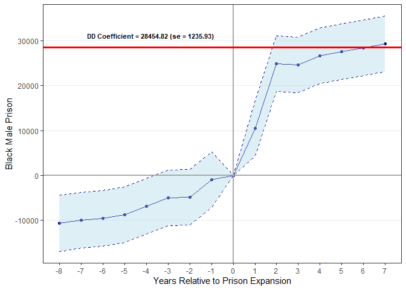

ECO 395M: Final Project
=======================

Bernardo Arreal Magalhaes - UTEID ba25727

Adhish Luitel - UTEID al49674

Ji Heon Shim - UTEID js93996

Introduction
------------

Assessing policy effects and making predictions based on it has always
been a key part of quantitative economics. Empirical economists are very
often interested in estimating the impact of certain events or policies
on a particular outcome. Wooldridge (2013) describes the effectiveness
applications of Differences-in-Differences methodology when the data
arise from a natural experiment. This kind of experiment occurs when an
exogenous event changes the environment in which individuals opperate,
and require observations of both treatment and control group before and
after the change.

This methodology is particularly powerfull for infering causality since
it neutralizes unobserved, but fixed, omitted variables (Angrist and
Pischke, 2018). Nonetheless, it relies on a quite strong – and
unfortunately not testable – assumption that the outcome in the multiple
individuals/firms/states included in the analysis share the same trend
over time, which is called parallel trends assumption.

The table below illustrates a simple version of the Diff-in-Diff method
and why this assumption is required. By decreasing the outcome after
treatment from the outcome before treatment for a treated state, the
difference (D1) is going to be the effect caused by the treatment (E)
plus a trend (T). This step neutralizes unobserved factors of a
particular state. For a state that wasn't treated, the difference (D1)
before and after treatment is the trend (T) only. So, if we assume that
T is the same for both states, we can decrease T, that was measured from
the control state, from T + E in order to isolate the causal effect E.

This assumption is not testable because we don’t know what would’ve
happened to the treatment state had it not been treated.

But what if we could predict what would have happened to the treated
state in this alternative world where it wasn’t treated without having
to rely on the parallel trends assumption?

INTRODUCTION TO PREDICTIVE MODELS

In this particular study, we compared the application of different
suppervised learning predictive methods with the Diff-in-Diff estimator
of the following research project.

### Research topic brief summary

During the 1980s, the state of Texas lost a civil action lawsuit where a
prisoner argued that the state Department of Corrections was engaging in
unconstitutional practices regarding prisoners conditions. The court
ruled in favor of the prisoner, and forced the state to pursue a series
of settlements. Among other orders, the court placed constraints on the
number of inmates allowed per cells. Given this constraint, state
legislators approved a billion dollar prison construction project that
ended up doubling the state’s capacity within 3 years.

Cunningham (2020) argues that the nature of this expansion allows us to
use it as a natural experiment to estimate the effect of prison
expansion on incarceration. He uses the synthetic control method to
predict counterfactuals as in Abadie et al. (2010) by searching for the
set of weights that generate the best fitting convex combination of the
control units, being the best the one that minimizes root mean square
error in the pre-treatment period.

His preliminar results indicate that an increase in state prison
capacity caused an increase in black male incarceration. We used a set
of alternative methods to estimate the causal effect.

Method
------

In this project, we used a standard Diff-in-Diff model, and compared its
results with the simple difference in outcomes predicted by MENTION THE
PREDICTIVE MODELS.

Our dataset is consisted of state level anual observations of the
following variables: number of black male prisoners (bmprison), alcohol
consumption per capita (alcohol), aids mortality (aidscapita), average
household income (income), unemployment rate (ur), share of the
population in poverty (poverty), share of the population which is
african american (black) and share of the population which is 15 to 19
years old (perc1519).

RESULTS
-------

### Differences-in-Differences

In order to preserve the same parameters that were included in
Cunningham's analysis, the baseline model is:

    bmprison ~ alcohol + aidscapita + income + ur + poverty + black + perc1519 + year + state + year_after1993*state_texas

    ## bmprison ~ alcohol + aidscapita + income + ur + poverty + black + 
    ##     perc1519 + year + state + year_after1993 * state_texas

The model indicates that the expansion of the state prison capacity is
associated with an increase of 28,454.82 black male prisoners, holding
all else fixed.

    ## 
    ## =====================================================
    ##                               Dependent variable:    
    ##                           ---------------------------
    ##                              Black Male Prisoners    
    ## -----------------------------------------------------
    ## Prison capacity expansion        28,454.820***       
    ##                                   (1,235.930)        
    ##                                                      
    ## -----------------------------------------------------
    ## State Fixed effects                   Yes            
    ## Year Fixed effects                    Yes            
    ## Observations                          816            
    ## R2                                   0.947           
    ## Adjusted R2                          0.942           
    ## =====================================================
    ## Note:                     *p<0.1; **p<0.05; ***p<0.01

When decomposing the effect in each year, we get the point estimates
shown in the figure below. The coefficients capture how the treatment
group differs from the control group when controlling for multiple
factors and when considering state and year fixed effects. It also
allows us the test the plausibility of parallel trends in the
pre-treatment period. As we are including controls and fixed effects,
there should be less to be explained by the coefficients to the left of
the grey vertical line since the only difference should be the treatment
itself, and it didn't occur in years prior to the intervention.

A test of joint significance of the leads coefficients, as in Kearney
and Levine (2015), reject the null hypothesis that they are jointly
equal to zero (p-value = 0.006). Therefore, it provides evidence that
the parallel trends assumption doesn't hold even in the pre-treatment
period, indicating the necessity of exploring different methods.

    ## 
    ## ==========================================
    ## Statistic Res.Df   Df   Chisq  Pr(> Chisq)
    ## ------------------------------------------
    ## Mean      731.500 7.000 19.959    0.006   
    ## ------------------------------------------

### LASSO

### STEPWISE SELECTION

### RANDOM FOREST?

CONCLUSION
----------
