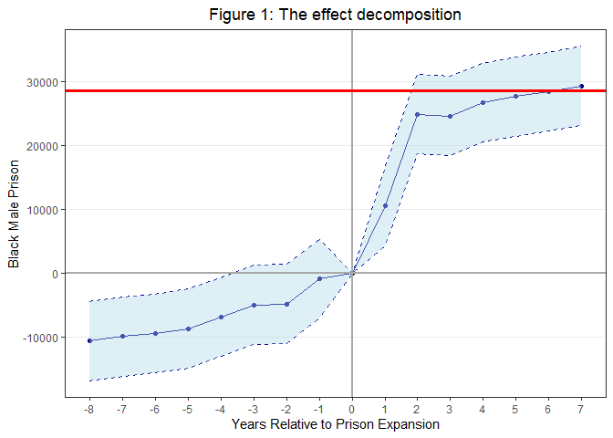

ECO 395M: Final Project
=======================

Bernardo Arreal Magalhaes - UTEID ba25727

Adhish Luitel - UTEID al49674

Ji Heon Shim - UTEID js93996

Introduction
------------

Empirical economists are very often interested in estimating the impact
of certain events or policies on a particular outcome. Wooldridge (2013)
describes the effectiveness applications of Differences-in-Differences
methodology when the data arise from a natural experiment. This kind of
experiment occurs when an exogenous event changes the environment in
which individuals opperate, and require observations of both treatment
and control group before and after the change.

This methodology is particularly powerfull for infering causality since
it neutralizes unobserved, but fixed, omitted variables (Angrist and
Pischke, 2018). Nonetheless, it relies on a quite strong – and
unfortunately not testable – assumption that the outcome in the multiple
individuals/firms/states included in the analysis share the same trend
over time, which is called parallel trends assumption.

The table below illustrates a simple version of the Diff-in-Diff method
and why this assumption is required. By decreasing the outcome after
treatment from the outcome before treatment for a treated state, the
difference (D1) is going to be the effect caused by the treatment (E)
plus a trend (T). This step neutralizes unobserved factors of a
particular state. For a state that wasn't treated, the difference (D1)
before and after treatment is the trend (T) only. So, if we assume that
T is the same for both states, we can decrease T, that was measured from
the control state, from T + E in order to isolate the causal effect E.

This assumption is not testable because we don’t know what would’ve
happened to the treatment state had it not been treated. But what if we
could predict what would have happened to the treated state in this
alternative world where it wasn’t treated without having to rely on the
parallel trends assumption? In this particular study, we are going to
compare the application of different suppervised learning predictive
methods with the Diff-in-Diff estimator of an ongoing research project.

### Research topic brief summary

During the 1980s, the state of Texas lost a civil action lawsuit where a
prisoner argued that the state Department of Corrections was engaging in
unconstitutional practices regarding prisoners conditions. The court
ruled in favor of the prisoner, and forced the state to pursue a series
of settlements. Among other orders, the court placed constraints on the
number of inmates allowed per cells. Given this constraint, state
legislators approved a billion dollar prison construction project that
ended up doubling the state’s capacity within 3 years.

Cunningham (2020) argues that the nature of this expansion allows us to
use it as a natural experiment to estimate the effect of prison
expansion on incarceration. He uses the synthetic control method to
predict counterfactuals as in Abadie et al. (2010) by using a set of
covariates and multiple control states to build a predictive model that
minimizes root mean square error. His preliminar results indicates that
an increase in state prison capacity caused an increase in black male
incarceration.

Method
------

In this project, we will be estimating the causal effect by using a
standard Diff-in-Diff method, and comparing its results with the simple
difference in outcomes predicted by different methods.

### Differences-in-Differences

In order to preserve the same parameters that were included in
Cunningham's analysis, the baseline model we will be using is:

    bmprison ~ alcohol + aidscapita + income + ur + poverty + black + perc1519 + year + state + year_after1993*state_texas

    ## bmprison ~ alcohol + aidscapita + income + ur + poverty + black + 
    ##     perc1519 + year + state + year_after1993 * state_texas

Where 'bmprison' is the number of black male prisoners, 'alcohol' is the
alcohol consumption per capita, 'aidscapita' is the aids mortality,
'income' is the average household income, 'ur' is the unemployment rate,
'poverty' is the share of the population in poverty, 'black' is the
share of the population which is african american and 'perc1519' is the
share of the population which is 15 to 19 years, being all of the
variables in the state level.

    ## 
    ## =====================================================
    ##                               Dependent variable:    
    ##                           ---------------------------
    ##                              Black Male Prisoners    
    ## -----------------------------------------------------
    ## Prison capacity expansion        28,454.820***       
    ##                                   (1,235.930)        
    ##                                                      
    ## -----------------------------------------------------
    ## State Fixed effects                   Yes            
    ## Year Fixed effects                    Yes            
    ## Observations                          816            
    ## R2                                   0.947           
    ## Adjusted R2                          0.942           
    ## =====================================================
    ## Note:                     *p<0.1; **p<0.05; ***p<0.01

INTERPRET THE MODEL'S RESULT

INTERPRET LEADS AND LAGS

INTERPRET F-TEST

    ## 
    ## ==========================================
    ## Statistic Res.Df   Df   Chisq  Pr(> Chisq)
    ## ------------------------------------------
    ## Mean      731.500 7.000 19.959    0.006   
    ## ------------------------------------------
